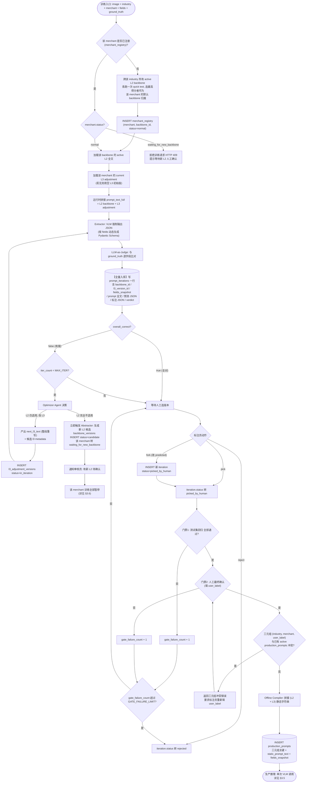
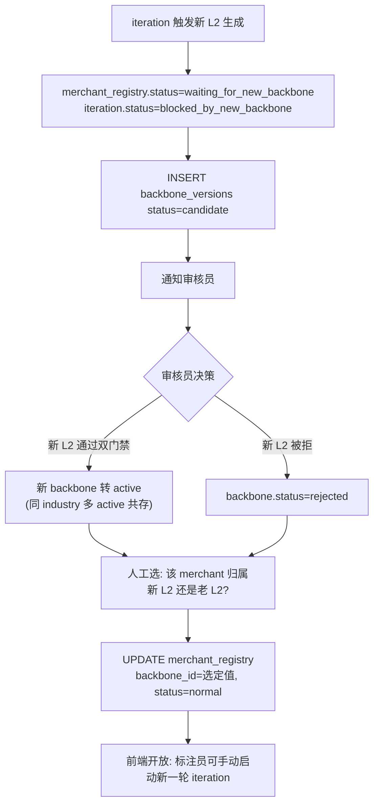
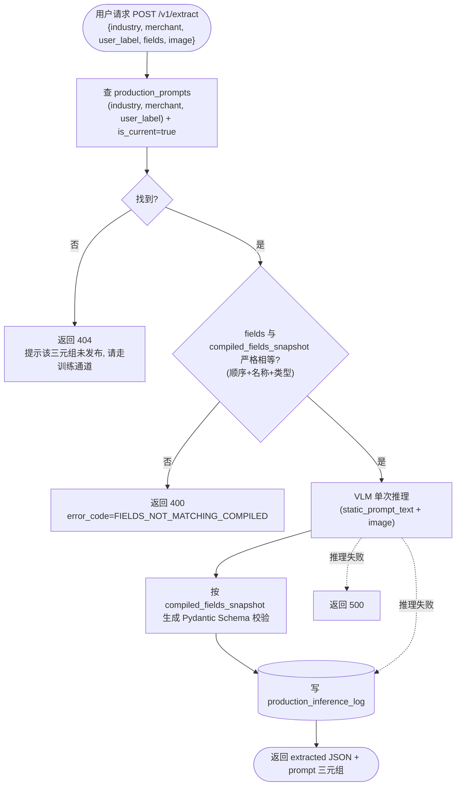
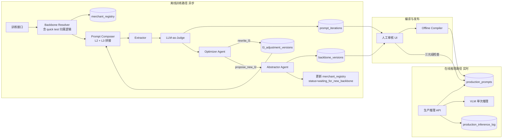
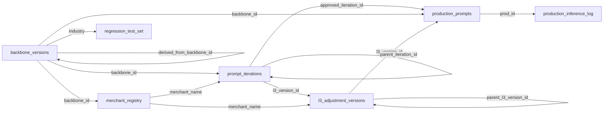
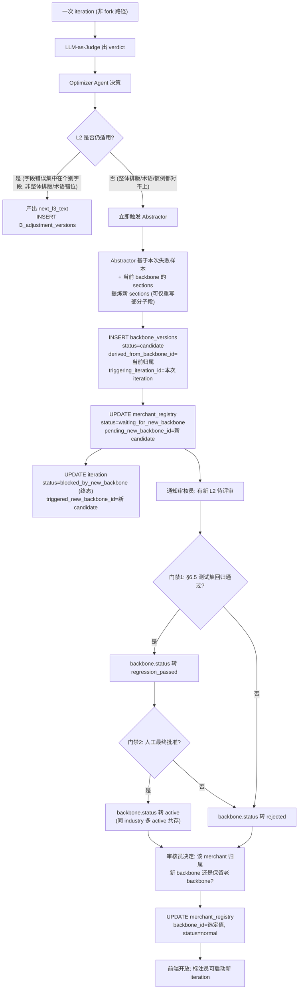
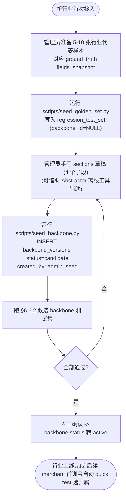
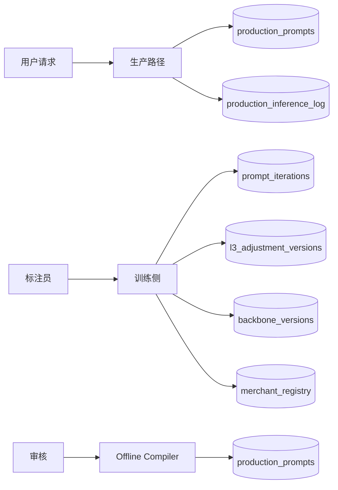
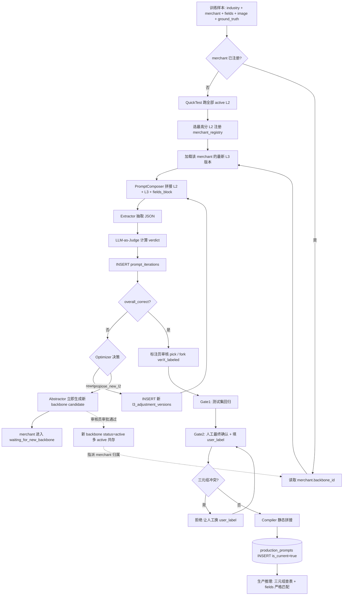

# DESIGN.md

# Schema-Driven Multi-Modal Receipt Extraction System

> 本文档是基于头脑风暴产物的工程实施蓝图。读完本文应能直接动手编码：
> 业务边界明确、数据结构可建表、流程节点可代码化、模块间契约明晰。

---

## 1. Scope 边界与非目标

### 1.1 当前阶段定位

本系统当前阶段为 **测试 / PoC 阶段**，目标是验证「数据库驱动的分层 Prompt 自演化架构」的可行性。

| 维度 | 是否在 Scope 内 |
|---|---|
| 多语言、多来源（扫描 / 截屏 / 随手拍）小票字段抽取 | 是 |
| 用户在训练阶段自定义字段及类型（int/float/str） | 是 |
| L2 行业 Backbone（多活并存） + L3 Merchant Adjustment（整段演化） 双层模板 | 是 |
| 全量迭代版本入库与可追溯性 | 是 |
| LLM-as-Judge 作为 Loss 函数 | 是 |
| 离线编译产出静态 Prompt 进生产（按三元组发布） | 是 |
| 前端版本浏览与人工标注闭环 | 是（接口契约层面） |
| **并发性能、吞吐量、延迟优化** | **否** |
| **缓存层（Redis 等）、分布式部署** | **否** |
| **生产环境的 A/B 测试、灰度发布** | **否（仅保留版本号机制以便后续扩展）** |

### 1.2 架构硬约束（不可妥协项）

1. **不存在 L1 全局 Prompt**：本系统没有跨行业共享的 Prompt 前缀。Backbone 是**行业级 (L2)** 概念，L3 Adjustment 是**商户级**概念。
2. **L2 多活并存**：同一 industry 下允许同时存在多条 active L2 Backbone（如「咖啡厅1」「咖啡厅2」「咖啡厅3」是互斥的备选模板，不是版本关系）。每个 merchant 在训练阶段被显式归属到其中一条 L2，归属由系统首训跨 backbone quick test 自动选择，后续可由人工调整。
3. **L2 Backbone 不被单店污染**：单一商户的异常排版、特殊词汇绝不允许直接修改其归属的 L2 Backbone 文本。当 Optimizer 判定「现有所有 active L2 都不适用某图」时，**立即**触发 Abstractor 生成一条新的候选 L2（不走累计候选池），并把该 merchant 置为 `waiting_for_new_backbone` 暂停态；新 L2 经人工确认后，由人工决定该 merchant 归属新 L2 还是保留老 L2。
4. **L3 Adjustment 整段演化**：L3 是 per-merchant 的一段 freeform 调整文本（结构上按字段组织，如「字段1: ... 字段2: ...」），Optimizer 允许**整段重写**该文本。L3 不再使用 `append_hint / negative_exclude / format_note / revoke_hint` 这套补丁拼贴体系。
5. **数据库版本链 Append-Only**：所有 prompt 演化产物（L2 backbone 版本、L3 adjustment 版本、iteration、production_prompts、audit_log、production_inference_log）的业务字段一律 `INSERT`，不允许 `UPDATE` 或 `DELETE`。可变状态字段（如 `status` 在 `candidate / active / archived / superseded / rejected` 之间切换）必须通过事务原子切换并同步写 `audit_log`，不允许直接 SQL UPDATE 后不留痕。
6. **生产 Prompt 是发布时已固化的静态字符串**：每条 `production_prompts` 行的 `static_prompt_text` 在编译时就是 `(L2 backbone 全文) + (L3 adjustment 全文)` 拼接好的最终字符串。生产推理时只读取这一段字符串、做单次推理；不查 backbone 表、不查 L3 表、不做任何运行时拼接。
7. **生产 Prompt 三元组主键**：生产 prompt 的标识是 `(industry, merchant_name, user_label)` 三元组，由人工在最终确认时显式填写 `user_label`。三元组冲突时编译期报警并拒绝写入，强制用户重命名。同 (industry, merchant) 下允许多个不同 `user_label` 的 active prompt 并存（用于同一店的不同字段集场景）。
8. **Fields 与 prompt 严格绑定**：每条 production_prompt 在编译期固化一组 fields 快照。生产调用时传入的 fields 必须与该快照**完全相等**（顺序、名称、类型三项一致），不允许子集，不允许超集。生产用户的语义是「挑选一个 prompt」，不是「挑选 fields」。
9. **双门禁才能进生产**：人工选定最佳 iteration → 在独立测试集上全部通过 → 人工最终确认（含填写 user_label）。三件事齐备才允许编译入生产。任何一项缺失都不得入生产。

---

## 2. 业务场景描述

### 2.1 输入与输出

**输入**：

```json
{
  "image_path": "/path/to/receipt.jpg",
  "industry": "coffee",
  "merchant_hint": "Costa",
  "fields": [
    {"name": "date",        "type": "str"},
    {"name": "store_name",  "type": "str"},
    {"name": "item_name",   "type": "str"},
    {"name": "quantity",    "type": "float"},
    {"name": "unit_price",  "type": "float"},
    {"name": "final_price", "type": "float"}
  ]
}
```

- `image_path`：图片路径，支持任意语言、扫描件、截屏、随手拍。
- `industry`：行业标签，由调用方提供（不依赖 Router 自动判定）。
- `merchant_hint`（可选）：商户标识。若数据库存在对应 L3 SFT 则优先使用，否则回退到 L2 Backbone。
- `fields`：用户自定义抽取目标，每项包含字段名 + 数据类型。

**输出**：

```json
{
  "iteration_id": 8821,
  "version_label": "ver3",
  "predicted": {
    "date": "2026-05-08",
    "store_name": "Costa",
    "items": [
      {"item_name": "拿铁", "quantity": 1, "unit_price": 28.5}
    ],
    "final_price": 28.5
  }
}
```

### 2.2 角色与流转关系

| 角色 | 职责 |
|---|---|
| 终端用户（生产） | 选定一个 prompt 三元组 `(industry, merchant, user_label)` + 图片 → 拿到抽取结果（不允许新增字段） |
| 标注员（训练） | 提供图片 + 字段定义 + ground_truth 启动训练任务；浏览迭代历史、fork 修改、选最佳版、填写 `user_label` 发布 |
| 离线训练系统 | 调度 Optimizer Agent（改 L3 整段 / 提案新 L2）、Abstractor Agent（生成新 L2 候选）、回归测试、编译器 |
| 审核员 | 对新候选 L2 backbone 与待发布 prompt 做最终人工签字（含决定 merchant 归属新/老 backbone） |
| 生产推理服务 | 只读取已发布的 production_prompts.static_prompt_text，对图片做单次推理 |

### 2.3 核心业务循环（一句话）

> 标注员给图 + fields + 标注 → 系统按 merchant 归属选 L2 + 拉当前 L3 → 抽取 → LLM-as-Judge 算 Loss → Optimizer 整段重写 L3（或提案立即生成新 L2）→ 每轮入库 → 标注员选最佳版 → 测试集回归 → 人工填 user_label 最终确认 → 离线编译成 (L2 + L3) 拼接好的静态 prompt 入库 → 生产环境用户选三元组调用。

---

## 3. 业务流程

### 3.1 主流程图（含双门禁 + 全量入库）



### 3.2 流程节点契约

| 节点 | 输入 | 输出 | 副作用 |
|---|---|---|---|
| `CheckMerchant` | merchant_name, industry | merchant_registry 行（含 backbone_id 归属） | 不存在则触发 `QuickTest` |
| `QuickTest` | image, ground_truth, industry 下所有 active backbone | best_backbone_id | 仅产生 quick_test 评分日志，不写 iteration |
| `RegisterMerchant` | merchant_name, industry, best_backbone_id | merchant_registry 行 | INSERT merchant_registry（status=normal） |
| `LoadL2 + LoadL3 + Compose` | backbone_id, l3_version_id（可空） | prompt_text_full | 详见 §4.1 schema 构建职责 |
| `Extract` | image, prompt_text, schema | predicted_json | Pydantic 校验失败 → 写 iteration（status=extractor_error） |
| `Judge` | predicted_json, ground_truth_json, fields | per_field_verdict[] | 无 |
| `StoreIter` | 上述全部 | iteration_id | **必写** prompt_iterations |
| `OptimizerDecide` | iteration_id, verdict, current_prompt | next_action ∈ {`rewrite_l3`, `propose_new_l2`} | 见 §7.5 |
| `RewriteL3` | iteration, verdict | next_l3_text + l3 metadata | INSERT l3_adjustment_versions（status=in_iteration） |
| `NewL2Trigger` | iteration, 失败特征 | new_backbone_id | INSERT backbone_versions（status=candidate）；UPDATE merchant_registry.status=waiting_for_new_backbone；写 audit_log |
| `HumanAction` | 标注员意图 | pick / fork / reject | 详见 §10.3 |
| `Gate1` | iteration_id, test_set | pass_rate | 写 test_run 日志 |
| `Gate2` | reviewer_id, iteration_id, **user_label** | approved bool | 写 approval 日志 |
| `CheckTriple` | (industry, merchant, user_label) | 是否与现有 active 三元组冲突 | 冲突则拒绝并要求重命名 |
| `Compile` | backbone_text + l3_text + fields_snapshot | static_prompt_text | 拼接为 (L2 全文 + L3 全文)，详见 §8 |
| `Publish` | static_prompt_text, 三元组, fields_snapshot, approved_iteration_id | prod_id | INSERT production_prompts |
| `RejectNode` | iteration_id, reason | iteration.status = rejected | 写 audit_log |

### 3.3 关键不变量

- **每一次 Extractor 调用 → 必产生一条 prompt_iterations 记录**，无论对错或异常。
- **Optimizer 产出的 next_l3_text 写入 `l3_adjustment_versions` 表（status=in_iteration），人工确认前不参与编译**。
- **未通过 Gate1 + Gate2 的版本绝不进 production_prompts 表**。
- **生产推理只读 production_prompts.static_prompt_text**，不允许跨表 Join 拼接。
- **fork 路径不会触发新 L2 生成**（fork 是人工动作，由 Service 层 `is_human_edited=true` 短路）。
- **同 industry 下允许多条 active Backbone**；但同 (industry, merchant, user_label) 三元组下 `is_current=true` 的 production_prompts 唯一。
- **iteration 一旦进入 rejected / published_to_production / superseded / extractor_error，状态不可再变更**（终态）。
- **merchant_registry.status 处于 `waiting_for_new_backbone` 时，该 merchant 任何新训练请求被拒绝（HTTP 409）**，直到新 L2 被人工确认且 merchant 归属被人工指派。

### 3.4 流程退出与异常路径

主流程除了正常入生产之外，存在以下显式终态出口，必须在代码中显式处理。

#### 3.4.1 iteration 终态出口

| 终态 | 触发条件 | 副作用 | 重启方式 |
|---|---|---|---|
| `published_to_production` | 双门禁通过且编译完成 | 写 production_prompts 新行 | 无（成功路径） |
| `rejected` | 标注员主动 reject 或 `gate_failure_count >= GATE_FAILURE_LIMIT` | 写 audit_log；前端隐藏入口（仅管理员可见） | 管理员审阅后通过 `POST /v1/admin/iterations/{id}/restart` 创建一条新的 iteration（`parent_iteration_id` 指向被 reject 的那条），从 pending 重启 |
| `superseded` | 同 (merchant, user_label) 三元组下有新版 production_prompts 入库时，旧 approved iteration 一并迁移 | 自动迁移 | 无需重启 |
| `extractor_error` | Pydantic schema 校验失败、VLM 超时等 | 写 audit_log；不进入 Judge / Optimizer | 管理员审阅后重启 |
| `blocked_by_new_backbone` | 该 merchant 在迭代过程中触发了新 L2 生成 | UPDATE merchant_registry.status=waiting_for_new_backbone；该 iteration 自身停在此终态 | 新 L2 人工确认 + merchant 归属指派完成后，由人工在前端手动「以新 L2 为基底」启动新 iteration（不自动恢复） |

`GATE_FAILURE_LIMIT` 写入 `config_thresholds`，默认 3。

#### 3.4.2 backbone candidate 终态出口

| 终态 | 触发条件 | 副作用 | 重启方式 |
|---|---|---|---|
| `active` | 通过 §6.6 测试集回归 + 人工确认 | 同 industry 下作为新一条 active backbone（不替换老 backbone） | 无（成功路径） |
| `rejected` | 测试集回归失败 或 人工 reject | 写 audit_log；触发该 candidate 的所有 `blocked_by_new_backbone` iteration 关联的 merchant 仍停留在 `waiting_for_new_backbone`，由审核员决定是否换归属老 backbone 或重新触发 Abstractor | 管理员显式 `POST /v1/admin/backbones/{id}/restart` 重新跑一次回归 |
| `archived` | 由人工显式归档（如该 backbone 长期无 merchant 归属） | 不再参与 quick test 默认归属选择；已绑定的 merchant 仍可继续训练 | 不可恢复（如需复活，重新 seed 一条新 candidate） |

> 关键：本系统**不再有 `backbone_candidate_pool` 表**。每次 Optimizer 判定「现有 L2 全不适用」就立即生成一条 `backbone_versions` 候选行（status=candidate），不做累计聚合。

#### 3.4.3 merchant 暂停态恢复路径



### 3.5 生产推理独立流程

生产路径与训练路径**物理隔离**，不共享流程节点。生产用户的语义是「挑选一个 prompt 三元组」，不是「自定义字段」。



生产路径硬性约束（区别于训练路径）：

- **不调用** Judge / Optimizer / Compiler / Abstractor。
- **不读** prompt_iterations / l3_adjustment_versions / backbone_versions（candidate 行）。
- **只读** production_prompts + config_thresholds。
- **只写** production_inference_log。
- **不允许字段子集**：与编译期 fields 快照严格相等才放行（详见 §9.4）。

### 3.6 merchant 训练入口的归属决策

新 merchant 首次发起训练时（merchant_registry 没有该 merchant 行），系统按以下顺序决策：

```
Step 1: 列出该 industry 下所有 status=active 的 backbone (B1, B2, B3, ...)
        若数量为 0 → 拒绝训练 (该 industry 未冷启动, 走 §6.9 流程)

Step 2: 对每个 active backbone Bi, 用 (Bi 的 base_prompt_text + 空 L3) 拼成临时 prompt,
        跑一次 Extract + Judge (只用本次提交的图 + ground_truth, 不写 iteration);
        记录 overall_correct + 字段错误率作为得分.

Step 3: 取得分最高者 B* 作为该 merchant 的默认 backbone 归属;
        INSERT merchant_registry (merchant_name, industry, backbone_id=B*, status=normal,
        decided_by='auto_quick_test', decided_at=now()).

Step 4: 后续训练正式开始, 走 §3.1 主流程.

特殊情形:
- 所有 active backbone 在 Step 2 都得 0 分 (overall_correct=false 且错误率=100%):
  视为「现有 L2 全不适用」, 不写 merchant_registry,
  立即触发 §3.4.3 Trigger 路径生成新 L2 candidate, 但 merchant_registry 不创建,
  只写一条 audit_log (action_type=merchant_blocked_pre_registration);
  必须等新 L2 上线 + 人工指派归属后, 由审核员手动 INSERT merchant_registry.
```

**人工覆盖**：管理员可通过 `POST /v1/admin/merchants/{merchant}/reassign-backbone` 手动改写归属（如对 quick test 结果不满意），但该接口必检查目标 backbone 处于 active 状态，且强制写 audit_log。

---

## 4. 系统模块



| 模块 | 职责 | 输入 | 输出 | 备注 |
|---|---|---|---|---|
| Backbone Resolver | 决定本次训练用哪个 L2 backbone（首训 quick test，否则查 merchant_registry） | merchant_name, industry, image, ground_truth | backbone_id | 见 §3.6；首训时跨 backbone quick test |
| Prompt Composer | 拼接 (L2 base_prompt_text + L3 adjustment_text) → 训练用 prompt 全文 | backbone_id, l3_version_id（可空） | prompt_text_full + dynamic Pydantic Schema | 训练期允许运行时拼接；生产期严禁 |
| Extractor | 调 VLM 做结构化 JSON 抽取 | image + prompt + Pydantic Schema | predicted_json | 强制 `response_format=schema` |
| LLM-as-Judge | 对预测 JSON 与标注 JSON 做逐字段判定 | predicted, ground_truth, field_types | per_field_verdict[] | 见 §7 |
| Optimizer Agent | 决策下一步是「整段重写 L3」还是「请求生成新 L2」；只产出 next_l3_text 或触发 Abstractor，不直接落 production | iteration_id, verdict, current_prompt | next_action + (next_l3_text \| new_l2_trigger) | 见 §7.5 |
| Abstractor Agent | 立即根据当前失败图 + ground_truth + 现有 backbone 失败预测，提炼一条新 L2 候选（带 sections 子结构） | failing_iteration | 新 backbone_versions 行（status=candidate） | 见 §6.4；不再做累计聚合 |
| Offline Compiler | 拼接 (L2 + L3) → 静态字符串；三元组冲突检查；写 production_prompts | backbone_id, l3_version_id, fields_snapshot, user_label | prod_id | 见 §8 |
| Version Control DB | 持久化所有 backbone 版本 / l3 版本 / iteration / production / 审计 | 写请求 | 主键 | 见 §5 |
| Approval UI | 人工选最佳 iteration、fork 修改、填 user_label 发布、审批新 L2 候选、指派 merchant 归属 | 浏览操作 | approval 记录 + audit | 见 §10 |

> **Router 模块**：当前阶段不实现自动行业判定。`industry` 字段由调用方在输入 JSON 中显式提供。后续如果需要，可在 Backbone Resolver 之前增加一个轻量级 Router；当前不做。

### 4.1 fields -> Pydantic Schema 转换职责

用户输入的 `fields` 是 `[{name, type}]` 的轻量列表，但 Extractor 调 VLM 时需要严格的 Pydantic Schema（驱动 `response_format` 强制结构化输出）。该转换工作的归属：

- **责任方**：`PromptComposerService`，在加载 L2 + L3 文本拼接后，基于 `fields` 动态生成 `DynamicReceiptModel`（Pydantic v2 `create_model`）。
- **不变量**：
  - 转换函数纯函数，相同 `fields` 输入产出结构相同的 Pydantic 类（用于编译期 fields 快照、生产期 fields 校验）。
  - `int` 映射到 `Optional[int]`，`float` 映射到 `Optional[float]`，`str` 映射到 `Optional[str]`；缺失字段统一返回 None。
  - 字段顺序按用户输入顺序保留（影响 schema 序列化结果，进而影响 production_prompts.compiled_fields_snapshot 的等价性比较）。
- **不允许**：
  - `ExtractorService` 直接接收 `fields` 列表自己生成 schema（重复职责且容易不一致）。
  - 生产路径在 `ProductionInferenceService` 内自行二次构造 Pydantic 类（生产路径直接读 `production_prompts.compiled_fields_snapshot` 调用 `build_schema(...)`，结果与编译期完全一致）。
- **示例**：

```python
from pydantic import create_model
from typing import Optional

TYPE_MAP = {"int": Optional[int], "float": Optional[float], "str": Optional[str]}

def build_schema(fields: list[FieldSpec]) -> type:
    field_def = {f.name: (TYPE_MAP[f.type], None) for f in fields}
    return create_model("DynamicReceiptModel", **field_def)
```

> 所有 Pydantic 类用 `create_model` 动态生成，不允许预定义。这样新字段无需改代码即可投产。

---

## 5. 数据结构与数据库设计

> 本章是 v3.0 全面重写。**已删除**的旧表：`backbone_registry`（被 `backbone_versions` 取代）、`shop_templates`（被 `merchant_registry` 取代）、`prompt_patches`（被 `l3_adjustment_versions` 取代）、`backbone_candidate_pool`（机制取消）、`patch_compilation_link`（编译产物只引用一条 backbone + 一条 l3，不需要 N:M）。

### 5.1 表关系总览



> 审计层 `audit_log` 横向关联所有业务表（`target_table` + `target_id`），不在图中展开避免视觉混乱。

### 5.2 表 A：`backbone_versions`（L2 行业 Backbone 版本表 ★核心表）

承载 L2 backbone 全部版本与 sections 子结构。**同 industry 允许多条 status=active 共存**（如「咖啡厅1」「咖啡厅2」是互斥备选模板）。

| 字段 | 类型 | 说明 |
|---|---|---|
| backbone_id | BIGSERIAL PK | |
| industry | VARCHAR(64) NOT NULL | 行业标签 |
| backbone_name | VARCHAR(128) NOT NULL | 显示名，由 Abstractor 或管理员命名（如 `coffee_shop_style_1`、`coffee_shop_style_lucky`），同 industry 内必须唯一 |
| sections | JSONB NOT NULL | 结构化子段；标准 keys：`layout` / `terminology` / `industry_conventions` / `extra_notes`；每个 value 是一段 freeform text |
| base_prompt_text | TEXT NOT NULL | 由 sections 按固定顺序拼接而成的 backbone 全文（编译期唯一被读取的字段；sections 仅用于 Abstractor 局部重写时取出对应子段） |
| sections_hash | VARCHAR(64) NOT NULL | sections 的 SHA-256，用于幂等检测 |
| status | VARCHAR(32) NOT NULL | `candidate` / `regression_passed` / `active` / `archived` / `rejected` |
| derived_from_backbone_id | BIGINT NULL | 上游 backbone（Abstractor 在某 backbone 失败基础上提炼时填写） |
| triggering_iteration_id | BIGINT NULL | 触发本次 candidate 生成的 iteration（Abstractor 路径填写） |
| rejected_reason | VARCHAR(64) NULL | `gate_regression_fail` / `gate_human_reject` / `human_archive` |
| created_by | VARCHAR(64) NOT NULL | `system_abstractor` / `admin_seed` / 管理员名 |
| created_at | TIMESTAMP NOT NULL | |
| activated_at | TIMESTAMP NULL | 通过双门禁后写入 |

**唯一约束**：

```sql
UNIQUE (industry, backbone_name)
```

> 注意：**没有** `(industry, status='active')` 的 partial unique index——本设计明确允许同 industry 多条 active 共存。

**状态机**：

```
candidate ──(§6.6 测试集回归通过)──> regression_passed ──(人工确认)──> active
   │                                          │                          ├──(管理员显式归档)──> archived [终态]
   │                                          │                          └──(被某次 quick test 长期不命中, 管理员清理)──> archived
   │                                          └──(人工拒绝)──> rejected [终态]
   ├──(测试集回归失败)──> rejected [终态]
   └──(管理员废弃)──> rejected [终态]

终态: archived / rejected. 不可恢复 (如需复活, 重新 seed 一条 candidate, derived_from 指向被废弃者).
```

**`sections` 标准结构**（Abstractor 与 Compiler 共享）：

```json
{
  "layout": "咖啡厅小票一般包含饮品、面包、糕点；最上方大写为店名，订单号位于...",
  "terminology": "「合计」「应付」「实付」均视为最终金额字段；「会员卡余额」不属于交易金额。",
  "industry_conventions": "时间格式通常为 YYYY-MM-DD HH:mm；金额单位为元，保留两位小数。",
  "extra_notes": ""
}
```

`base_prompt_text` 的生成规则（编译期 + Abstractor 产出时统一调用同一函数）：

```
[L2 Backbone for industry={industry}, name={backbone_name}]

【布局描述】
{sections.layout}

【通用术语表】
{sections.terminology}

【行业惯例】
{sections.industry_conventions}

{若 sections.extra_notes 非空}
【其他说明】
{sections.extra_notes}
```

**强约束**：

- Abstractor 重写局部 sections 时，**必须 INSERT 一条新行**（含整套新 sections + 重新拼接的 base_prompt_text + 新 sections_hash），不允许 UPDATE 任何已存在行的 sections 字段。
- 候选行的 `triggering_iteration_id` 不为空时，意味着该 candidate 是由某次「L2 完全不适用」事件触发的，必须级联检查关联的 `merchant_registry` 是否已转 `waiting_for_new_backbone`。

### 5.3 表 B：`merchant_registry`（商户归属注册表 ★核心表）

每个 merchant 在系统中存在一行，明确归属哪个 L2 backbone，以及当前训练状态。

| 字段 | 类型 | 说明 |
|---|---|---|
| merchant_id | BIGSERIAL PK | |
| merchant_name | VARCHAR(128) NOT NULL | |
| industry | VARCHAR(64) NOT NULL | 冗余字段；与 backbone_id 关联的 industry 必须一致（应用层校验） |
| backbone_id | BIGINT NOT NULL FK → backbone_versions | 当前归属的 L2 backbone（必须处于 active） |
| status | VARCHAR(32) NOT NULL | `normal` / `waiting_for_new_backbone` |
| pending_new_backbone_id | BIGINT NULL FK → backbone_versions | 当 status=waiting_for_new_backbone 时填，指向待审批的 candidate backbone |
| decided_by | VARCHAR(64) NOT NULL | `auto_quick_test` / 管理员名 |
| decided_at | TIMESTAMP NOT NULL | 最近一次归属确定时间 |
| created_at | TIMESTAMP NOT NULL | |

**唯一约束**：

```sql
UNIQUE (merchant_name)
```

> 当前阶段假定 `merchant_name` 全局唯一；如未来引入多 industry 同名商户，再扩展为 `(industry, merchant_name)`。

**状态机**：

```
首次注册 (§3.6 quick test 完成) ──> normal
normal ──(某次 iteration 触发新 L2 生成)──> waiting_for_new_backbone
waiting_for_new_backbone ──(审核员指派归属)──> normal
   ├──(审核员选老 backbone)──> backbone_id 不变, pending_new_backbone_id 清空
   └──(审核员选新 backbone)──> backbone_id 改为 pending_new_backbone_id, pending 清空
```

**强约束**：

- `backbone_id` 必须始终指向 `backbone_versions.status='active'` 的行（外键 + 应用层双重校验）。
- `pending_new_backbone_id` 仅在 status=waiting_for_new_backbone 时允许非 NULL。
- 状态切换必须走 `MerchantRegistryService.transition(...)`，禁止业务代码直接 UPDATE。
- **管理员可手动改 backbone_id**（仅在 status=normal 时通过 `POST /v1/admin/merchants/{merchant}/reassign-backbone`），但目标 backbone 必须 active，且强制写 audit_log。

### 5.4 表 C：`l3_adjustment_versions`（商户级 L3 调整版本表 ★核心表）

per-merchant 的 freeform 调整文本版本链。每次 Optimizer 整段重写或人工 fork 都 INSERT 一条新行。**完全替代**旧 `prompt_patches` 表。

| 字段 | 类型 | 说明 |
|---|---|---|
| l3_version_id | BIGSERIAL PK | |
| merchant_name | VARCHAR(128) NOT NULL | |
| backbone_id | BIGINT NOT NULL FK → backbone_versions | 该 L3 是基于哪条 backbone 演化的（与 merchant_registry 当前归属一致） |
| parent_l3_version_id | BIGINT NULL FK → l3_adjustment_versions | 上一版 L3（用于追溯演化链）；初始版为 NULL |
| adjustment_text | TEXT NOT NULL | L3 全段 freeform 文本，结构形如：「{merchant} 的小票相对于该行业基础描述有以下特别需要注意的点：1. 字段A：... 2. 字段B：...」 |
| structured_metadata | JSONB NOT NULL | Optimizer 为便于人工 review 而附带的结构化元数据；标准 keys：`field_focus_keywords`（dict: field_name → 关键词列表）、`field_excluded_keywords`、`field_format_notes`、`covered_fields`（数组，必须等于本次 iteration 的 fields_snapshot 字段名集合） |
| adjustment_text_hash | VARCHAR(64) NOT NULL | adjustment_text 的 SHA-256，用于幂等检测 |
| status | VARCHAR(32) NOT NULL | `in_iteration` / `published` / `superseded` / `discarded` |
| source | VARCHAR(32) NOT NULL | `optimizer` / `human_fork` / `human_initial_seed` |
| source_iteration_id | BIGINT NULL FK → prompt_iterations | 哪一条 iteration 产出了这版 L3（optimizer 路径必填；human_fork 路径填 fork 源 iteration） |
| created_by | VARCHAR(64) NOT NULL | `system_optimizer` / 标注员名 |
| created_at | TIMESTAMP NOT NULL | |

**`status` 状态机**：

```
in_iteration ──(随某条 iteration 通过双门禁 + 编译完成)──> published
   │                                                            └──(同 (merchant, user_label) 出现新 published)──> superseded [终态]
   ├──(关联 iteration 进入 rejected/extractor_error/blocked_by_new_backbone)──> discarded [终态]
   └──(关联 iteration 长期 pending 且管理员清理)──> discarded [终态]

终态: published 不可再变 (除被新版 superseded); superseded / discarded 不可恢复.
```

**唯一约束**：

```sql
-- 防止同一 merchant 反复 INSERT 完全相同 adjustment_text 的版本
UNIQUE (merchant_name, adjustment_text_hash)
```

**幂等写入**：当 Optimizer 在多次 iteration 中产出完全相同的 adjustment_text 时，Repository 层捕获 UniqueViolation 后返回已有的 `l3_version_id`，并写一条 `audit_log (action_type=l3_dedup_hit)`。详见 §5.4.1。

#### 5.4.1 唯一约束冲突的处理（幂等写入）

```python
def insert_l3_version(payload: dict) -> int:
    text_hash = sha256(payload["adjustment_text"].encode("utf-8"))
    payload["adjustment_text_hash"] = text_hash
    try:
        return db.execute(INSERT INTO l3_adjustment_versions ... RETURNING l3_version_id)
    except UniqueViolation:
        existing = db.execute(
            SELECT l3_version_id FROM l3_adjustment_versions
            WHERE merchant_name = ... AND adjustment_text_hash = ...
        ).first()
        # 幂等命中：返回已存在的 l3_version_id, 不重复 INSERT
        return existing.l3_version_id
```

副作用：

- 不写入新记录，但**必须**额外写一条 `audit_log`（`action_type=l3_dedup_hit`），记录该 adjustment 来自哪个 iteration。
- 不修改已存在记录的任何字段（保持 append-only 不变量）。
- 上层 Service / Workflow **不感知去重**，依然按"创建成功"处理后续逻辑（让 iteration 引用同一个 l3_version_id 即可）。

**强约束**：

- `structured_metadata.covered_fields` 必须严格等于本次 iteration 的 `fields_snapshot` 字段名集合（顺序无关，名称集合相等）；不满足则 Optimizer 输出非法，丢弃并写 audit_log（`action_type=l3_field_coverage_mismatch`）。
- L3 文本不允许引用「不在 fields_snapshot 中的字段」（应用层校验，不强制 SQL 约束）。
- L3 演化链跨 backbone 切换时（merchant 被指派到新 backbone），**不携带老 L3**：新 backbone 下从 `human_initial_seed` 或空 L3 重新启动一条 L3 链。

### 5.5 表 D：`prompt_iterations`（迭代版本明细，全量存储 ★核心表）

每一次 Extractor + Judge 都必产生一条记录。这是系统的「神经元」。

| 字段 | 类型 | 说明 |
|---|---|---|
| iteration_id | BIGSERIAL PK | |
| merchant_name | VARCHAR(128) NOT NULL FK → merchant_registry | |
| backbone_id | BIGINT NOT NULL FK → backbone_versions | 本轮使用的 L2 backbone |
| l3_version_id | BIGINT NULL FK → l3_adjustment_versions | 本轮使用的 L3（首轮可能为 NULL，表示走「空 L3」） |
| parent_iteration_id | BIGINT NULL FK → prompt_iterations | 上一轮迭代或被 fork 的源 iteration |
| version_label | VARCHAR(32) NOT NULL | `ver1` / `ver2` / `ver3_labeled` 等；命名规则同旧版 |
| fields_snapshot | JSONB NOT NULL | 本次 iteration 用户传入的 fields 列表（[{name, type}] 顺序敏感）；同一训练任务的所有 iteration 共享同一 snapshot |
| prompt_text_full | TEXT NOT NULL | 本轮发给 VLM 的**完整** Prompt（= L2.base_prompt_text + L3.adjustment_text 拼接结果） |
| image_ref | VARCHAR(512) NOT NULL | 图片路径或对象存储 key |
| predicted_json | JSONB NOT NULL | VLM 输出（extractor_error 时存 `{"_error": ..., "_raw": ...}`） |
| ground_truth_json | JSONB NOT NULL | 人工标注 |
| field_diff_json | JSONB NULL | 逐字段 verdict（来自 Judge）；extractor_error 时为 NULL |
| optimizer_decision | VARCHAR(32) NULL | `rewrite_l3` / `propose_new_l2` / null（本轮无下一步） |
| next_l3_version_id | BIGINT NULL FK → l3_adjustment_versions | optimizer_decision=rewrite_l3 时，指向 Optimizer 产出的下一版 L3 |
| triggered_new_backbone_id | BIGINT NULL FK → backbone_versions | optimizer_decision=propose_new_l2 时，指向 Abstractor 立即产出的 candidate backbone |
| is_human_edited | BOOLEAN NOT NULL DEFAULT FALSE | 是否由人工 fork 产生 |
| edited_by | VARCHAR(64) NULL | |
| edited_at | TIMESTAMP NULL | |
| test_set_pass_rate | DOUBLE PRECISION NULL | 在测试集上的通过率（仅在标注员标记为候选后计算） |
| gate_failure_count | INT NOT NULL DEFAULT 0 | Gate1/Gate2 累计失败次数；超过 `GATE_FAILURE_LIMIT` 自动转 rejected |
| user_label | VARCHAR(64) NULL | Gate2 通过时由人工填写；写入 production_prompts 三元组 |
| status | VARCHAR(32) NOT NULL | 见状态机 |
| rejected_reason | VARCHAR(64) NULL | `gate_exhausted` / `human_reject` / `extractor_error` / `triggered_new_backbone` |
| created_at | TIMESTAMP NOT NULL | |
| status_changed_at | TIMESTAMP NOT NULL | 每次状态变更时由 Service 层显式更新 |

**`status` 枚举**：`pending` / `picked_by_human` / `regression_passed` / `approved` / `published_to_production` / `superseded` / `rejected` / `extractor_error` / `blocked_by_new_backbone`

**状态机**：

```
pending ──(标注员 pick)──> picked_by_human
   │                              ├──(Gate1 通过)──> regression_passed ──(Gate2 通过 + 三元组无冲突)──> approved
   │                              │                                                                       └──(Compiler 完成)──> published_to_production [终态]
   │                              ├──(Gate1 失败 且 gate_failure_count < LIMIT)──> picked_by_human (重试)
   │                              ├──(Gate2 失败 且 gate_failure_count < LIMIT)──> picked_by_human (重试)
   │                              ├──(Gate1/Gate2 失败 且 gate_failure_count >= LIMIT)──> rejected [终态]
   │                              └──(标注员主动 reject)──> rejected [终态]
   ├──(标注员 fork)──> 创建新 iteration (status=picked_by_human, parent_iteration_id 指向源)
   ├──(Optimizer decision=propose_new_l2)──> blocked_by_new_backbone [终态]
   ├──(同 (merchant, user_label) 出现新 published)──> superseded [终态]
   └──(Extractor 调用异常)──> extractor_error [终态]

终态: published_to_production / rejected / superseded / extractor_error / blocked_by_new_backbone
终态不允许再变更. rejected / blocked_by_new_backbone 重启需走 §3.4 规定的管理员或审核员入口.
```

**`version_label` 命名规则**（与旧版相同）：

- 模型自动迭代产物：`ver1` / `ver2` / `ver3` ...
- 人工 fork 修改产物：`ver{X}_labeled`（X = 被 fork 的源版本号）
- 同一个 `verX` 可以多次 fork（产生 `verX_labeled_1` / `verX_labeled_2`），由 Repository 在 INSERT 时根据已有同前缀的最大序号自增。
- fork 行为表现为：插入一条新记录，`parent_iteration_id` 指向源版本，`is_human_edited=true`，**源版本不修改**；fork 出的新记录初始 `status=picked_by_human`，不经过 pending；`l3_version_id` 复制自源版本（fork 不改 L3，只改 predicted_json）。

**强约束**：

- `fields_snapshot` 一旦写入即不可变；同一训练任务（共享同一 root parent_iteration_id 的 iteration 链）所有 iteration 的 fields_snapshot 必须严格相等（应用层校验）。
- `optimizer_decision=propose_new_l2` 与 `triggered_new_backbone_id` 必须同时填写或同时为空。
- `status=approved` 时 `user_label` 必须非空；`status=published_to_production` 时 `user_label` 必须非空。

### 5.6 表 E：`production_prompts`（生产 Prompt 仓库 ★核心表）

完全替代旧 `prompt_production`。主键改为 `(industry, merchant_name, user_label)` 三元组语义。

| 字段 | 类型 | 说明 |
|---|---|---|
| prod_id | BIGSERIAL PK | 内部主键（外键友好），不对外暴露 |
| industry | VARCHAR(64) NOT NULL | 三元组之一 |
| merchant_name | VARCHAR(128) NOT NULL | 三元组之一 |
| user_label | VARCHAR(64) NOT NULL | 三元组之一；由人工在 Gate2 时填写（如 `standard_v1` / `with_remarks` / `lucky_promo_2026q1`） |
| backbone_id | BIGINT NOT NULL FK → backbone_versions | 编译时使用的 L2 backbone（**只允许引用 active 行；引用后该行不可被 archived，编译期事务内加 SELECT...FOR SHARE 检查**） |
| l3_version_id | BIGINT NULL FK → l3_adjustment_versions | 编译时使用的 L3 版本（首发即空 L3 时为 NULL） |
| static_prompt_text | TEXT NOT NULL | **生产唯一读取的字段**；= L2.base_prompt_text + L3.adjustment_text 拼接结果（拼接规则见 §8.2） |
| static_prompt_hash | VARCHAR(64) NOT NULL | static_prompt_text 的 SHA-256，编译确定性自检（详见 §8.2.7） |
| compiled_fields_snapshot | JSONB NOT NULL | 编译期已知的 fields 清单 [{name, type}]（顺序敏感）；生产期严格相等校验（详见 §9.4） |
| approved_iteration_id | BIGINT NOT NULL FK → prompt_iterations | 触发本次编译的 approved 迭代 |
| compiled_at | TIMESTAMP NOT NULL | |
| compiled_by | VARCHAR(64) NOT NULL | 触发编译的审核员 |
| is_current | BOOLEAN NOT NULL | 同一三元组下仅一条为 true |
| superseded_by_prod_id | BIGINT NULL FK → production_prompts | 被新版顶替时填，方便审计追溯 |

**强约束（唯一索引）**：

```sql
-- 三元组下 is_current=true 的行有且仅有一条
CREATE UNIQUE INDEX uq_prod_current_triple
ON production_prompts (industry, merchant_name, user_label)
WHERE is_current = true;

-- 一条 approved iteration 只能被编译一次
CREATE UNIQUE INDEX uq_prod_approved_iter
ON production_prompts (approved_iteration_id);
```

**编译期三元组冲突检查**（详见 §8.2）：

```python
existing = prod_repo.get_current_by_triple(industry, merchant_name, user_label)
if existing is not None:
    raise UserLabelConflict(
        f"三元组 ({industry}, {merchant_name}, {user_label}) 已存在 active 版本 prod_id={existing.prod_id}, "
        f"请重新填写 user_label"
    )
```

**回滚契约**：

- 旧版本永不删除。
- 回滚操作 = INSERT 一条新行，`static_prompt_text` 复制自历史版本，`is_current=true`；旧 current 在事务内置 false 并填 `superseded_by_prod_id`。即「回滚也是一次前进」，保持 append-only。

### 5.7 表 F：`config_thresholds`（可配置参数表）

| key | 默认值 | 说明 |
|---|---|---|
| MAX_ITER | 5 | 单条样本的最大优化迭代次数 |
| TEST_SET_PASS_THRESHOLD | 1.0 | 测试集回归门禁的通过率（默认 100%） |
| FLOAT_TOLERANCE | 0.01 | 数值字段判定容差 |
| GATE_FAILURE_LIMIT | 3 | iteration 双门禁累计失败次数上限，超过转 rejected |
| L2_QUICK_TEST_MIN_SCORE | 0.5 | 首训 quick test 中 backbone 至少要达到的字段正确率，低于此阈值视为「该 backbone 不适用」（用于 §3.6 全 0 判定） |

阈值集中管理，禁止在代码中硬编码。**已删除**的旧 key：`ERROR_RATE_THRESHOLD` / `MIN_NEW_BACKBONE_COUNT`（候选池机制取消，不再需要）。

### 5.8 表 G：`production_inference_log`（生产推理审计表）

生产路径产出的所有推理记录都写入本表，**与训练侧 prompt_iterations 完全隔离**。

| 字段 | 类型 | 说明 |
|---|---|---|
| log_id | BIGSERIAL PK | |
| prod_id | BIGINT NOT NULL FK → production_prompts | 本次推理使用的 production_prompts 行 |
| industry | VARCHAR(64) NOT NULL | 冗余存储，免 join |
| merchant_name | VARCHAR(128) NOT NULL | 冗余 |
| user_label | VARCHAR(64) NOT NULL | 冗余 |
| static_prompt_hash | VARCHAR(64) NOT NULL | 本次推理使用的 prompt 文本 hash |
| image_ref | VARCHAR(512) NOT NULL | |
| request_fields | JSONB NOT NULL | 用户传入的 fields 列表（用于审计 fields drift） |
| predicted_json | JSONB NULL | VLM 输出（成功时） |
| error_code | VARCHAR(64) NULL | `PROMPT_TRIPLE_NOT_FOUND` / `FIELDS_NOT_MATCHING_COMPILED` / `VLM_TIMEOUT` / `SCHEMA_VALIDATION_FAILED` 等 |
| error_msg | TEXT NULL | |
| latency_ms | INT NULL | 当前阶段不强制采集 |
| created_at | TIMESTAMP NOT NULL | |

**强约束**：

- 本表只允许 INSERT（与 prompt_iterations 同等的 append-only 不变量）。
- 本表**永远不参与训练**：Optimizer / Judge / Abstractor 都不能读这张表。
- 本表生产推理服务**只写**，不读（debug 工具走单独只读连接）。

### 5.9 表 H：`audit_log`（审计日志表）

所有"会改变系统状态的操作"都必须落审计。

| 字段 | 类型 | 说明 |
|---|---|---|
| audit_id | BIGSERIAL PK | |
| actor | VARCHAR(64) NOT NULL | 操作人；系统操作填 `system` |
| action_type | VARCHAR(64) NOT NULL | 见下方枚举 |
| target_table | VARCHAR(64) NOT NULL | 受影响的表名 |
| target_id | BIGINT NOT NULL | 受影响行的主键 |
| before_state | JSONB NULL | 变更前的关键字段快照 |
| after_state | JSONB NULL | 变更后的关键字段快照 |
| metadata | JSONB NULL | 自由结构 |
| created_at | TIMESTAMP NOT NULL | |

**`action_type` 必须覆盖以下枚举**：

```
iteration_status_changed         iteration 状态转换
iteration_auto_rejected          gate_failure_count 超限自动 reject
iteration_human_picked           pick 操作
iteration_human_forked           fork 操作
iteration_human_rejected         人工 reject
iteration_human_corrected_gt     ground_truth 修正
iteration_blocked_by_new_l2      iteration 因触发新 L2 进入 blocked 终态
l3_version_inserted              新 L3 版本入库 (Optimizer 或 fork 路径)
l3_dedup_hit                     L3 唯一约束冲突幂等命中
l3_field_coverage_mismatch       Optimizer 输出 L3 字段覆盖不匹配, 已丢弃
prompt_compiled                  Compiler 完成一次编译
prompt_published                 production_prompts INSERT 新 is_current
prompt_triple_conflict_rejected  Gate2 时三元组冲突, 拒绝发布
backbone_candidate_inserted      Abstractor 立即生成新 L2 candidate
backbone_regression_passed       新 L2 通过测试集回归
backbone_activated               新 L2 转 active
backbone_rejected                新 L2 被双门禁拒绝
backbone_archived                老 L2 被管理员归档
merchant_registered              merchant_registry 首次 INSERT (含 quick test 结果)
merchant_blocked_pre_registration quick test 全失败, 未注册即触发新 L2
merchant_status_waiting          merchant 转 waiting_for_new_backbone
merchant_assigned_backbone       审核员指派 merchant 归属
merchant_reassigned              管理员手动改 backbone_id (normal 状态下)
extractor_validation_failed      Pydantic schema 校验失败
production_inference_failed      生产推理失败
```

**强约束**：

- 本表 INSERT-only。
- 任何会触发审计的操作必须**同事务**写入 audit_log，不允许"先改业务表再异步写日志"。

### 5.10 表 I：`regression_test_set`（回归测试集 / golden set）

按 industry 与 backbone 维度组织的「黄金集」，供 Gate1（iteration 级）与 §6.6（backbone 级）门禁使用。

| 字段 | 类型 | 说明 |
|---|---|---|
| set_id | BIGSERIAL PK | |
| industry | VARCHAR(64) NOT NULL | |
| backbone_id | BIGINT NULL FK → backbone_versions | NULL 表示 industry 级（任意 backbone 都用），非空表示绑定到特定 backbone 演化分支 |
| image_ref | VARCHAR(512) NOT NULL | |
| ground_truth_json | JSONB NOT NULL | |
| fields_snapshot | JSONB NOT NULL | 该测试样本的 fields 集合（用于跨不同 fields 集合的 prompt 选取适用样本） |
| created_by | VARCHAR(64) NOT NULL | |
| created_at | TIMESTAMP NOT NULL | |

**强约束**：

- 本表 INSERT-only；管理员通过 `scripts/seed_golden_set.py` 入库。
- backbone 被 archived/rejected 时，关联的 backbone 级测试样本不删（保留审计），但下次回归不再使用。

> §5 v3.0 共保留 9 张表（A-I）。**已删除** v2.0 的 3 张表：`prompt_patches` / `patch_compilation_link` / `backbone_candidate_pool`，以及 `shop_templates`（被 `merchant_registry` 取代）、`backbone_registry`（被 `backbone_versions` 取代）。`async_task_runs` 在 §12.15 单独定义。

---

## 6. Backbone 生成与稳定性机制

### 6.1 设计目标

- L2 Backbone 文本不被任何单店异常污染：单店的特殊排版/词汇只能走 **L3 整段重写** 路径，绝不直接修改其归属的 active L2。
- 当 Optimizer 判定「现有所有 active L2 都不适用某图」时，**立即**触发 Abstractor 生成一条新候选 L2，**不再做候选池累计**——因为 L2 抽象层级高，等几条样本聚合反而失去时效性，而且容易被多个差异较大的样本拉偏。
- 同 industry 下允许多条 active L2 共存（如「咖啡厅1」「咖啡厅2」「咖啡厅3」），它们是**互斥的备选模板**而非版本关系。merchant 通过 `merchant_registry.backbone_id` 显式归属其中一条。

### 6.2 触发机制（单层立即触发）



### 6.3 「L2 是否仍适用」的判定标准

Optimizer 依以下规则在 verdict 与历史 iteration 链上做判定（详见 §7.5）：

| 信号 | 走 `rewrite_l3` | 走 `propose_new_l2` |
|---|---|---|
| 字段错误集中在 1-2 个字段，且类型为 `field_omission` / `value_mismatch` / `semantic_mismatch` | ✓ | |
| 全部或大多数字段错（>50%），且 verdict 中出现「整体排版/位置完全对不上」「术语体系陌生」类描述 | | ✓ |
| 同一 iteration 链已经连续 3 轮 `rewrite_l3` 都没让 overall_correct 提升 | | ✓ |
| 字段全错但 ground_truth 中所有字段值在图中都能定位（即图能看清，是 backbone 没教模型怎么看） | | ✓ |

> 判定逻辑由 Optimizer 大模型按 §7.5 的 prompt 自行决策；事后 Optimizer Service 做轻量校验（如错误率 ≥ 80% 仍选 `rewrite_l3` 时，写一条 audit_log `optimizer_decision_low_confidence` 提示审核员关注）。

### 6.4 Abstractor Agent 工作方式

输入：触发本次新 L2 生成的单条 iteration（含 image + ground_truth + 当前 backbone 的 sections + 失败 prediction + verdict）。

> 不再聚合多店样本——立即基于单条样本生成。

Prompt 概要：

> 你是一个 OCR prompt 设计专家。当前 industry 下已存在以下 active L2 backbone：
> - {backbone_1.name}：{backbone_1.sections}
> - {backbone_2.name}：{backbone_2.sections}
> - ...
>
> 标注员针对一张新店的小票走完整训练链路，但所有现有 backbone 都被判定不适用。失败 iteration 详情如下：
> - 图片：{image_ref}
> - ground_truth：{ground_truth_json}
> - 当前归属 backbone（{current_backbone.name}）的 prompt 全文：{current.base_prompt_text}
> - 失败的 prediction：{predicted_json}
> - verdict 摘要：{verdict_summary}
>
> 请提炼一套新的 sections（结构与现有 backbone 对齐：layout / terminology / industry_conventions / extra_notes），用以描述这张新店小票所代表的整体子风格。
> 严禁在 sections 中写入 merchant 专有词汇（如店名、单店特殊菜单），那些必须留给 L3。
> 严禁修改 fields 集合或字段含义。
> 请输出严格 JSON：`{"backbone_name": "...", "sections": {...}, "rationale": "..."}`。

输出契约（严格 JSON）：

```json
{
  "backbone_name": "coffee_shop_style_lucky",
  "sections": {
    "layout": "...",
    "terminology": "...",
    "industry_conventions": "...",
    "extra_notes": ""
  },
  "rationale": "为什么现有 backbone 不适用 + 新 sections 的设计依据"
}
```

写入：`backbone_versions`，`status=candidate`，`derived_from_backbone_id=当前归属`，`triggering_iteration_id=本次 iteration`，`created_by=system_abstractor`。`base_prompt_text` 由 §5.2 定义的拼接函数从 sections 自动生成。

**校验**：

- `backbone_name` 必须在 `(industry, backbone_name)` 唯一约束内不冲突；冲突则在名字后追加 `_2`、`_3` 自增。
- sections 字段集必须包含所有 4 个标准 key（缺失则 Abstractor 输出非法，写 audit_log 后丢弃；交由审核员手动 seed）。

### 6.5 候选 Backbone 的双门禁

候选 Backbone 必须在「测试集」上跑通才能转 active。测试集来源详见 §6.6。

只有：候选 Backbone 在 §6.6.2 测试集上通过率 ≥ 阈值，才允许人工最终确认转 active。

### 6.6 测试集构造规则

系统中存在两类测试集，必须分别构造、互不混用。

#### 6.6.1 iteration 级回归测试集（Gate1 使用）

**目的**：判断某条 iteration 编译出的 prompt 是否能在历史样本上保持/提升性能。

**构造**（按以下顺序联合，去重）：

1. 该 (merchant, user_label) 历史 `status=published_to_production` 的 iteration（如有）。
2. 该 merchant 当前归属 backbone 的「backbone 级 golden set」（`regression_test_set` 中 `backbone_id=该归属值` 的样本，且 fields_snapshot 与本 iteration 相等）。
3. 行业级 golden set（`backbone_id IS NULL` 的样本，且 fields_snapshot 与本 iteration 相等）。
4. 当前待评估的 iteration 自身（必含，作为 sanity check）。

**通过标准**：

- 该集合上 LLM-as-Judge 的 `overall_correct=true` 比例 ≥ `TEST_SET_PASS_THRESHOLD`（默认 1.0）。
- 任意原本在生产中通过的样本如果新 prompt 上失败，立即门禁不通过（`is_regression=true`）。

> 跨 fields_snapshot 的样本不参与本次回归（fields 集合不同，prompt 形态本就不同，比较无意义）。

#### 6.6.2 候选 Backbone 测试集（§6.5 使用）

**目的**：候选 Backbone 既要解决触发本次提炼的失败样本，又不能让该 industry 下其他 active backbone 已覆盖的样本退化。

**构造**（联合，去重）：

1. 触发本次提炼的 iteration 自身（必含；新 backbone 必须能正确处理它）。
2. 该 industry 行业级 golden set（`backbone_id IS NULL`，所有 fields_snapshot）。
3. 该 industry 下**所有其他 active backbone** 关联的 backbone 级 golden set 全集（用于检测「新 backbone 是否会把别的子风格抢走」）。

**通过标准**：

- 触发样本：必须 `overall_correct=true`。
- 行业级 golden set + 其他 active backbone 的 golden set：新 backbone 在这些样本上不要求全对，但**与其他 active backbone 在这些样本上的 quick test 得分对比，新 backbone 不能成为最高分者**。换言之：新 backbone 应该是「专门解决新子风格」的，不能去抢别人的地盘；如果新 backbone 在所有样本上都拿最高分，反而说明 sections 太宽泛，需要被拒。

#### 6.6.3 行业 golden set / backbone golden set（管理员手动维护）

存于 §5.10 `regression_test_set` 表（已在 §5 定义）：

- `backbone_id IS NULL` → 行业级 golden set，所有同 industry 的 backbone 共用。
- `backbone_id NOT NULL` → backbone 级 golden set，仅该 backbone 演化分支使用。

冷启动时管理员通过 `scripts/seed_golden_set.py` 入库，详见 §6.8。

### 6.7 候选 Backbone 状态机

详见 §5.2 `backbone_versions.status` 完整状态机。简述：

```
candidate ──(Gate1 §6.6.2 通过)──> regression_passed ──(Gate2 人工批准)──> active
                                            │                                  └──(管理员归档)──> archived [终态]
                                            └──(Gate2 拒绝)──> rejected [终态]
candidate ──(Gate1 失败)──> rejected [终态]
```

**rejected 的级联效果**（关键）：

- 关联的 `prompt_iterations.triggered_new_backbone_id` 指向被 reject 的 backbone 时，该 iteration 仍停留在 `blocked_by_new_backbone` 终态（不会回流到 pending）。
- 关联的 merchant 仍处 `waiting_for_new_backbone`，需审核员显式调 `POST /v1/admin/merchants/{merchant}/assign-backbone` 选定老 backbone 或重新触发新 backbone 生成。

### 6.8 冷启动流程（行业首次接入）

行业首次接入时，`backbone_versions` 中没有该 industry 的 active 行。冷启动必须由管理员显式完成以下步骤：



**关键约束**：

- 冷启动 Backbone 与 Abstractor 触发的 Backbone 共用 `candidate -> regression_passed -> active` 状态机（无特殊路径）。
- 管理员如果跳过 §6.8 流程直接 INSERT `backbone_versions.status=active`，会绕过双门禁，**这种行为视为违规**，由代码层禁止（统一通过 `BackboneService.activate(...)` 入口，该入口必检测 §6.6.2 测试集通过率）。
- 同 industry 可以在冷启动阶段直接 seed 多条 candidate（用于覆盖已知的多种子风格），逐条走双门禁；通过的全部 active 共存。

### 6.9 多 active Backbone 的运维约束

#### 6.9.1 没有「自动归档」

- 同 industry 多条 active backbone 共存是常态，不存在「新 active 上线就把旧的归档」的逻辑。
- archived 仅由管理员手动通过 `POST /v1/admin/backbones/{id}/archive` 触发，且必须通过应用层校验：该 backbone 当前没有任何 `merchant_registry.backbone_id` 引用、没有任何 `production_prompts` 引用（否则拒绝归档）。

#### 6.9.2 新 backbone 上线后 merchant 的归属

- 老 merchant 的 `merchant_registry.backbone_id` 不会自动迁移；他们继续用老 backbone 演化的 L3。
- 新 merchant 首训时，§3.6 的 quick test 会跨**所有 active backbone**（含新上线的）选最佳归属。
- 已存在的 merchant 若想切换到新 backbone，必须由管理员手动 `POST /v1/admin/merchants/{merchant}/reassign-backbone`；切换后该 merchant 的 L3 链**重新从空 L3 启动**（老 backbone 上的 L3 与新 backbone 不兼容，详见 §5.4 强约束）。

---

## 7. Optimizer Agent 与 LLM-as-Judge Loss

### 7.1 LLM-as-Judge 的必要性

字符串相等无法判定「咖啡」与「咖啡因饮料」的语义错误；embedding 相似度对此类近义异义字段也不可靠。本系统采用 LLM 作为 Loss 函数。

### 7.2 Judge 的输入与输出

**输入**：

```json
{
  "image_ref": "/path/to/image.jpg",
  "fields_spec": [
    {"name": "item_name",   "type": "str"},
    {"name": "quantity",    "type": "float"},
    {"name": "final_price", "type": "float"}
  ],
  "predicted": { ... },
  "ground_truth": { ... }
}
```

**输出（严格 JSON）**：

```json
{
  "overall_correct": false,
  "field_verdicts": [
    {
      "field": "item_name",
      "predicted_value": "咖啡因饮料",
      "ground_truth_value": "咖啡",
      "verdict": "wrong",
      "error_type": "semantic_mismatch",
      "explanation": "图片菜品行写的是'咖啡因饮料'，但用户期望的是品类'咖啡'。需要在 SFT 中追加 hint 让模型把含咖啡因的饮品归一化为'咖啡'。"
    },
    {
      "field": "quantity",
      "predicted_value": 1,
      "ground_truth_value": 1,
      "verdict": "correct",
      "error_type": null,
      "explanation": null
    }
  ]
}
```

### 7.3 按字段类型的判定策略

| 字段类型 | 判定方法 | 备注 |
|---|---|---|
| `int` | 精确相等 | LLM 仅在判 verdict 时确认；不允许「近似正确」 |
| `float` | `abs(pred - gt) <= FLOAT_TOLERANCE` | 容差由 config_thresholds 控制 |
| `str` | LLM 语义判定 | 由 Judge 大模型判语义等价；同义异字算 partial 不算 wrong |

**`verdict` 取值定义**：

- `correct`：完全正确
- `partial`：语义接近但不等价（如「拿铁咖啡」vs「拿铁」），需要追加归一化 hint
- `wrong`：错误（含遗漏 / 多余 / 完全错值）

`error_type` 枚举：`field_omission` / `field_hallucination` / `value_mismatch` / `semantic_mismatch` / `format_error` / `unit_error`。

### 7.4 Judge 的 System Prompt 模板

```
你是一个严格的字段抽取裁判。我会给你：
- 一张小票图片
- 字段规约（每个字段的名称与数据类型）
- 模型预测的 JSON
- 人工标注的真实 JSON

你的任务是逐字段判定预测是否正确，输出严格的 JSON。
判定规则：
- int 类型：必须数值精确相等才算 correct
- float 类型：误差 <= {FLOAT_TOLERANCE} 算 correct
- str 类型：语义等价即 correct；同义异字（如「拿铁咖啡」vs「拿铁」）算 partial；语义错误（如「咖啡」vs「咖啡因饮料」）算 wrong
- 只对预测进行判定，不要自行推测图片中的值

只输出严格符合 schema 的 JSON，不要任何额外说明。
```

### 7.5 Optimizer Agent 工作方式

**输入**：单条 prompt_iterations 记录（含 verdict）+ 该 iteration 使用的 prompt 全文 + fields_snapshot + 当前 backbone 的 sections + 历史链上前 N 轮的 verdict 简要（用于检测「连续多轮 rewrite_l3 仍不收敛」）。

**职责**：基于 verdict 决策下一步动作，二选一：

1. **`rewrite_l3`**：若现有 L2 仍适用（按 §6.3 信号判断），整段重写当前 merchant 的 L3 adjustment_text，覆盖 fields_snapshot 中所有出错字段。**完整重写**整段 L3，不是补丁拼接。
2. **`propose_new_l2`**：若 L2 完全不适用，触发 Abstractor 立即生成新 L2 候选；本 iteration 自身转 `blocked_by_new_backbone` 终态。

**关键约束**：

- Optimizer **不允许直接修改 L2 sections**，L2 演化只能走 §6.4 Abstractor 路径。
- `rewrite_l3` 路径下，Optimizer 必须输出**整段** adjustment_text（freeform 文本），可以保留前一版的部分内容也可以彻底重写；推荐写法是「针对每个出错字段补强或纠正」。
- adjustment_text 的结构必须是固定开头 + 字段块：

  ```
  {merchant} 的小票相对该行业基础描述有以下特别需要注意的点：
  
  字段 [field_name_1]：<针对该字段的所有提示，可包含「关注的关键词」「需要排除的干扰词」「位置/格式说明」等任意自由表达>
  
  字段 [field_name_2]：...
  
  ...（覆盖 fields_snapshot 全部字段）
  
  {可选 extra_notes 段：跨字段的整体注意事项}
  ```

- `structured_metadata` 必须由 Optimizer 同步产出，作为 freeform 文本的「机器可读侧写」，便于人工 review 与后续 diff 工具：

  ```json
  {
    "field_focus_keywords": {"extra_fee": ["包装服务费", "环保包装捐献"], ...},
    "field_excluded_keywords": {"final_price": ["会员卡余额", "充值金额"], ...},
    "field_format_notes": {"date": "YYYY-MM-DD HH:mm 格式", ...},
    "covered_fields": ["date", "store_name", "extra_fee", "final_price", ...]
  }
  ```

  `covered_fields` 字段名集合必须严格等于 fields_snapshot 字段名集合。

**输出格式（严格 JSON，作为 OptimizerService 的返回值）**：

```json
{
  "decision": "rewrite_l3",
  "next_l3": {
    "adjustment_text": "Costa 的小票相对该行业基础描述有以下特别需要注意的点：\n\n字段 [extra_fee]：在小票最底部的小字区域，重点关注「包装服务费」「环保包装捐献」这类词；不要把「会员折扣」「优惠抵扣」当成 extra_fee。\n\n字段 [final_price]：通常出现在「合计」「应付」字样之后；严禁把「会员卡余额」「充值金额」当作 final_price 提取。\n\n字段 [date]：日期格式形如 2026-05-08 14:32，从订单号下方一行提取。\n...",
    "structured_metadata": {
      "field_focus_keywords": {"extra_fee": ["包装服务费", "环保包装捐献"]},
      "field_excluded_keywords": {"extra_fee": ["会员折扣", "优惠抵扣"], "final_price": ["会员卡余额", "充值金额"]},
      "field_format_notes": {"date": "YYYY-MM-DD HH:mm"},
      "covered_fields": ["date", "store_name", "extra_fee", "final_price"]
    },
    "rationale": "本轮 extra_fee 漏掉了底部「包装服务费」；final_price 错把「会员卡余额」当成了金额。本轮重写聚焦这两点，date / store_name 沿用上一版描述。"
  },
  "next_l2_proposal": null
}
```

或：

```json
{
  "decision": "propose_new_l2",
  "next_l3": null,
  "next_l2_proposal": {
    "rationale": "现有 backbone「咖啡厅1」描述的小票布局是「上方店名 + 中间订单 + 下方金额」，但本图是横向布局，订单号位于左上角且没有显式「合计」字样；fields 中 6 个字段错了 5 个，且全是位置/术语全错；尝试重写 L3 已无意义，需要新 backbone。",
    "evidence": {
      "current_backbone_id": 12,
      "field_error_rate": 0.83,
      "consecutive_rewrite_l3_attempts": 2
    }
  }
}
```

**输出契约校验**（伪代码，由 Optimizer Service 在落库前执行）：

```python
def validate_optimizer_output(out: dict, fields_snapshot: list[dict]) -> dict:
    if out["decision"] == "rewrite_l3":
        meta = out["next_l3"]["structured_metadata"]
        snapshot_field_names = {f["name"] for f in fields_snapshot}
        covered = set(meta["covered_fields"])
        if covered != snapshot_field_names:
            audit.record("l3_field_coverage_mismatch",
                         metadata={"missing": list(snapshot_field_names - covered),
                                   "extra": list(covered - snapshot_field_names)})
            raise OptimizerOutputInvalid("L3 字段覆盖不匹配")
        for fname in meta.get("field_focus_keywords", {}):
            if fname not in snapshot_field_names:
                raise OptimizerOutputInvalid(f"focus_keywords 引用未知字段 {fname}")
    elif out["decision"] == "propose_new_l2":
        if out["next_l3"] is not None:
            raise OptimizerOutputInvalid("propose_new_l2 时 next_l3 必须为 null")
    else:
        raise OptimizerOutputInvalid(f"未知 decision: {out['decision']}")
    return out
```

**`next_l3` 持久化时机**：

- 校验通过后，OptimizerService 立即 INSERT 一条 `l3_adjustment_versions`（status=`in_iteration`，source=`optimizer`，source_iteration_id=本轮 iteration），拿到新的 `l3_version_id`，再 UPDATE 当前 iteration 的 `next_l3_version_id` 字段。
- 下一轮 iteration 的 `l3_version_id` 引用此 ID，进入主流程 §3.1。
- 若该 iteration 链最终被 published，关联的 in_iteration L3 版本会通过 `CompilerService` 转为 `published`；若被 reject 则转 `discarded`。

### 7.6 Extractor 与 Judge 的字段对齐策略

VLM 实际输出可能与用户期望的 fields 不严格一致。需要明确每种偏差的处理。

| 偏差场景 | Extractor 行为 | Judge 行为 |
|---|---|---|
| VLM 输出多了 fields 中没有的字段 | 由 Pydantic Schema 强制 ignore，丢弃多余键 | 不进入 verdict 评估 |
| VLM 缺少 fields 中的字段 | 缺失字段填 None | 视为 `wrong`，error_type=`field_omission` |
| VLM 输出字段类型不符（如 final_price 给了字符串） | Pydantic 严格校验，类型转换失败时**整条迭代标 status=extractor_error** | 不调用 Judge |
| VLM 输出嵌套结构（list 套 dict） | 仅当 fields 中明确定义 `item_name` 等条目级字段时允许；否则视为格式错 | 字段维度逐一比较 list 元素，使用 LCS 匹配 |

**Pydantic 校验失败的处理路径**：

```python
try:
    predicted = DynamicReceiptModel.model_validate_json(vlm_output_str)
except ValidationError as e:
    iteration_repo.insert({
        "status": "extractor_error",
        "predicted_json": {"_error": str(e), "_raw": vlm_output_str},
        "field_diff_json": None,
        ...
    })
    audit.record("extractor_validation_failed", iteration_id=iteration_id)
    return  # 不进入 Judge / Optimizer
```

`extractor_error` 是 iteration 的终态，标注员可在前端看到该状态并触发管理员重启。

---

## 8. 离线编译与发布

### 8.1 编译产物的整体形态

**生产 prompt = 一段拼接好的静态字符串**，由两段构成：

```
{L2 backbone.base_prompt_text}

----- L3 商户调整 -----

{L3 adjustment_text}
```

> 不再有「按字段分组的 patch 拼接」「append_hint / negative_exclude 警告语包裹」等机制。L2 与 L3 各自的文本是已经写好的整段表达，编译只做**两段拼接 + 固定分隔符**。

### 8.2 Offline Compiler 模块详解

#### 8.2.1 输入

```python
def compile_and_publish(
    backbone_id: int,
    l3_version_id: Optional[int],
    fields_snapshot: list[FieldSpec],
    approved_iteration_id: int,
    user_label: str,
    compiled_by: str,
) -> CompiledPrompt
```

参数语义：

- `backbone_id` 必须指向 `backbone_versions.status=active` 的行；编译事务内对该行加 `SELECT ... FOR SHARE` 防止编译过程中被归档。
- `l3_version_id` 为 None 时表示「空 L3」（首发场景：merchant 刚归属新 backbone 且尚无任何 L3 调整）。否则必须指向 `l3_adjustment_versions.status='in_iteration'` 且与 backbone_id 匹配的行；编译事务内将其转为 `published`。
- `fields_snapshot` 来自 approved iteration 的 `fields_snapshot`。
- `user_label` 由审核员在 Gate2 时填写（见 §10.3）；编译期校验三元组冲突。

#### 8.2.2 拼接规则（强确定性）

```
Step 1: 加载 backbone_versions.base_prompt_text 原文 (即由 sections 拼接好的 L2 全文)
Step 2: 若 l3_version_id 非空, 加载 l3_adjustment_versions.adjustment_text 原文
Step 3: 拼接:
        static_prompt_text =
            backbone.base_prompt_text
          + "\n\n----- L3 商户调整 -----\n\n"
          + (l3.adjustment_text if l3_version_id else "(无商户级调整)")
          + "\n\n----- 字段输出要求 -----\n\n"
          + render_fields_block(fields_snapshot)
          + "\n\n----- prompt 元信息 -----\n\n"
          + f"prompt_id_triple = ({industry}, {merchant_name}, {user_label})\n"
          + f"compiled_at = {compiled_at_iso8601_utc}"
Step 4: 计算 SHA-256 → static_prompt_hash
```

`render_fields_block(fields_snapshot)` 是纯函数，按 fields_snapshot 顺序生成形如：

```
请抽取以下字段, 严格按 JSON 输出, 不要捏造任何字段:
- date (类型 str): ...
- store_name (类型 str): ...
- final_price (类型 float): ...
- ...
```

**确定性强约束**：

- 拼接函数完全纯函数：相同 (backbone_id, l3_version_id, fields_snapshot, industry, merchant_name, user_label, compiled_at) 一定输出字节级相同的 static_prompt_text。
- 唯一不确定输入是 `compiled_at`（人为传入，不调用 `now()`），编译 Service 在事务开始前固化一次时间戳。
- 编译模块必须对自身做单元测试：相同输入（含固化 compiled_at）跑 100 次，输出 hash 完全一致。

#### 8.2.3 编译产物示例（片段）

```
[L2 Backbone for industry=coffee, name=coffee_shop_style_1]

【布局描述】
咖啡厅小票一般包含饮品、面包、糕点；最上方大写为店名，订单号位于...

【通用术语表】
「合计」「应付」「实付」均视为最终金额字段；「会员卡余额」不属于交易金额。

【行业惯例】
时间格式通常为 YYYY-MM-DD HH:mm；金额单位为元，保留两位小数。

----- L3 商户调整 -----

Costa 的小票相对该行业基础描述有以下特别需要注意的点：

字段 [extra_fee]：在小票最底部的小字区域，重点关注「包装服务费」「环保包装捐献」这类词；不要把「会员折扣」「优惠抵扣」当成 extra_fee。

字段 [final_price]：通常出现在「合计」「应付」字样之后；严禁把「会员卡余额」「充值金额」当作 final_price 提取。

字段 [date]：日期格式形如 2026-05-08 14:32，从订单号下方一行提取。

字段 [store_name]：通常是小票顶部一行大写的「Costa」字样；可能有 Costa Coffee 全称或 Costa 简称，统一归一化为「Costa」。

----- 字段输出要求 -----

请抽取以下字段, 严格按 JSON 输出, 不要捏造任何字段:
- date (类型 str): ...
- store_name (类型 str): ...
- extra_fee (类型 float): ...
- final_price (类型 float): ...

----- prompt 元信息 -----

prompt_id_triple = (coffee, Costa, standard_v1)
compiled_at = 2026-05-09T02:08:00Z
```

#### 8.2.4 触发时机

Offline Compiler **不是按定时任务运行**，而是在以下事件发生时触发：

- 一条 prompt_iterations 走完 Gate1 + Gate2、status 变为 `approved` 且填写了 `user_label` 时，针对该 (backbone_id, l3_version_id, fields_snapshot, user_label) 编译一次。
- 一个候选 Backbone 在审核员手动初始化阶段，可通过 `scripts/seed_initial_l3.py` 走一次「空 L3 + 行业 golden 样本」的编译产物（用于该 backbone 上线时立刻拥有可用的生产 prompt 三元组）。

#### 8.2.5 三元组冲突检查与发布事务

```python
def compile_and_publish(...) -> dict:
    # Step 0: 三元组冲突检查 (写库前)
    iter_row = iteration_repo.get(approved_iteration_id)
    triple = (iter_row.industry, iter_row.merchant_name, user_label)
    existing = prod_repo.get_current_by_triple(*triple)
    if existing is not None:
        audit.record(
            "prompt_triple_conflict_rejected",
            target_table="production_prompts",
            target_id=existing.prod_id,
            metadata={"attempted_triple": triple, "approved_iteration_id": approved_iteration_id},
        )
        raise UserLabelConflict(triple, existing.prod_id)
    
    # Step 1: 拼接 (使用固化时间戳)
    compiled_at = utc_now()
    backbone = backbone_repo.get(backbone_id)  # SELECT FOR SHARE
    assert backbone.status == "active"
    l3 = l3_repo.get(l3_version_id) if l3_version_id else None
    assert l3 is None or (l3.status == "in_iteration" and l3.backbone_id == backbone_id)
    static_text = render_static_prompt(backbone, l3, fields_snapshot, triple, compiled_at)
    static_hash = sha256(static_text)
    
    # Step 2: 事务内写库
    with db.transaction():
        # 同三元组旧 current (历史版本) 切 false 并填 superseded_by
        # (本来不存在; 但保险起见再查一次, 防止并发竞争)
        prev_current = prod_repo.get_current_by_triple(*triple, lock="FOR UPDATE")
        if prev_current is not None:
            raise UserLabelConflict(triple, prev_current.prod_id)
        
        prod_id = prod_repo.insert({
            "industry": iter_row.industry,
            "merchant_name": iter_row.merchant_name,
            "user_label": user_label,
            "backbone_id": backbone_id,
            "l3_version_id": l3_version_id,
            "static_prompt_text": static_text,
            "static_prompt_hash": static_hash,
            "compiled_fields_snapshot": fields_snapshot,
            "approved_iteration_id": approved_iteration_id,
            "compiled_at": compiled_at,
            "compiled_by": compiled_by,
            "is_current": True,
        })
        
        # L3 in_iteration -> published
        if l3_version_id is not None:
            l3_repo.transition(l3_version_id, "published")
        
        # iteration approved -> published_to_production
        iteration_repo.transition(approved_iteration_id, "published_to_production")
        
        audit.record("prompt_compiled", target_table="production_prompts", target_id=prod_id, ...)
        audit.record("prompt_published", target_table="production_prompts", target_id=prod_id, ...)
    
    return {"prod_id": prod_id, "triple": triple}
```

#### 8.2.6 回滚契约

- 旧版本永不删除。
- 回滚操作 = 走完整 §8.2.5 流程，但 `static_prompt_text` 复制自历史 prod 行（不重新拼接）；`l3_version_id` 仍指向历史那条 published L3。
- 旧 current 在事务内置 false 并填 `superseded_by_prod_id` 指向新行。即「回滚也是一次前进」，保持 append-only。
- 回滚必须由管理员通过 `POST /v1/admin/production-prompts/{prod_id}/rollback` 触发，不允许标注员路径自动回滚。

### 8.3 生产推理读取

```python
def get_production_prompt(industry: str, merchant_name: str, user_label: str) -> dict:
    row = prod_repo.get_current_by_triple(industry, merchant_name, user_label)
    if row is None:
        raise PromptTripleNotFound(industry, merchant_name, user_label)
    return {
        "static_prompt_text": row.static_prompt_text,
        "static_prompt_hash": row.static_prompt_hash,
        "compiled_fields_snapshot": row.compiled_fields_snapshot,
        "prod_id": row.prod_id,
    }
```

只读单表单行，**禁止任何 Join 或运行时拼接**。

---

## 9. 生产环境契约

### 9.1 生产路径硬约束

| 项 | 要求 |
|---|---|
| Prompt 来源 | 只能来自 `production_prompts` 中按三元组 `(industry, merchant_name, user_label)` + `is_current=true` 命中的那一行 |
| Prompt 拼接 | 编译期已固化为 static_prompt_text，运行时**严禁**任何字符串拼接 |
| 推理次数 | 单图单次 VLM 调用，无重试、无反思 |
| 输出格式 | 强制 `response_format = Pydantic Schema`（按 `compiled_fields_snapshot` 动态构造） |
| 字段漂移 | fields 必须与 `compiled_fields_snapshot` **严格相等**，否则拒绝（详见 §9.4） |
| 异常处理 | 推理失败直接返回错误，不在生产路径触发 Optimizer |
| 日志 | 写一条独立的 `production_inference_log`，与训练侧 prompt_iterations 完全隔离 |

### 9.2 训练侧与生产侧隔离



- 生产推理服务**只读** `production_prompts`，不允许访问其他训练侧表。
- 训练侧产生的任何中间产物（iteration / l3 / backbone 候选 / merchant_registry）都不能跨界进入生产路径。
- 二者之间唯一桥梁就是 Offline Compiler。

### 9.3 调用接口（草案）

```
POST /v1/extract
{
  "image_path": "...",
  "industry": "coffee",
  "merchant_name": "Costa",
  "user_label": "standard_v1",
  "fields": [
    {"name": "date", "type": "str"},
    {"name": "store_name", "type": "str"},
    {"name": "extra_fee", "type": "float"},
    {"name": "final_price", "type": "float"}
  ]
}

→ 200 OK
{
  "extracted": { ... },
  "prompt_triple": ["coffee", "Costa", "standard_v1"],
  "static_prompt_hash": "abc123...",
  "model": "vlm-xxx",
  "latency_ms": null
}

→ 404 Not Found
{
  "error_code": "PROMPT_TRIPLE_NOT_FOUND",
  "message": "三元组 (coffee, Costa, standard_v1) 没有 active 版本; 请走训练通道发布."
}

→ 400 Bad Request
{
  "error_code": "FIELDS_NOT_MATCHING_COMPILED",
  "message": "请求 fields 与该 prompt 编译期 fields 不严格相等",
  "expected": [...],
  "got": [...]
}
```

### 9.4 生产期 fields 漂移处理

`production_prompts.static_prompt_text` 是基于**编译期已知 fields** 生成的。生产时用户传入的 `fields` 必须与编译期**完全相等**才放行——子集也不允许，因为 prompt 文本里已经写明「请抽取以下字段」并枚举了所有 fields，模型可能仍输出未请求的字段；裁剪输出会引入隐式行为，不利于审计。

| 漂移情形 | 处理 |
|---|---|
| 用户 fields 完全 == 编译期 fields（顺序、名称、类型三项一致） | 正常处理 |
| 用户 fields 是编译期 fields 的**严格子集** | **拒绝**：返回 HTTP 400，错误码 `FIELDS_NOT_MATCHING_COMPILED` |
| 用户 fields 包含编译期没有的字段 | 同上拒绝 |
| 用户 fields 数据类型与编译期不一致（如 `final_price` 编译时是 float，用户传 str） | 同上拒绝 |
| 用户 fields 顺序与编译期不同 | 同上拒绝（保证审计可重放） |

> 用户的语义是「挑选一个 prompt」，不是「挑选 fields」——若想抽取不同字段子集，请去训练通道发布另一个 user_label。

校验实现：

```python
def validate_fields_strict_equal(req_fields: list[FieldSpec], prod: dict) -> None:
    snapshot = prod["compiled_fields_snapshot"]   # [{name, type}]
    if len(req_fields) != len(snapshot):
        raise FieldsNotMatchingCompiled(prod, req_fields)
    for req, snap in zip(req_fields, snapshot):
        if req.name != snap["name"] or req.type != snap["type"]:
            raise FieldsNotMatchingCompiled(prod, req_fields)
```

校验在 §3.5 流程图的 `ValidateFields` 节点执行，先于调 VLM。

---

## 10. 前端展示约束

### 10.1 列表视图（默认）

- 按 `merchant_name` 查询时，**默认只显示最新一条 prompt_iterations**（按 `created_at desc` 取首条）。
- 显示字段：`version_label`、`status`、`is_human_edited`、`test_set_pass_rate`、最近一次错误字段统计、当前归属 backbone（来自 merchant_registry）、merchant 状态（normal / waiting_for_new_backbone）。
- 提供「查看历史」入口。
- merchant 处于 `waiting_for_new_backbone` 时整行高亮，新建训练任务的按钮置灰。

### 10.2 历史视图

- 按 `created_at asc` 列出该商户的所有 iterations。
- 树状或时间线展示，体现 `parent_iteration_id` 链路；fork 与 rewrite_l3 走子分支显式区分。
- 每条记录可展开查看：完整 prompt（L2 + L3 + fields block 已拼接好）、预测 JSON、标注 JSON、Judge 的 verdict、Optimizer 决策（rewrite_l3 / propose_new_l2）。
- 若某 iteration 触发了新 L2 生成，链路上加显眼的 `→ NEW L2 candidate (id=…)` 标记，点击跳转到候选 backbone 详情页。
- 已发布的 production_prompts 行需要在该 iteration 卡片上显示三元组 + prod_id + static_prompt_hash。

### 10.3 标注员操作契约

| 操作 | 后端行为 |
|---|---|
| 在某版本上点「标记为最佳」 (pick) | 该 iteration `status` 转 `picked_by_human`；不修改任何 JSON 字段 |
| 修改预测的某字段值 (fork) | **只允许修改 `predicted_json`，绝不允许修改 `ground_truth_json`**。后端 INSERT 一条新 iteration，复制源版本所有字段，仅替换 `predicted_json` 为修改后值；`parent_iteration_id` 指向源版本，`is_human_edited=true`，`version_label = ver{X}_labeled`，初始 `status = picked_by_human`，`l3_version_id` 复制自源版本（fork 不动 L3）；源版本不变 |
| 修改人工标注 (annotate) | 不允许在 prompt_iterations 内修改。如果发现标注本身错了，需通过 `POST /v1/admin/iterations/{id}/correct-ground-truth` 入口（管理员权限）；该操作把原 iteration `status` 转 `superseded` 并 INSERT 一条新 iteration（`status=pending`，使用同一张图但带新标注） |
| 触发测试集回归 (Gate1) | 调用回归服务；结果写回该 iteration 的 `test_set_pass_rate`；通过则 `status=regression_passed`；不通过则 `gate_failure_count += 1` |
| 提交人工最终确认 (Gate2) | 仅允许在 `status=regression_passed` 上调用；**前端必须弹窗强制标注员填写 `user_label`**（即三元组中的最后一段，命名建议形如 `standard_v1` / `with_remarks` / `lucky_promo_2026q1`），同时显示已存在的同 (industry, merchant) 下其他 user_label 列表辅助避免重名；后端 `POST /v1/review/iterations/{id}/approve` 必带 `user_label` 参数 |
| **三元组冲突的交互** | Gate2 接口若返回 `prompt_triple_conflict_rejected`，前端提示「该 user_label 已被该商户的另一条 active prompt 占用，请重命名」并展示冲突的 prod_id、static_prompt_hash、compiled_at；标注员重新填 user_label 后再次 submit；连续 3 次冲突仍未解决则前端建议改用「升级现有 user_label」入口（实际上是回滚发布同一 user_label 的新版本，详见 §8.2.6） |
| **标记为不可用 (reject)** | 显式将该 iteration `status` 转 `rejected`，写 `rejected_reason='human_reject'`；前端隐藏（仅管理员视图可见） |
| 在候选 Backbone 上点「批准激活」 | 调用 §6.5 的 backbone 双门禁流程；通过则 `backbone_versions.status` 转 `active`（不归档同 industry 老 active）；触发审核员后续指派 merchant 归属对话框 |
| 在 `waiting_for_new_backbone` 的 merchant 上指派归属 | `POST /v1/admin/merchants/{merchant}/assign-backbone`，参数 `target_backbone_id`（必须 active）；后端原子更新 merchant_registry.backbone_id + status=normal + 清空 pending_new_backbone_id；写 audit_log |

**约束补充**：

- 任意 fork 操作都不会触发新 L2 生成（fork 是人工动作，不是模型推理失败），由 Service 层用 `is_human_edited=true` 短路。
- pick / fork / reject 三种动作之间不互斥，但：同一 iteration 一旦进入 `rejected` / `published_to_production` / `superseded` / `extractor_error` / `blocked_by_new_backbone` 终态，所有写操作都被拒绝。
- Gate2 提交时，前端必须二次确认：弹窗显示「即将发布三元组 (industry, merchant, user_label)，static_prompt_hash 预览前 12 字符」，标注员点击「我确认这是最终版本」后才真正调接口。

### 10.4 必须在前端可见的字段

- 测试集通过率（数值 + 与上一版的对比）
- 当前 (industry, merchant) 下所有 active production_prompts 三元组列表（让标注员知道有哪些 user_label 已被占用）
- 该 iteration 是否已经被某个 production_prompts 行采纳（含三元组与 prod_id）
- merchant 的当前归属 backbone 与可选的 active backbone 列表（指派对话框使用）

---

## 11. 总结

### 11.1 设计总览（v3.0）



### 11.2 设计取舍要点回顾（v3.0）

| 决策点 | 选择 | 原因 |
|---|---|---|
| 是否要 L1 全局 Prompt | 否 | 跨行业语义差异过大，共享前缀只会稀释注意力 |
| L2 active 数量 | 同一 industry 允许多条 active 共存 | 同行业不同子风格（咖啡店有 style_1 / style_2）需求真实存在，强制单 active 会导致 L2 被强行泛化稀释 |
| L3 演化粒度 | 整段重写（INSERT 新版本，prev_l3 链） | 避免 patch 拼贴的可读性塌陷与冲突累积；版本链保留全部历史 |
| 生产 prompt 形态 | (industry, merchant, user_label) 三元组 → 静态字符串 | 低延迟、高确定性、生产期与训练完全解耦；user_label 让同 merchant 可发布多个并存版本 |
| Fields 是否可漂移 | 否，必须与 compiled_fields_snapshot 严格相等 | 确保 Pydantic schema 与 prompt 文本契约一致，否则结构化输出无意义 |
| 数据库写入语义 | Append-only 业务字段 + 状态指针原子翻转 | 100% 可追溯 + 当前版本可读，二者兼得 |
| Loss 函数 | LLM-as-Judge | 字符串/embedding 都无法解决语义近义异义 |
| 进生产门禁 | Gate1 (测试集回归) + Gate2 (人工确认 + user_label) | 防止单次人工误判直接污染生产；user_label 强制人工命名让冲突显式化 |
| L2 演化触发 | 单条样本触发立即生成 candidate（无候选池聚合） | 每条 propose_new_l2 都附带具体失败证据，Abstractor 可直接从单一上下文产出；候选池累计反而引入隐式合并冲突 |
| 新 merchant 归属 | 自动 QuickTest 跑全部 active L2 取最高分 | 避免人工每接一家店都要选模板；不达阈值自动触发 propose_new_l2 |
| Merchant 暂停态 | 触发 propose_new_l2 后进入 waiting_for_new_backbone | 防止 merchant 在新 L2 未审批前继续基于旧错 backbone 训练 |
| 迭代版本入库粒度 | Full artifacts（含 prompt 全文 / 预测 / verdict / l3_version_id / fields_snapshot / optimizer_decision / 时间戳） | 任何 BadCase 都可完整复盘 |

### 11.3 后续可扩展项（不在当前 Scope）

- Router 模块（自动判定 industry / 自动猜 merchant_name）
- 缓存层 / 高并发部署
- A/B 测试与灰度发布（基于 production_prompts 的 (merchant, user_label) 多版本天然可做 user_label 级灰度）
- DSPy 全局 Prompt 编译优化器（基于 prompt_iterations 黄金集）
- 跨 industry / 跨 backbone 的共性挖掘（前提是真的发现共性）
- 自动 user_label 生成建议（基于 L3 内容 diff 摘要）

---

**本文档版本**：v3.0  
**对齐基线**：v2.0 + 用户 v3.0 架构决策（L2 多 active + L3 整段重写 + 三元组生产 prompt + 单条触发 propose_new_l2 + merchant_registry waiting 态）

---

## 12. 工程落地蓝图（可直接指导代码编写）

本章给出“从 0 到可运行”的代码级蓝图，目标是让工程师按章节逐项实现，不需要再做二次架构猜测。

### 12.1 建议技术栈

| 层 | 选型 | 说明 |
|---|---|---|
| API 框架 | Python + FastAPI | 类型约束清晰，方便 Pydantic Schema 驱动 |
| ORM | SQLAlchemy 2.x | 与 append-only 表结构契合 |
| 任务队列 | Celery / RQ（二选一） | 处理离线优化、回归测试、编译 |
| 数据库 | PostgreSQL | JSON 字段、事务能力强 |
| 存储 | 本地文件或对象存储 | 保存图片与调试工件 |
| LLM/VLM SDK | 统一适配层 `ModelGateway` | 屏蔽不同模型供应商差异 |

> 当前阶段不做并发优化，先单实例 + 单数据库跑通闭环。

### 12.2 推荐目录结构

```text
receipt_agent/
  app/
    main.py
    api/
      routes_extract.py
      routes_training.py
      routes_review.py
      routes_admin.py
    domain/
      entities.py
      enums.py
      value_objects.py
    services/
      backbone_resolver_service.py
      prompt_composer_service.py
      extractor_service.py
      judge_service.py
      optimizer_service.py
      abstractor_service.py
      compiler_service.py
      review_service.py
      backbone_service.py
      regression_service.py
      production_inference_service.py
      audit_service.py
    repositories/
      backbone_repo.py
      merchant_registry_repo.py
      l3_repo.py
      iteration_repo.py
      production_prompts_repo.py
      regression_test_set_repo.py
      production_inference_log_repo.py
      audit_log_repo.py
      config_repo.py
      async_task_repo.py
    workflows/
      training_workflow.py
      production_workflow.py
      backbone_workflow.py
    tasks/
      optimize_iteration_task.py
      run_iteration_regression_task.py
      run_backbone_regression_task.py
      compile_prompt_task.py
      abstractor_propose_task.py
    gateways/
      model_gateway.py
      storage_gateway.py
    schemas/
      request_models.py
      response_models.py
      judge_models.py
      optimizer_models.py
    db/
      base.py
      session.py
      models.py
      migrations/
    tests/
      unit/
      integration/
      e2e/
  scripts/
    seed_backbone.py
    replay_iteration.py
  DESIGN.md
```

### 12.3 分层职责与依赖规则

1. `api` 只做入参校验和调用 workflow，不直接操作 repository。  
2. `workflows` 只编排业务顺序，不写 SQL。  
3. `services` 只包含领域逻辑（选择模板、判分、编译等），通过 repository 读写。  
4. `repositories` 只做数据访问，不写业务判断。  
5. `gateways` 负责外部依赖（模型、存储）；领域层不直接调用 SDK。  

依赖方向固定：`api -> workflows -> services -> repositories/gateways`。

### 12.4 关键实体（Python 草案）

```python
from dataclasses import dataclass
from enum import Enum
from typing import Any, Optional

class IterationStatus(str, Enum):
    PENDING = "pending"
    PICKED_BY_HUMAN = "picked_by_human"
    REGRESSION_PASSED = "regression_passed"
    APPROVED = "approved"
    PUBLISHED_TO_PRODUCTION = "published_to_production"
    SUPERSEDED = "superseded"
    REJECTED = "rejected"
    EXTRACTOR_ERROR = "extractor_error"
    BLOCKED_BY_NEW_BACKBONE = "blocked_by_new_backbone"

class BackboneStatus(str, Enum):
    CANDIDATE = "candidate"
    REGRESSION_PASSED = "regression_passed"
    ACTIVE = "active"
    ARCHIVED = "archived"
    REJECTED = "rejected"

class L3Status(str, Enum):
    IN_ITERATION = "in_iteration"
    PUBLISHED = "published"
    SUPERSEDED = "superseded"
    DISCARDED = "discarded"

class MerchantStatus(str, Enum):
    NORMAL = "normal"
    WAITING_FOR_NEW_BACKBONE = "waiting_for_new_backbone"

class OptimizerDecision(str, Enum):
    REWRITE_L3 = "rewrite_l3"
    PROPOSE_NEW_L2 = "propose_new_l2"

@dataclass
class FieldSpec:
    name: str
    type: str  # int | float | str

@dataclass
class ProductionRequest:
    """生产路径请求"""
    image_path: str
    industry: str
    merchant_name: str
    user_label: str
    fields: list[FieldSpec]

@dataclass
class TrainingRequest:
    """训练路径请求"""
    image_path: str
    industry: str
    merchant_name: str
    fields: list[FieldSpec]
    ground_truth: dict[str, Any]
    initiator: str    # 触发本次训练的标注员

@dataclass
class IterationRecord:
    iteration_id: int
    merchant_name: str
    backbone_id: int
    l3_version_id: Optional[int]
    parent_iteration_id: Optional[int]
    version_label: str
    fields_snapshot: list[dict]
    prompt_text_full: str
    predicted_json: dict[str, Any]
    ground_truth_json: dict[str, Any]
    field_diff_json: Optional[dict[str, Any]]
    optimizer_decision: Optional[OptimizerDecision]
    next_l3_version_id: Optional[int]
    triggered_new_backbone_id: Optional[int]
    status: IterationStatus
    user_label: Optional[str]
```

> 已删除：`PatchType` enum（v3.0 不再有 patch 体系）；`ExtractionRequest`（拆为生产/训练两个请求类型）。

### 12.5 Repository 接口定义（先写接口再实现）

```python
from typing import Optional, Sequence

class BackboneVersionRepository:
    def get(self, backbone_id: int) -> dict: ...
    def list_active_by_industry(self, industry: str) -> Sequence[dict]:
        """同 industry 多 active 共存; 返回全部 active 行."""
    def insert_candidate(self, industry: str, backbone_name: str,
                         sections: dict, derived_from_backbone_id: Optional[int],
                         triggering_iteration_id: Optional[int],
                         created_by: str) -> int:
        """INSERT status=candidate; 内部根据 sections 计算 base_prompt_text + sections_hash;
        backbone_name 冲突时自动追加 _2/_3 自增."""
    def transition(self, backbone_id: int, to_status: str,
                   rejected_reason: Optional[str] = None) -> None: ...
    def set_activated_at(self, backbone_id: int, ts) -> None: ...
    def archive(self, backbone_id: int, by: str) -> None:
        """前置校验: 当前没有 merchant_registry 引用, 没有 production_prompts 引用."""

class MerchantRegistryRepository:
    def get(self, merchant_name: str) -> Optional[dict]: ...
    def insert(self, merchant_name: str, industry: str, backbone_id: int,
               decided_by: str) -> int:
        """首次注册; 严格仅在 §3.6 quick test 完成后由 BackboneResolverService 调用."""
    def transition_to_waiting(self, merchant_name: str,
                              pending_new_backbone_id: int) -> None: ...
    def assign_backbone(self, merchant_name: str, target_backbone_id: int,
                        by: str) -> None:
        """从 waiting_for_new_backbone 恢复 normal 或在 normal 内重指派;
        校验 target backbone status=active; 写 audit_log."""

class IterationRepository:
    def insert(self, payload: dict) -> int: ...
    def insert_extractor_error(self, **kwargs) -> int: ...
    def get(self, iteration_id: int) -> dict: ...
    def list_by_merchant(self, merchant_name: str,
                         limit: int = 50, offset: int = 0) -> Sequence[dict]: ...
    def list_history(self, merchant_name: str) -> Sequence[dict]:
        """按 created_at asc 返回完整链, 含父子关系."""
    def transition(self, iteration_id: int,
                   to_status: str,
                   rejected_reason: Optional[str] = None) -> None:
        """显式状态转换, 内部校验来源状态合法性."""
    def attach_optimizer_decision(self, iteration_id: int,
                                  decision: str,
                                  next_l3_version_id: Optional[int] = None,
                                  triggered_new_backbone_id: Optional[int] = None) -> None: ...
    def attach_user_label(self, iteration_id: int, user_label: str) -> None:
        """Gate2 通过时由 ReviewService 调用; iteration 必须处于 regression_passed."""
    def bump_gate_failure(self, iteration_id: int, new_count: int) -> None: ...
    def next_auto_version_label(self, merchant_name: str) -> int: ...
    def next_labeled_version(self, source_label: str) -> str: ...
    def list_published_for_triple(self, industry: str, merchant_name: str,
                                  user_label: str) -> Sequence[dict]: ...
    def list_recent_decisions_for_chain(self, root_iteration_id: int,
                                        n: int) -> Sequence[str]:
        """返回该 iteration 链最近 n 轮的 optimizer_decision (用于 §6.3 连续 rewrite_l3 判定)."""

class L3AdjustmentRepository:
    def insert(self, payload: dict) -> int:
        """实现 §5.4.1 幂等去重逻辑 (按 (merchant_name, adjustment_text_hash))."""
    def get(self, l3_version_id: int) -> dict: ...
    def list_history_for_merchant(self, merchant_name: str,
                                  backbone_id: int) -> Sequence[dict]:
        """返回该 merchant 在该 backbone 下的 L3 版本链."""
    def transition(self, l3_version_id: int, to_status: str) -> None: ...

class ProductionPromptRepository:
    def get_current_by_triple(self, industry: str, merchant_name: str,
                              user_label: str, lock: Optional[str] = None) -> Optional[dict]:
        """三元组定位 + is_current=true; lock 可选 'FOR UPDATE' / 'FOR SHARE'."""
    def insert(self, payload: dict) -> int:
        """事务内 INSERT 新行 (is_current=true); 由 CompilerService 调用."""
    def supersede(self, prod_id: int, by_prod_id: int) -> None:
        """is_current=false + superseded_by_prod_id=by_prod_id."""
    def list_active_for_merchant(self, industry: str,
                                 merchant_name: str) -> Sequence[dict]:
        """返回该 (industry, merchant) 下所有 is_current=true 的三元组 (供前端展示已用 user_label 列表)."""
    def list_versions_for_triple(self, industry: str, merchant_name: str,
                                 user_label: str) -> Sequence[dict]: ...

class ConfigRepository:
    def get_int(self, key: str) -> int: ...
    def get_float(self, key: str) -> float: ...
    def set(self, key: str, value, by: str) -> None: ...

class AuditLogRepository:
    def record(self, action_type: str, target_table: str,
               target_id: int, actor: str = "system",
               before: dict = None, after: dict = None,
               metadata: dict = None) -> int: ...

class ProductionInferenceLogRepository:
    def insert(self, payload: dict) -> int: ...
    """生产推理唯一可写表; 仅 ProductionInferenceService 可调用."""

class RegressionTestSetRepository:
    def list_for_iteration_regression(self, industry: str, merchant_name: str,
                                      backbone_id: int,
                                      fields_snapshot: list[dict]) -> Sequence[dict]:
        """构造 §6.6.1 iteration 级回归测试集; fields_snapshot 不匹配的样本不返回."""
    def list_for_backbone_regression(self, industry: str, backbone_id: int,
                                     triggering_iteration_id: int) -> Sequence[dict]:
        """构造 §6.6.2 候选 backbone 测试集."""
    def insert(self, payload: dict) -> int: ...

class AsyncTaskRunsRepository:
    def get_by_key(self, task_name: str, key: str) -> Optional[dict]: ...
    def mark_started(self, task_name: str, key: str) -> int: ...
    def mark_completed(self, run_id: int, result: dict) -> None: ...
    def mark_failed(self, run_id: int, error_msg: str) -> None: ...
```

> 已删除：`ShopTemplateRepository` / `PatchRepository` / `PatchCompilationLinkRepository` / `CandidatePoolRepository`（v3.0 表已删）。

### 12.6 Service 方法签名（代码骨架）

```python
class BackboneResolverService:
    def resolve_for_training(self, req: TrainingRequest) -> dict:
        """返回 {backbone_id, is_new_merchant, quick_test_scores: dict[backbone_id, float]}.
        若 merchant_registry 已存在 -> 直接读 backbone_id;
        否则跑 §3.6 quick test 选最佳 backbone 并 INSERT merchant_registry (status=normal);
        若所有 backbone quick test 都低于 L2_QUICK_TEST_MIN_SCORE -> 触发新 L2 candidate 生成,
        merchant_registry 不创建 (返回 backbone_id=None, 调用方需要立即触发 BackboneService.propose_new)."""
    def reassign_backbone(self, merchant_name: str, target_backbone_id: int,
                         by: str) -> None:
        """管理员手动重指派归属."""

class PromptComposerService:
    def compose_for_training(self, backbone_id: int,
                             l3_version_id: Optional[int],
                             fields: list[FieldSpec]) -> dict:
        """返回 {prompt_text_full, dynamic_pydantic_schema}.
        训练期允许此处运行时拼接 L2 + L3; 与 CompilerService 共用 §8.2.2 拼接函数."""

class ExtractorService:
    def extract(self, image_path: str, prompt_text: str,
                pydantic_schema: type) -> dict:
        """调用 VLM 并强制结构化输出.
        schema 校验失败抛 ValidationError, 调用方据此写 extractor_error."""

class JudgeService:
    def judge(self, image_path: str, fields: list[FieldSpec],
              predicted: dict, ground_truth: dict) -> dict:
        """返回 overall_correct + field_verdicts. 按 §7.3 类型策略."""

class OptimizerService:
    def propose_next(self, iteration_id: int) -> dict:
        """读取 iteration 全文 + 历史链 + verdict, 调 LLM 决策;
        返回 §7.5 定义的严格 JSON: decision + (next_l3 | next_l2_proposal).
        内部做输出契约校验 (字段覆盖、decision/next_xxx 一致性);
        若 decision=rewrite_l3, INSERT l3_adjustment_versions (status=in_iteration);
        若 decision=propose_new_l2, 不直接落库, 由 workflow 显式调 AbstractorService."""

class AbstractorService:
    def propose_new_backbone(self, triggering_iteration_id: int) -> int:
        """基于单条失败 iteration (含图 + ground_truth + 当前 backbone sections + verdict)
        生成新 backbone 候选; INSERT backbone_versions (status=candidate);
        UPDATE merchant_registry (status=waiting_for_new_backbone, pending_new_backbone_id=新 id);
        UPDATE iteration (status=blocked_by_new_backbone, triggered_new_backbone_id=新 id);
        通知审核员 (out-of-band notification, 不在事务内);
        返回新 backbone_id."""

class CompilerService:
    def compile_and_publish(self, approved_iteration_id: int,
                            user_label: str, compiled_by: str) -> dict:
        """事务内执行 §8.2.5:
        - 三元组冲突检查 (失败抛 UserLabelConflict);
        - 拼接 static_prompt_text (按 §8.2.2 确定性顺序);
        - 计算 hash;
        - INSERT production_prompts;
        - L3 in_iteration -> published;
        - iteration approved -> published_to_production;
        - 写 audit_log (prompt_compiled + prompt_published).
        返回 {prod_id, triple, static_prompt_hash}."""
    def rollback(self, target_prod_id: int, by: str) -> dict:
        """复制历史版本生成新 current 行, 走完整 §8.2.5 事务."""

class BackboneService:
    def seed_candidate(self, industry: str, sections: dict,
                       backbone_name: str, by: str) -> int:
        """冷启动入口, 详见 §6.8; INSERT backbone_versions status=candidate, created_by=admin_seed."""
    def submit_for_regression(self, backbone_id: int) -> dict:
        """跑 §6.6.2 测试集, 通过则转 regression_passed."""
    def activate(self, backbone_id: int, by: str) -> dict:
        """§6.7 转 active; 注意: 不归档同 industry 老 active (多 active 共存)."""
    def reject(self, backbone_id: int, reason: str, by: str) -> None:
        """转 rejected; 关联的 blocked iteration 不自动恢复."""

class ReviewService:
    def pick(self, iteration_id: int, by: str) -> None:
        """pending -> picked_by_human."""
    def fork(self, source_iteration_id: int, edited_predicted: dict, by: str) -> int:
        """详见 §10.3, INSERT 新 iteration (l3_version_id 复制自源)."""
    def reject(self, iteration_id: int, by: str) -> None: ...
    def submit_gate1(self, iteration_id: int) -> dict:
        """触发 RegressionService.run_for_iteration; 通过则转 regression_passed."""
    def submit_gate2(self, iteration_id: int, user_label: str, by: str) -> dict:
        """前置校验: status=regression_passed; user_label 非空;
        UPDATE iteration.user_label = user_label;
        转 approved; 触发 CompilerService.compile_and_publish.
        若 CompilerService 抛 UserLabelConflict, 把 iteration 回退到 regression_passed,
        gate_failure_count + 1, 返回 conflict 详情供前端处理 (见 §10.3)."""

class RegressionService:
    def run_for_iteration(self, iteration_id: int) -> dict:
        """构造测试集 (§6.6.1), 跑 LLM-as-Judge, 写回 test_set_pass_rate."""
    def run_for_backbone(self, backbone_id: int) -> dict:
        """构造测试集 (§6.6.2), 同上."""

class AuditService:
    def record(self, action_type: str, target_table: str, target_id: int,
               actor: str = "system", before: dict = None, after: dict = None,
               metadata: dict = None) -> None: ...
    """统一入口; 业务代码不允许直接写 audit_log_repo."""

class ProductionInferenceService:
    def extract(self, req: ProductionRequest) -> dict:
        """生产路径; 详见 §3.5 + §9.4. 严禁调用 Judge/Optimizer/Compiler/Abstractor."""
```

> 已删除：`TemplateSelectorService`（拆为 `BackboneResolverService` + `PromptComposerService`）；`CandidatePoolService`（候选池机制取消）。新增：`AbstractorService`（独立服务）、`ReviewService`（统一封装 pick/fork/gate1/gate2）。

### 12.7 API 合同（可直接建路由）

#### 12.7.1 在线抽取 API

`POST /v1/extract`

请求：

```json
{
  "image_path": "s3://bucket/receipt-1.jpg",
  "industry": "coffee",
  "merchant_name": "Costa",
  "user_label": "standard_v1",
  "fields": [
    {"name": "date", "type": "str"},
    {"name": "final_price", "type": "float"}
  ]
}
```

响应：

```json
{
  "extracted": {"date": "2026-05-01", "final_price": 32.0},
  "prompt_triple": ["coffee", "Costa", "standard_v1"],
  "static_prompt_hash": "abc123def456...",
  "prod_id": 101
}
```

错误响应见 §9.3。

#### 12.7.2 训练入口 API

`POST /v1/training/iterations/run`

请求：

```json
{
  "image_path": "...",
  "industry": "coffee",
  "merchant_name": "Costa",
  "fields": [...],
  "ground_truth": {...},
  "initiator": "annotator_alice"
}
```

用途：对单条标注样本触发一轮「Backbone Resolver → Compose → Extract → Judge → 入库 → 可选 Optimizer 重试」循环。
首次训练时若 quick test 全失败会自动触发新 L2 candidate（响应中带 `triggered_new_backbone_id`）。

#### 12.7.3 标注操作 API

- `POST /v1/review/iterations/{id}/pick`
- `POST /v1/review/iterations/{id}/fork-labeled`（参数：edited_predicted）
- `POST /v1/review/iterations/{id}/run-regression`（触发 Gate1）
- `POST /v1/review/iterations/{id}/approve`（触发 Gate2，参数：**`user_label`**；冲突时返回 409 + 已存在三元组详情）
- `POST /v1/review/iterations/{id}/reject`

#### 12.7.4 Backbone 候选 API

- `GET /v1/admin/backbones?industry=coffee&status=candidate` 列表
- `POST /v1/admin/backbones/{backbone_id}/run-regression`（触发 §6.5 测试集回归）
- `POST /v1/admin/backbones/{backbone_id}/activate`
- `POST /v1/admin/backbones/{backbone_id}/reject`
- `POST /v1/admin/backbones/{backbone_id}/archive`（前置校验：无 merchant 引用、无 production 引用）

#### 12.7.5 Merchant 归属 API

- `GET /v1/admin/merchants/{merchant_name}` 含归属 backbone + 状态
- `POST /v1/admin/merchants/{merchant_name}/assign-backbone`（参数：target_backbone_id）—— 用于 waiting_for_new_backbone 恢复 或 normal 内重指派
- `POST /v1/admin/merchants/{merchant_name}/reassign-backbone` 同上别名（语义清晰）

#### 12.7.6 生产 prompt 管理 API

- `GET /v1/admin/production-prompts?industry=coffee&merchant=Costa` 列出所有三元组（含历史版本）
- `POST /v1/admin/production-prompts/{prod_id}/rollback` 回滚到指定历史版本（详见 §8.2.6）

### 12.8 训练主流程伪代码（可直接翻译为 workflow）

```python
def run_training_iteration(
    req: TrainingRequest,
    max_iter: int,
) -> dict:
    """模型推理路径的训练循环. fork 路径不走这里, 由前端 review API 直接 INSERT iteration.
    返回 {root_iteration_id, last_status, triggered_new_backbone_id?}.
    """
    # Step 1: 解析 backbone 归属 (含首训 quick test)
    resolved = backbone_resolver.resolve_for_training(req)
    if resolved["backbone_id"] is None:
        # 首训 quick test 全部失败, 触发新 L2 (merchant_registry 不创建)
        new_bb_id = backbone_service.propose_new_for_unregistered_merchant(req)
        return {"root_iteration_id": None, "last_status": "blocked_by_new_backbone",
                "triggered_new_backbone_id": new_bb_id}
    backbone_id = resolved["backbone_id"]
    
    # Step 2: 校验 merchant 状态 (并发场景下可能已被另一个会话置为 waiting)
    mr = merchant_registry_repo.get(req.merchant_name)
    if mr["status"] == MerchantStatus.WAITING_FOR_NEW_BACKBONE:
        raise MerchantBlocked(req.merchant_name, mr["pending_new_backbone_id"])
    
    # Step 3: L3 起步 = 该 merchant 在该 backbone 下的最新 published L3 (若有), 否则空 L3
    l3_version_id = l3_repo.latest_published_for_merchant(req.merchant_name, backbone_id)
    parent_id = None
    version_no = iteration_repo.next_auto_version_label(req.merchant_name)
    fields_snapshot = [{"name": f.name, "type": f.type} for f in req.fields]
    
    for _ in range(max_iter):
        # Compose
        composed = prompt_composer.compose_for_training(backbone_id, l3_version_id, req.fields)
        prompt_text = composed["prompt_text_full"]
        schema = composed["dynamic_pydantic_schema"]
        
        # Extract
        try:
            predicted = extractor.extract(req.image_path, prompt_text, schema)
        except ValidationError as e:
            iter_id = iteration_repo.insert_extractor_error(
                merchant_name=req.merchant_name,
                backbone_id=backbone_id,
                l3_version_id=l3_version_id,
                parent_iteration_id=parent_id,
                fields_snapshot=fields_snapshot,
                prompt_text_full=prompt_text,
                image_ref=req.image_path,
                ground_truth_json=req.ground_truth,
                error=str(e),
            )
            audit.record("extractor_validation_failed", target_id=iter_id)
            return {"root_iteration_id": parent_id or iter_id, "last_status": "extractor_error"}
        
        # Judge
        judge_result = judge.judge(req.image_path, req.fields, predicted, req.ground_truth)
        
        # Insert iteration
        iter_id = iteration_repo.insert({
            "merchant_name": req.merchant_name,
            "backbone_id": backbone_id,
            "l3_version_id": l3_version_id,
            "parent_iteration_id": parent_id,
            "version_label": f"ver{version_no}",
            "fields_snapshot": fields_snapshot,
            "prompt_text_full": prompt_text,
            "image_ref": req.image_path,
            "predicted_json": predicted,
            "ground_truth_json": req.ground_truth,
            "field_diff_json": judge_result,
            "is_human_edited": False,
            "status": IterationStatus.PENDING,
            "gate_failure_count": 0,
        })
        
        if judge_result["overall_correct"]:
            return {"root_iteration_id": iter_id, "last_status": "pending"}
        
        # Optimizer 决策
        opt_out = optimizer.propose_next(iter_id)
        if opt_out["decision"] == OptimizerDecision.PROPOSE_NEW_L2:
            # 立即触发新 L2 (Abstractor 服务内部会更新 iteration / merchant_registry 状态)
            new_bb_id = abstractor.propose_new_backbone(triggering_iteration_id=iter_id)
            return {"root_iteration_id": iter_id, "last_status": "blocked_by_new_backbone",
                    "triggered_new_backbone_id": new_bb_id}
        
        # decision = rewrite_l3, OptimizerService 已写入 l3_adjustment_versions 并 attach 到 iteration
        iter_row = iteration_repo.get(iter_id)
        l3_version_id = iter_row["next_l3_version_id"]
        parent_id = iter_id
        version_no += 1
    
    return {"root_iteration_id": iter_id, "last_status": "pending"}


def fork_iteration_by_human(
    source_iteration_id: int,
    edited_predicted: dict,
    editor: str,
) -> int:
    """fork 路径: 由 POST /v1/review/iterations/{id}/fork-labeled 调用.
    fork 不动 L3 (l3_version_id 复制自源); 不调用 judge / optimizer / abstractor."""
    src = iteration_repo.get(source_iteration_id)
    if src["status"] in TERMINAL_STATES:
        raise IterationFinalError(source_iteration_id, src["status"])
    
    new_label = iteration_repo.next_labeled_version(src["version_label"])
    new_id = iteration_repo.insert({
        **src,
        "iteration_id": None,
        "parent_iteration_id": source_iteration_id,
        "version_label": new_label,
        "predicted_json": edited_predicted,
        "is_human_edited": True,
        "edited_by": editor,
        "edited_at": now(),
        "status": IterationStatus.PICKED_BY_HUMAN,
        "gate_failure_count": 0,
        "user_label": None,
        "next_l3_version_id": None,
        "triggered_new_backbone_id": None,
    })
    audit.record("iteration_human_forked", target_id=new_id, metadata={"src": source_iteration_id})
    return new_id


def handle_gate_failure(iteration_id: int, gate: str) -> None:
    """Gate1/Gate2 失败的统一处理路径."""
    iter = iteration_repo.get(iteration_id)
    new_count = iter["gate_failure_count"] + 1
    
    if new_count >= config.get_int("GATE_FAILURE_LIMIT"):
        iteration_repo.transition(
            iteration_id, to_status=IterationStatus.REJECTED,
            rejected_reason="gate_exhausted",
        )
        audit.record("iteration_auto_rejected", target_id=iteration_id, metadata={"gate": gate})
    else:
        iteration_repo.bump_gate_failure(iteration_id, new_count)
        iteration_repo.transition(iteration_id, to_status=IterationStatus.PICKED_BY_HUMAN)
```

### 12.9 编译发布伪代码（事务保证）

```python
def compile_and_publish(approved_iteration_id: int, user_label: str, compiled_by: str) -> dict:
    iter_row = iteration_repo.get(approved_iteration_id)
    assert iter_row["status"] == IterationStatus.APPROVED
    assert iter_row.get("user_label") == user_label   # ReviewService 已 attach
    
    backbone = backbone_repo.get(iter_row["backbone_id"])
    assert backbone["status"] == BackboneStatus.ACTIVE
    l3 = l3_repo.get(iter_row["l3_version_id"]) if iter_row["l3_version_id"] else None
    if l3 is not None:
        assert l3["status"] == L3Status.IN_ITERATION
        assert l3["backbone_id"] == backbone["backbone_id"]
    
    triple = (backbone["industry"], iter_row["merchant_name"], user_label)
    compiled_at = utc_now()
    static_text = render_static_prompt(
        backbone, l3, iter_row["fields_snapshot"], triple, compiled_at
    )
    static_hash = sha256(static_text)
    
    with db.transaction():
        # 三元组冲突双重保险 (FOR UPDATE)
        existing = prod_repo.get_current_by_triple(*triple, lock="FOR UPDATE")
        if existing is not None:
            audit.record("prompt_triple_conflict_rejected",
                         target_table="production_prompts",
                         target_id=existing["prod_id"],
                         metadata={"attempted_triple": triple,
                                   "approved_iteration_id": approved_iteration_id})
            raise UserLabelConflict(triple, existing["prod_id"])
        
        prod_id = prod_repo.insert({
            "industry": backbone["industry"],
            "merchant_name": iter_row["merchant_name"],
            "user_label": user_label,
            "backbone_id": backbone["backbone_id"],
            "l3_version_id": iter_row["l3_version_id"],
            "static_prompt_text": static_text,
            "static_prompt_hash": static_hash,
            "compiled_fields_snapshot": iter_row["fields_snapshot"],
            "approved_iteration_id": approved_iteration_id,
            "compiled_at": compiled_at,
            "compiled_by": compiled_by,
            "is_current": True,
        })
        
        if l3 is not None:
            l3_repo.transition(l3["l3_version_id"], L3Status.PUBLISHED)
        iteration_repo.transition(approved_iteration_id, IterationStatus.PUBLISHED_TO_PRODUCTION)
        
        audit.record("prompt_compiled", target_table="production_prompts", target_id=prod_id,
                     metadata={"triple": triple, "static_prompt_hash": static_hash})
        audit.record("prompt_published", target_table="production_prompts", target_id=prod_id)
    
    return {"prod_id": prod_id, "triple": triple, "static_prompt_hash": static_hash}
```

### 12.10 PostgreSQL DDL 初稿（核心表）

```sql
-- ========== 表 A: backbone_versions ==========
CREATE TABLE backbone_versions (
  backbone_id BIGSERIAL PRIMARY KEY,
  industry VARCHAR(64) NOT NULL,
  backbone_name VARCHAR(128) NOT NULL,
  sections JSONB NOT NULL,
  base_prompt_text TEXT NOT NULL,
  sections_hash VARCHAR(64) NOT NULL,
  status VARCHAR(32) NOT NULL,
  derived_from_backbone_id BIGINT NULL REFERENCES backbone_versions(backbone_id),
  triggering_iteration_id BIGINT NULL,
  rejected_reason VARCHAR(64) NULL,
  created_by VARCHAR(64) NOT NULL,
  created_at TIMESTAMP NOT NULL DEFAULT NOW(),
  activated_at TIMESTAMP NULL
);

CREATE UNIQUE INDEX uq_backbone_industry_name
  ON backbone_versions (industry, backbone_name);

CREATE INDEX idx_backbone_industry_status
  ON backbone_versions (industry, status);

-- 注意: 不再有 uq_active_backbone_per_industry; 同 industry 多 active 共存.

-- ========== 表 B: merchant_registry ==========
CREATE TABLE merchant_registry (
  merchant_id BIGSERIAL PRIMARY KEY,
  merchant_name VARCHAR(128) NOT NULL UNIQUE,
  industry VARCHAR(64) NOT NULL,
  backbone_id BIGINT NOT NULL REFERENCES backbone_versions(backbone_id),
  status VARCHAR(32) NOT NULL,
  pending_new_backbone_id BIGINT NULL REFERENCES backbone_versions(backbone_id),
  decided_by VARCHAR(64) NOT NULL,
  decided_at TIMESTAMP NOT NULL,
  created_at TIMESTAMP NOT NULL DEFAULT NOW(),
  CONSTRAINT chk_pending_iff_waiting CHECK (
    (status = 'waiting_for_new_backbone' AND pending_new_backbone_id IS NOT NULL)
    OR (status = 'normal' AND pending_new_backbone_id IS NULL)
  )
);

CREATE INDEX idx_merchant_industry ON merchant_registry (industry);
CREATE INDEX idx_merchant_backbone ON merchant_registry (backbone_id);

-- ========== 表 C: l3_adjustment_versions ==========
CREATE TABLE l3_adjustment_versions (
  l3_version_id BIGSERIAL PRIMARY KEY,
  merchant_name VARCHAR(128) NOT NULL,
  backbone_id BIGINT NOT NULL REFERENCES backbone_versions(backbone_id),
  parent_l3_version_id BIGINT NULL REFERENCES l3_adjustment_versions(l3_version_id),
  adjustment_text TEXT NOT NULL,
  structured_metadata JSONB NOT NULL,
  adjustment_text_hash VARCHAR(64) NOT NULL,
  status VARCHAR(32) NOT NULL,
  source VARCHAR(32) NOT NULL,
  source_iteration_id BIGINT NULL,
  created_by VARCHAR(64) NOT NULL,
  created_at TIMESTAMP NOT NULL DEFAULT NOW()
);

CREATE UNIQUE INDEX uq_l3_dedup
  ON l3_adjustment_versions (merchant_name, adjustment_text_hash);

CREATE INDEX idx_l3_merchant_backbone
  ON l3_adjustment_versions (merchant_name, backbone_id, created_at DESC);

-- ========== 表 D: prompt_iterations ==========
CREATE TABLE prompt_iterations (
  iteration_id BIGSERIAL PRIMARY KEY,
  merchant_name VARCHAR(128) NOT NULL REFERENCES merchant_registry(merchant_name),
  backbone_id BIGINT NOT NULL REFERENCES backbone_versions(backbone_id),
  l3_version_id BIGINT NULL REFERENCES l3_adjustment_versions(l3_version_id),
  parent_iteration_id BIGINT NULL REFERENCES prompt_iterations(iteration_id),
  version_label VARCHAR(32) NOT NULL,
  fields_snapshot JSONB NOT NULL,
  prompt_text_full TEXT NOT NULL,
  image_ref VARCHAR(512) NOT NULL,
  predicted_json JSONB NOT NULL,
  ground_truth_json JSONB NOT NULL,
  field_diff_json JSONB NULL,
  optimizer_decision VARCHAR(32) NULL,
  next_l3_version_id BIGINT NULL REFERENCES l3_adjustment_versions(l3_version_id),
  triggered_new_backbone_id BIGINT NULL REFERENCES backbone_versions(backbone_id),
  is_human_edited BOOLEAN NOT NULL DEFAULT FALSE,
  edited_by VARCHAR(64) NULL,
  edited_at TIMESTAMP NULL,
  test_set_pass_rate DOUBLE PRECISION NULL,
  gate_failure_count INT NOT NULL DEFAULT 0,
  user_label VARCHAR(64) NULL,
  status VARCHAR(32) NOT NULL,
  rejected_reason VARCHAR(64) NULL,
  created_at TIMESTAMP NOT NULL DEFAULT NOW(),
  status_changed_at TIMESTAMP NOT NULL DEFAULT NOW(),
  CONSTRAINT chk_optimizer_decision_consistency CHECK (
    (optimizer_decision IS NULL AND next_l3_version_id IS NULL AND triggered_new_backbone_id IS NULL)
    OR (optimizer_decision = 'rewrite_l3' AND next_l3_version_id IS NOT NULL AND triggered_new_backbone_id IS NULL)
    OR (optimizer_decision = 'propose_new_l2' AND triggered_new_backbone_id IS NOT NULL AND next_l3_version_id IS NULL)
  ),
  CONSTRAINT chk_user_label_when_approved CHECK (
    status NOT IN ('approved', 'published_to_production') OR user_label IS NOT NULL
  )
);

CREATE INDEX idx_iteration_merchant_created
  ON prompt_iterations (merchant_name, created_at DESC);

CREATE INDEX idx_iteration_status
  ON prompt_iterations (status);

-- ========== 表 E: production_prompts ==========
CREATE TABLE production_prompts (
  prod_id BIGSERIAL PRIMARY KEY,
  industry VARCHAR(64) NOT NULL,
  merchant_name VARCHAR(128) NOT NULL,
  user_label VARCHAR(64) NOT NULL,
  backbone_id BIGINT NOT NULL REFERENCES backbone_versions(backbone_id),
  l3_version_id BIGINT NULL REFERENCES l3_adjustment_versions(l3_version_id),
  static_prompt_text TEXT NOT NULL,
  static_prompt_hash VARCHAR(64) NOT NULL,
  compiled_fields_snapshot JSONB NOT NULL,
  approved_iteration_id BIGINT NOT NULL REFERENCES prompt_iterations(iteration_id),
  compiled_at TIMESTAMP NOT NULL,
  compiled_by VARCHAR(64) NOT NULL,
  is_current BOOLEAN NOT NULL,
  superseded_by_prod_id BIGINT NULL REFERENCES production_prompts(prod_id)
);

-- 三元组 + is_current=true 唯一
CREATE UNIQUE INDEX uq_prod_current_triple
  ON production_prompts (industry, merchant_name, user_label)
  WHERE is_current = true;

-- approved_iteration_id 唯一 (一条 approved iteration 只能编译一次)
CREATE UNIQUE INDEX uq_prod_approved_iter
  ON production_prompts (approved_iteration_id);

CREATE INDEX idx_prod_triple_history
  ON production_prompts (industry, merchant_name, user_label, compiled_at DESC);

-- ========== 表 F: config_thresholds ==========
CREATE TABLE config_thresholds (
  config_key VARCHAR(64) PRIMARY KEY,
  config_value TEXT NOT NULL,
  updated_by VARCHAR(64) NOT NULL,
  updated_at TIMESTAMP NOT NULL DEFAULT NOW()
);

INSERT INTO config_thresholds (config_key, config_value, updated_by) VALUES
  ('MAX_ITER', '5', 'system_init'),
  ('TEST_SET_PASS_THRESHOLD', '1.0', 'system_init'),
  ('FLOAT_TOLERANCE', '0.01', 'system_init'),
  ('GATE_FAILURE_LIMIT', '3', 'system_init'),
  ('L2_QUICK_TEST_MIN_SCORE', '0.5', 'system_init');

-- ========== 表 G: production_inference_log ==========
CREATE TABLE production_inference_log (
  log_id BIGSERIAL PRIMARY KEY,
  prod_id BIGINT NOT NULL REFERENCES production_prompts(prod_id),
  industry VARCHAR(64) NOT NULL,
  merchant_name VARCHAR(128) NOT NULL,
  user_label VARCHAR(64) NOT NULL,
  static_prompt_hash VARCHAR(64) NOT NULL,
  image_ref VARCHAR(512) NOT NULL,
  request_fields JSONB NOT NULL,
  predicted_json JSONB NULL,
  error_code VARCHAR(64) NULL,
  error_msg TEXT NULL,
  latency_ms INT NULL,
  created_at TIMESTAMP NOT NULL DEFAULT NOW()
);

CREATE INDEX idx_prod_log_prod ON production_inference_log (prod_id, created_at DESC);

-- ========== 表 H: audit_log ==========
CREATE TABLE audit_log (
  audit_id BIGSERIAL PRIMARY KEY,
  actor VARCHAR(64) NOT NULL,
  action_type VARCHAR(64) NOT NULL,
  target_table VARCHAR(64) NOT NULL,
  target_id BIGINT NOT NULL,
  before_state JSONB NULL,
  after_state JSONB NULL,
  metadata JSONB NULL,
  created_at TIMESTAMP NOT NULL DEFAULT NOW()
);

CREATE INDEX idx_audit_target ON audit_log (target_table, target_id, created_at DESC);
CREATE INDEX idx_audit_action ON audit_log (action_type, created_at DESC);

-- ========== 表 I: regression_test_set ==========
CREATE TABLE regression_test_set (
  set_id BIGSERIAL PRIMARY KEY,
  industry VARCHAR(64) NOT NULL,
  backbone_id BIGINT NULL REFERENCES backbone_versions(backbone_id),
  image_ref VARCHAR(512) NOT NULL,
  ground_truth_json JSONB NOT NULL,
  fields_snapshot JSONB NOT NULL,
  created_by VARCHAR(64) NOT NULL,
  created_at TIMESTAMP NOT NULL DEFAULT NOW()
);

CREATE INDEX idx_test_set_industry ON regression_test_set (industry, backbone_id);

-- ========== 异步任务表 ==========
CREATE TABLE async_task_runs (
  run_id BIGSERIAL PRIMARY KEY,
  task_name VARCHAR(64) NOT NULL,
  idempotency_key VARCHAR(255) NOT NULL,
  status VARCHAR(16) NOT NULL,
  result_json JSONB NULL,
  error_msg TEXT NULL,
  started_at TIMESTAMP NOT NULL DEFAULT NOW(),
  finished_at TIMESTAMP NULL
);

CREATE UNIQUE INDEX uq_task_key ON async_task_runs (task_name, idempotency_key);
```

> 已删除的旧表 DDL：`prompt_patches` / `patch_compilation_link` / `backbone_registry` / `shop_templates` / `prompt_production` / `backbone_candidate_pool`。迁移路径：v3.0 不向后兼容，建议直接重新建库。

### 12.11 异步任务编排（任务清单）

| 任务 | 触发时机 | 输入 | 输出 |
|---|---|---|---|
| `optimize_iteration_task` | 训练 workflow 内一轮 Judge 完成且非 overall_correct | `iteration_id` | optimizer_decision + 下一轮 iteration（rewrite_l3）或 new backbone candidate（propose_new_l2） |
| `run_iteration_regression_task` | 标注员触发 Gate1 | `iteration_id` | pass_rate + regression report |
| `run_backbone_regression_task` | 审核员触发新 L2 候选回归 | `backbone_id` | pass_rate + regression report |
| `compile_prompt_task` | 标注员触发 Gate2 通过 | `(approved_iteration_id, user_label, compiled_by)` | 新 `production_prompts` 行（或 UserLabelConflict 异常） |
| `abstractor_propose_task` | Optimizer decision=propose_new_l2 | `triggering_iteration_id` | 新 backbone candidate 草稿 |

> 不再有 `cluster_candidate_task`（候选池机制取消）。

### 12.12 测试策略（必须先写）

#### 单元测试

1. `BackboneResolverService.resolve_for_training`：merchant 已存在直接返回归属；merchant 不存在跑 quick test 选最高分；quick test 全失败触发新 L2 candidate。
2. `PromptComposerService.compose_for_training` 与 `CompilerService` 的拼接函数共用同一实现，且对相同 (backbone, l3, fields_snapshot, triple, compiled_at) 字节级等价；100 次跑 hash 一致。
3. `JudgeService`：`int/float/str` 判定逻辑与容差正确（与旧版相同）。
4. `OptimizerService.propose_next` 输出契约校验：`covered_fields` 与 `fields_snapshot` 不一致时 raise `OptimizerOutputInvalid` 并写 audit_log；decision 与 next_xxx 一致性校验。
5. `L3AdjustmentRepository.insert` 幂等去重：相同 adjustment_text_hash 命中既有 l3_version_id 并写一条 `l3_dedup_hit` audit。
6. `CompilerService.compile_and_publish` 三元组冲突检查：同 (industry, merchant, user_label) + is_current=true 已存在时抛 `UserLabelConflict`，事务回滚。

#### 集成测试

1. 一条训练样本触发多轮 rewrite_l3 迭代并全部入库；每轮 next_l3_version_id 串成链。
2. `verX_labeled` fork 后源版本不被改写；fork 复制 l3_version_id 不重新跑 Optimizer。
3. 双门禁前无法发布 production_prompts；Gate2 缺 user_label 拒绝。
4. merchant 进入 `waiting_for_new_backbone` 后，新建训练任务返回 HTTP 409。
5. Optimizer decision=propose_new_l2 时，原 iteration 转 `blocked_by_new_backbone`，merchant 转 waiting；新 backbone candidate 入库。

#### E2E 测试

1. 从上传图+标注到 `published_to_production` 全链路（包含三元组冲突重试场景）。
2. 新 industry 冷启动：管理员 seed 行业 golden set + seed 一条 candidate backbone → activate → 新 merchant 接入 → quick test 自动归属 → 训练演化 → 发布。
3. 触发新 L2 candidate 全链路：iteration 进入 blocked → 审核员审批通过 → 多 active backbone 共存 → 审核员指派 merchant 归属新 backbone → 新一轮训练正常进行。
4. 同 (industry, merchant) 多个 user_label active 共存：发布两个不同 user_label，生产端按 user_label 分别命中。
5. 生产 fields 不严格等于编译期：拒绝并记录到 production_inference_log。

### 12.13 里程碑（按周交付）

| 里程碑 | 目标 | 可验收标准 |
|---|---|---|
| M1 | 数据模型 + Repository | 9 张核心表可迁移，CRUD 跑通；状态机 transition 函数完备 |
| M2 | 训练闭环 (单 backbone) | 一条样本可多轮 rewrite_l3 入库并生成 verdict；fields_snapshot 严格一致 |
| M3 | 人工审核闭环 | pick/fork/Gate1/Gate2 全流程可操作；user_label 三元组冲突交互通顺 |
| M4 | 编译发布 + 生产 | production_prompts 三元组发布，生产 API 严格相等 fields 校验生效 |
| M5 | Backbone 演化 | propose_new_l2 → Abstractor → 双门禁 → 多 active 共存 → merchant 重指派全链路 |

### 12.14 第一批必须实现的代码文件（启动清单）

1. `app/db/models.py`：9 张核心表 SQLAlchemy 模型定义。
2. `app/repositories/iteration_repo.py`：迭代入库与状态流转。
3. `app/repositories/l3_repo.py`：L3 版本链 + 幂等去重。
4. `app/repositories/backbone_repo.py` + `merchant_registry_repo.py`：backbone 多 active + merchant 归属。
5. `app/services/backbone_resolver_service.py`：含首训 quick test 逻辑。
6. `app/services/prompt_composer_service.py`：训练期拼接（与 Compiler 共享拼接函数）。
7. `app/services/extractor_service.py` + `judge_service.py`：VLM 抽取与 LLM-as-Judge 封装。
8. `app/services/optimizer_service.py`：rewrite_l3 / propose_new_l2 决策 + 输出契约校验。
9. `app/services/abstractor_service.py`：单条触发即时生成新 L2 candidate。
10. `app/services/compiler_service.py`：(L2 + L3) 拼接 + 三元组冲突检查 + 发布事务。
11. `app/services/review_service.py`：pick / fork / gate1 / gate2 统一入口。
12. `app/workflows/training_workflow.py`：训练循环编排（含 propose_new_l2 出口）。
13. `app/api/routes_training.py` + `routes_review.py` + `routes_admin.py` + `routes_extract.py`。

### 12.15 异步任务幂等性策略

所有后台任务必须支持幂等重试（崩溃 / 网络抖动 / 重启场景）。

| 任务 | 幂等键设计 | 实现要点 |
|---|---|---|
| `optimize_iteration_task` | `iteration_id` | 一条 iteration 只能 attach 一次 optimizer_decision；二次调用直接读已有结果返回（next_l3_version_id 已存在则返回相同 id） |
| `run_iteration_regression_task` | `(iteration_id, golden_set_revision)` | 同一 iteration 在同一 golden set 版本下只跑一次；幂等键命中则返回缓存结果 |
| `run_backbone_regression_task` | `(backbone_id, golden_set_revision)` | 同上 |
| `compile_prompt_task` | `approved_iteration_id` | production_prompts 的 `uq_prod_approved_iter` 唯一索引保证幂等；二次触发抛 UniqueViolation 后查既有行返回 |
| `abstractor_propose_task` | `triggering_iteration_id` | 同一 triggering iteration 只能 propose 一次 backbone candidate；二次调用查 backbone_versions 中 `triggering_iteration_id=该 id` 的行返回 |

#### 任务通用约束

```python
class IdempotentTask:
    def idempotency_key(self, payload: dict) -> str: ...
    def has_completed(self, key: str) -> bool: ...   # 查任务表
    def mark_started(self, key: str) -> None: ...
    def mark_completed(self, key: str, result: dict) -> None: ...

    def execute(self, payload: dict):
        key = self.idempotency_key(payload)
        if self.has_completed(key):
            return self.fetch_result(key)
        try:
            self.mark_started(key)
            result = self.do_work(payload)
            self.mark_completed(key, result)
            return result
        except Exception as e:
            self.mark_failed(key, str(e))
            raise
```

需新增表 `async_task_runs`：

| 字段 | 类型 | 说明 |
|---|---|---|
| run_id | BIGSERIAL PK | |
| task_name | VARCHAR(64) | |
| idempotency_key | VARCHAR(255) | UNIQUE |
| status | ENUM | `started` / `completed` / `failed` |
| result_json | JSON NULL | |
| error_msg | TEXT NULL | |
| started_at | DATETIME | |
| finished_at | DATETIME NULL | |

`UNIQUE(task_name, idempotency_key)` 保证同一逻辑任务永远只成功一次。

---

## 13. 代码编写原则（针对本项目）

1. **状态机统一入口**：所有状态流转必须通过显式 transition 函数（如 `iteration_repo.transition`、`backbone_repo.transition`、`l3_repo.transition`、`merchant_registry_repo.transition`、`production_prompts_repo.transition`），禁止在代码各处「顺手改 status」。
2. **审计强制**：任何会影响 production_prompts、backbone_versions、l3_adjustment_versions、merchant_registry 的状态变更必须写审计日志（谁、何时、从哪个 from_status 到哪个 to_status、关联的 iteration_id / triple key），统一通过 `AuditService.record(...)`。
3. **Schema 校验**：任何模型输出（Extractor / Optimizer / Abstractor / Judge）落库前都做 Pydantic v2 校验，校验失败按 §7.6 / §7.5 进入 `extractor_error` / `optimizer_invalid` 终态，不写脏数据。
4. **路径隔离**：生产路径禁止调用 Optimizer / Judge / Abstractor / Compiler / Backbone Resolver 写入；只允许通过 (industry, merchant_name, user_label) 三元组读取 production_prompts.is_current=true 行。
5. **静态拼接**：运行时禁止 prompt 动态拼接（仅允许读取 production_prompts 的 `static_prompt_text`）；训练期 PromptComposer 必须复用 Compiler 的拼接函数，保证字节级等价。
6. **幂等性**：所有异步任务必须实现 §12.15 的幂等键模式，崩溃重启不允许产生重复副作用（特别是 compile_prompt_task 的 (approved_iteration_id) 唯一索引、abstractor_propose_task 的 triggering_iteration_id 防重）。
7. **终态不可变**：所有显式终态（`rejected` / `superseded` / `published` / `extractor_error` / `optimizer_invalid` / `archived` / `blocked_by_new_backbone`）一旦写入，禁止再修改业务字段；要重启都需走管理员入口（§3.4）。
8. **APPEND-only 不变量**：`backbone_versions`、`l3_adjustment_versions`、`prompt_iterations`、`production_prompts`、`audit_log`、`production_inference_log`、`regression_test_set`、`async_task_runs` 这八张表中，**业务字段** 一律 INSERT，禁止 UPDATE。状态字段（`status`、`is_current`、`merchant_registry.backbone_id` 等）作为「当前指针」可以由 transition 函数原子翻转，但每次翻转必须写一行 audit_log。
9. **三元组唯一性**：production_prompts 中 `(industry, merchant_name, user_label, is_current=true)` 的唯一约束由数据库 partial unique index 保证；Compiler 必须在事务内"先 SELECT FOR UPDATE 锁旧 current 行 → 翻转旧行 is_current=false → INSERT 新行 is_current=true"，不允许应用层自己 sleep/retry。
10. **Fields 严格相等**：训练期 (Optimizer.covered_fields ⊆ fields_snapshot) 和生产期 (request.fields ≡ compiled_fields_snapshot) 都做白盒校验；任何不一致都必须落 audit_log 或 production_inference_log，不允许静默回退。
11. **多 active backbone 显式分流**：BackboneResolver 的 quick test 必须把每个候选 backbone 的得分 + 命中阈值写入 audit_log，merchant 归属决策可追溯；merchant 进入 `waiting_for_new_backbone` 后，所有训练 API 必须返回 HTTP 409 并指向待审 backbone。
12. **L3 链不可断**：L3 的 `prev_l3_version_id`、iteration 的 `l3_version_id` / `next_l3_version_id` 形成链式结构；任何写入 l3_adjustment_versions 时必须校验 prev 链合法性，禁止孤儿。
13. **分层访问**：所有 SQL 通过 Repository 层访问；Service 层不允许直接写 SQL；API 层不允许跨过 Workflow / Service 直接调用 Repository。

---

## 14. 变更日志（Document Changelog）

| 版本 | 日期 | 主要变更 |
|---|---|---|
| v1.0 | 2026-05-08 | 初版，覆盖业务流程、模块、数据库设计、Optimizer / Judge 基础架构 |
| v1.1 | 2026-05-08 | 新增 §12 工程蓝图、§13 编码原则；从"架构说明"升级为"可指导编码"的工程文档 |
| v2.0 | 2026-05-08 | 21 项 v2.0 修订：补齐 6 项 Critical（流程退出、生产路径独立流程图、patch 唯一冲突、shop_templates 创建时机、Optimizer patch_type 决策）、9 项 Important（compiled_into 改 N:M 表、revoke_hint 语义、fork 语义、测试集构造、状态机对齐、fields→Schema 责任、Judge 对齐、冷启动、多版本 Backbone 切换）、6 项 Minor（边方向、fields 漂移、fork 不入池、production_inference_log、audit_log、任务幂等性）|
| **v3.0** | **2026-05-09** | **架构级重构：废弃 patch 模型，全面切换到「L2 backbone 多 active + L3 整段重写 + (industry, merchant, user_label) 三元组生产 prompt」模型；废弃候选池机制，改为单条触发立即 propose 新 L2；新增 merchant_registry 显式归属与 waiting_for_new_backbone 暂停态。** |

### v3.0 关键改动详单（架构级重构）

#### 顶层架构哲学（§1 / §2）
- **L2 多 active 共存**：同一 industry 允许多条 backbone 同时 active（如 `coffee_shop_style_1`、`coffee_shop_style_2`），不再强制单一 active。
- **L3 整段重写**：废弃 patch 增量演化，每轮 Optimizer 输出完整 L3 文本 + 结构化 metadata，形成 prev_l3_version_id 链。
- **生产 prompt = 静态字符串 + 三元组**：每个发布版本由 `(industry, merchant_name, user_label)` 唯一标识，生产期纯查表，禁止任何动态拼接。
- **Fields 不再可拔插**：生产请求的 fields 必须与 compiled_fields_snapshot 严格相等，不允许漂移。
- **append-only 重新定义**：业务字段一律 INSERT，状态字段（is_current、status、backbone_id 指针）通过 transition 原子翻转。

#### 流程层（§3）
- §3.1 主流程图完全重画：新增 `CheckMerchant` / `QuickTest` / `RegisterMerchant` / `OptimizerDecide` / `NewL2Trigger` / `CheckTriple` 节点；去掉所有 patch 相关节点。
- §3.4 新增 `blocked_by_new_backbone` 终态与 `merchant_registry.waiting_for_new_backbone` 暂停态；删除 `backbone_candidate_pool` 终态。
- §3.5 生产推理独立流程图重写：使用 (industry, merchant, user_label) 三元组查表 + fields 严格校验。
- §3.6 新增「商户首训 backbone 决策（Quick Test）」流程。

#### 数据层（§5）—— 整体重写
- **新增表**：`backbone_versions`（多 active L2）、`merchant_registry`（merchant→backbone 显式归属 + 状态机）、`l3_adjustment_versions`（L3 版本链）、`production_prompts`（三元组主键 + 静态字符串）。
- **删除表**：`prompt_patches`、`patch_compilation_link`、`backbone_candidate_pool`、`backbone_registry`、`shop_templates`、`prompt_production`。
- **修改表**：`prompt_iterations` 加 `l3_version_id` / `fields_snapshot` / `optimizer_decision` / `next_l3_version_id` / `triggered_new_backbone_id` / `user_label`；`production_inference_log` 改为引用 production_prompts.prod_id 并冗余 (industry, merchant_name, user_label) 三元组（去掉旧的 `prompt_version` 字段，新增 `static_prompt_hash` / `request_fields` / `error_code` 标准化）；`config_thresholds` 删 `ERROR_RATE_THRESHOLD` / `MIN_NEW_BACKBONE_COUNT`，加 `L2_QUICK_TEST_MIN_SCORE`；`regression_test_set` 加 `fields_snapshot`；`audit_log.action_type` 枚举全部刷新。

#### 算法层（§6 / §7）
- §6 完全重写：去掉候选池聚合，改为「单条样本 + 全部 active backbone 失败 → 立即生成新 L2 candidate」单层防线；新增 quick test 阈值决策；多 active backbone 共存机制；新 backbone 候选必须经过双门禁。
- §7.5 Optimizer 输出格式改为二选一决策：`rewrite_l3`（输出完整新 L3 文本）或 `propose_new_l2`（触发 Abstractor）；删除 patch_type 决策表。
- §7.6 fields 对齐校验从 patch 级下沉到 iteration 级（covered_fields ⊆ fields_snapshot）。

#### 编译与发布（§8 / §9）
- §8 编译器改为 `(L2 sections + L3 adjustment_text + fields_block)` 三段拼接，输出 static_prompt_text + static_prompt_hash；新增三元组 (industry, merchant, user_label) 冲突检查。
- §9 生产 API 改为 POST 请求体 `{industry, merchant_name, user_label, fields, image}`，fields 不严格相等直接 422 拒绝并落 production_inference_log。

#### 工程蓝图（§12）
- §12.4 实体类全部刷新，新增 `BackboneStatus` / `L3Status` / `MerchantStatus` / `OptimizerDecision` 枚举，删除 `PatchType`。
- §12.5 / §12.6 Repository 与 Service 接口全部重写：新增 `BackboneVersionRepository` / `MerchantRegistryRepository` / `L3AdjustmentRepository` / `ProductionPromptRepository`；新增 `BackboneResolverService` / `PromptComposerService` / `AbstractorService` / `ReviewService`。
- §12.8 训练伪代码改为「resolve backbone → 加载 L3 → 拼装 prompt → 抽取 → judge → optimizer 决策（rewrite_l3 / propose_new_l2 / approve）」。
- §12.9 编译伪代码加入三元组 SELECT FOR UPDATE + 旧 current 行翻转事务。
- §12.10 DDL 完全重写，对应新增 9 张表（含 partial unique index 保证三元组与 active 唯一性）。
- §12.11 任务清单：删除 `cluster_candidate_task`，新增 `abstractor_propose_task` / `run_backbone_regression_task`；compile_prompt_task 输入加 user_label。
- §12.12 测试用例全部重写：覆盖 quick test、L3 链、三元组冲突、merchant waiting 状态、propose_new_l2 全链路。
- §12.15 幂等键策略对齐新任务清单。

#### 编码原则（§13）
- §13 从 10 条扩展到 13 条：明确多 active backbone 分流、L3 链不可断、三元组唯一性事务、fields 严格相等、APPEND-only 八张表清单。
- §13 编码原则从 5 条扩到 10 条
