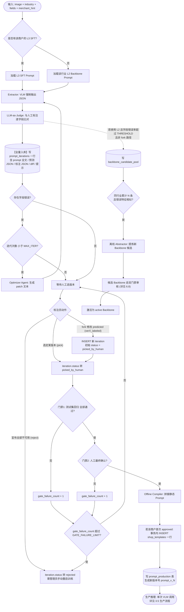
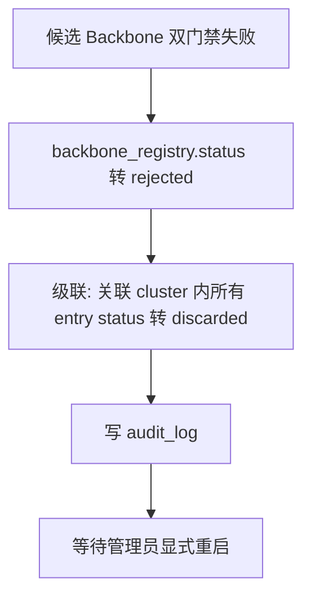
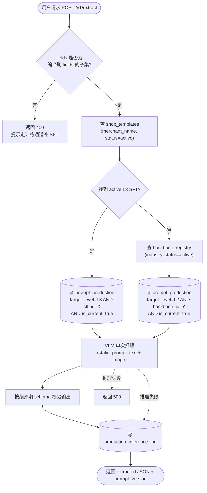
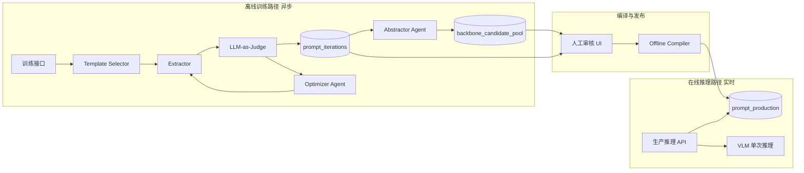
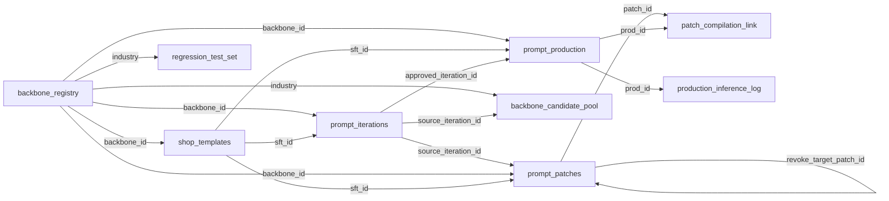
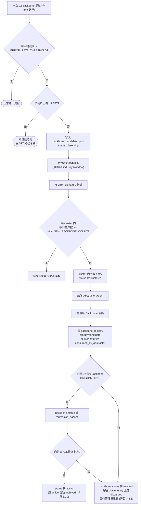
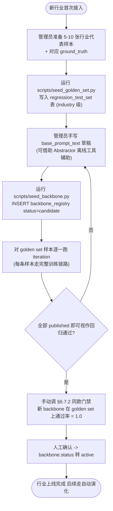
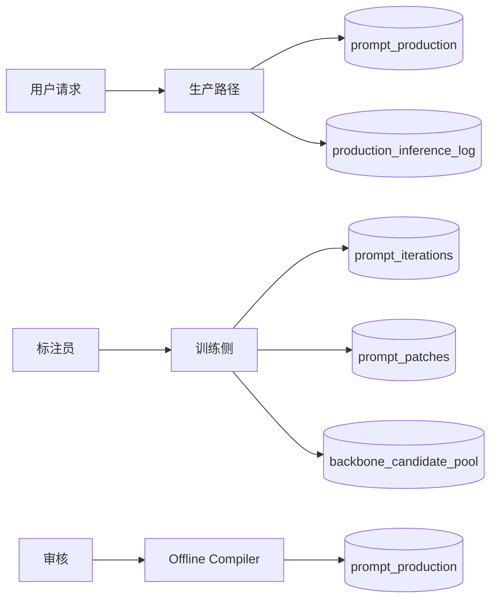
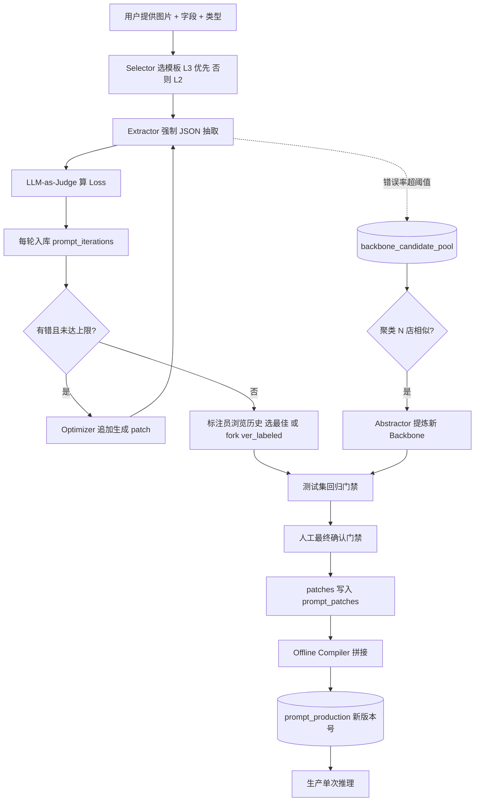

# DESIGN.md

# Schema-Driven Multi-Modal Receipt Extraction System

> 本文档是基于头脑风暴产物的工程实施蓝图。读完本文应能直接动手编码：
> 业务边界明确、数据结构可建表、流程节点可代码化、模块间契约明晰。

---

## 1. Scope 边界与非目标

### 1.1 当前阶段定位

本系统当前阶段为 **测试 / PoC 阶段**，目标是验证「数据库驱动的分层 Prompt 自演化架构」的可行性。

| 维度 | 是否在 Scope 内 |
|---|---|
| 多语言、多来源（扫描 / 截屏 / 随手拍）小票字段抽取 | 是 |
| 用户自定义字段及类型（int/float/str） | 是 |
| L2 行业 Backbone + L3 商户 SFT 双层模板 | 是 |
| 全量迭代版本入库与可追溯性 | 是 |
| LLM-as-Judge 作为 Loss 函数 | 是 |
| 离线编译产出静态 Prompt 进生产 | 是 |
| 前端版本浏览与人工标注闭环 | 是（接口契约层面） |
| **并发性能、吞吐量、延迟优化** | **否** |
| **缓存层（Redis 等）、分布式部署** | **否** |
| **生产环境的 A/B 测试、灰度发布** | **否（仅保留版本号机制以便后续扩展）** |

### 1.2 架构硬约束（不可妥协项）

1. **不存在 L1 全局 Prompt**：本系统没有跨行业共享的 Prompt 前缀。Backbone 是**行业级 (L2)** 概念（如「咖啡厅」「奶茶店」是两套互相独立的 Backbone），SFT 是**商户级 (L3)** 概念。
2. **数据库 Append-Only**：所有 Prompt 演化产物（迭代记录、补丁、人工标注）一律 `INSERT`，不允许 `UPDATE` 或 `DELETE` 业务字段。冲突通过追加 `negative_exclude` 类型补丁解决，绝不删除基础规则。
3. **生产 Prompt 必为静态字符串**：生产推理时不做任何动态拼接、不查数据库、不做多轮反思。生产环境只读取一段编译好的、版本化的静态字符串 Prompt，对模型做单次推理。
4. **双门禁才能进生产**：人工选定最佳版本 → 在独立测试集上全部通过 → 人工最终确认。三件事齐备才允许编译入生产。任何一项缺失都不得入生产。
5. **Backbone 不被单店污染**：单一商户的异常排版、特殊词汇绝不允许直接修改 L2 Backbone。Backbone 的演化必须经过「候选观察池」聚合多店共性后离线提炼。

---

## 2. 业务场景描述

### 2.1 输入与输出

**输入**：

```json
{
  "image_path": "/path/to/receipt.jpg",
  "industry": "coffee",
  "merchant_hint": "Costa",
  "fields": [
    {"name": "date",        "type": "str"},
    {"name": "store_name",  "type": "str"},
    {"name": "item_name",   "type": "str"},
    {"name": "quantity",    "type": "float"},
    {"name": "unit_price",  "type": "float"},
    {"name": "final_price", "type": "float"}
  ]
}
```

- `image_path`：图片路径，支持任意语言、扫描件、截屏、随手拍。
- `industry`：行业标签，由调用方提供（不依赖 Router 自动判定）。
- `merchant_hint`（可选）：商户标识。若数据库存在对应 L3 SFT 则优先使用，否则回退到 L2 Backbone。
- `fields`：用户自定义抽取目标，每项包含字段名 + 数据类型。

**输出**：

```json
{
  "iteration_id": 8821,
  "version_label": "ver3",
  "predicted": {
    "date": "2026-05-08",
    "store_name": "Costa",
    "items": [
      {"item_name": "拿铁", "quantity": 1, "unit_price": 28.5}
    ],
    "final_price": 28.5
  }
}
```

### 2.2 角色与流转关系

| 角色 | 职责 |
|---|---|
| 终端用户 | 提供图片 + 字段定义，调用接口拿到抽取结果 |
| 标注员 | 在前端查看模型迭代历史、修改字段、选择最佳版本（产生 `verX_labeled`） |
| 离线训练系统 | 调度 Optimizer Agent、Abstractor Agent、回归测试、编译器 |
| 审核员 | 对候选 Backbone 与待发布 Prompt 做最终人工签字 |
| 生产推理服务 | 只读取已编译的静态 Prompt，对图片做单次推理 |

### 2.3 核心业务循环（一句话）

> 用户给图 → 系统用现有模板抽 → LLM-as-Judge 比对标注算 Loss → Optimizer 写 patch 重抽 → 每轮入库 → 标注员选最佳版 → 测试集回归 → 人工最终确认 → 离线编译成静态 Prompt → 进生产。

---

## 3. 业务流程

### 3.1 主流程图（含双门禁 + 全量入库）



### 3.2 流程节点契约

| 节点 | 输入 | 输出 | 副作用 |
|---|---|---|---|
| `SelectTpl` | merchant_hint, industry | template_id, prompt_text, dynamic_pydantic_schema | 详见 §4.1 schema 构建职责 |
| `Extract` | image, prompt_text, schema | predicted_json | 调用失败仍写一条 iteration（含 error） |
| `Judge` | predicted_json, ground_truth_json, fields | per_field_verdict[] | 无 |
| `StoreIter` | 上述全部 | iteration_id | **必写** prompt_iterations，附带审计 |
| `Optimizer` | iteration_id, verdict | next_prompt + candidate_patches | 不入 prompt_patches，仅写迭代 hint |
| `HumanAction` | 标注员意图 | pick / fork / reject | 详见 §10.3 |
| `Gate1` | iteration_id, test_set | pass_rate | 写 test_run 日志 |
| `Gate2` | reviewer_id, iteration_id | approved bool | 写 approval 日志 |
| `RejectNode` | iteration_id, reason | iteration.status = rejected | 写 audit_log |
| `Compile` | backbone_text + 所有 approved patches | static_prompt_text | 写 prompt_production + patch_compilation_link |
| `CreateSft` | merchant_name, backbone_id, approved_iteration_id | sft_id | 仅首次 approved 时 INSERT shop_templates |
| `Pool` | iteration_id, error_signature | entry_id | 写 backbone_candidate_pool（仅 L2 推理路径触发） |

### 3.3 关键不变量

- **每一次 Extractor 调用 → 必产生一条 prompt_iterations 记录**，无论对错或异常。
- **Optimizer 产出的 candidate_patches 在人工确认前不入 prompt_patches 表**，只随迭代记录的 `optimizer_hint_text` 字段留痕。
- **未通过 Gate1 + Gate2 的版本绝不进 prompt_production 表**。
- **生产推理只读 prompt_production**，不允许跨表 Join 拼接。
- **fork 路径不触发候选池**（仅模型推理路径触发，见 §6.3）。
- **shop_templates 行只在首次 approved 时由 Compiler 在事务内 INSERT**（详见 §5.3.1）。
- **同 industry 下任意时刻最多只有一条 active Backbone**（详见 §6.10）。
- **iteration 一旦进入 rejected 或 published_to_production，状态不可再变更**（终态）。

### 3.4 流程退出与异常路径

主流程除了正常入生产之外，存在三类显式终态出口，必须在代码中显式处理。

#### 3.4.1 iteration 终态出口

| 终态 | 触发条件 | 副作用 | 重启方式 |
|---|---|---|---|
| `published_to_production` | 双门禁通过且编译完成 | 写 prompt_production 新版本 | 无（成功路径） |
| `rejected` | 标注员主动 reject 或 `gate_failure_count >= GATE_FAILURE_LIMIT` | 写 audit_log；前端隐藏入口（仅管理员可见） | 管理员审阅后通过 `POST /v1/admin/iterations/{id}/restart` 创建一条新的 iteration（`parent_iteration_id` 指向被 reject 的那条），从 pending 重启 |
| `superseded` | 同一 (merchant, backbone) 上有更新版本进入 approved | 自动迁移 | 无需重启 |

`GATE_FAILURE_LIMIT` 写入 `config_thresholds`，默认 3。

#### 3.4.2 backbone_candidate_pool 终态出口

| 终态 | 触发条件 | 副作用 | 重启方式 |
|---|---|---|---|
| `consumed_by_abstractor` | cluster 触发 Abstractor 提炼 | 关联 backbone candidate 创建 | 无 |
| `discarded` | 候选 Backbone 在双门禁失败 **或** 管理员手动废弃 cluster | cluster 内所有样本统一标 `discarded`；不再参与下次聚类 | 管理员通过 `POST /v1/admin/candidate-pool/restart` 显式选定 entry_id 列表，将其 status 重置为 `observing` 并重新聚类 |

不允许自动从 `discarded` 回到 `observing`，避免无限重试垃圾样本。

#### 3.4.3 backbone candidate 失败的级联回滚



> 关键：**rejected/discarded 都是终态**，不会被定时任务自动复活，必须管理员显式触发重启。

### 3.5 生产推理独立流程

生产路径与训练路径**物理隔离**，不共享流程节点。



生产路径硬性约束（区别于训练路径）：

- **不调用** Judge / Optimizer / Compiler / 任何 candidate_pool 写入。
- **不读** prompt_iterations / prompt_patches / backbone_candidate_pool。
- **只读** prompt_production + shop_templates + backbone_registry + config_thresholds。
- **只写** production_inference_log。

---

## 4. 系统模块



| 模块 | 职责 | 输入 | 输出 | 备注 |
|---|---|---|---|---|
| Template Selector | 根据 merchant_hint / industry 选择 L3 SFT 或 L2 Backbone | 调用参数 | template_id + 完整 prompt 文本 | merchant 命中即用 L3，未命中回退 L2 |
| Extractor | 调 VLM 做结构化 JSON 抽取 | image + prompt + Pydantic Schema | predicted_json | 强制 `response_format=schema` |
| LLM-as-Judge | 对预测 JSON 与标注 JSON 做逐字段判定 | predicted, ground_truth, field_types | per_field_verdict[] | 见 §7 |
| Optimizer Agent | 基于 verdict 生成下一轮 prompt 的追加文本 | iteration_id, verdict, image | patch_text + 新一版 prompt | 只追加，不重写 |
| Abstractor Agent | 离线汇总观察池样本，提炼新 Backbone | 候选池中 ≥N 条样本 | 新 Backbone 草稿文本 | 见 §6 |
| Offline Compiler | 拼接 Backbone + 所有 approved patches → 静态字符串 | backbone_id 或 sft_id | static_prompt_text + version_no | 见 §8 |
| Version Control DB | 持久化所有迭代 / 补丁 / 候选 / 生产版本 | 写请求 | 主键 | 见 §5 |
| Approval UI | 人工选最佳版、修改字段、批准 patch、审核候选 Backbone | 浏览操作 | approval / labeled 记录 | 见 §10 |

> **Router 模块**：当前阶段不实现自动行业判定。`industry` 字段由调用方在输入 JSON 中显式提供。后续如果需要，可在 Selector 之前增加一个轻量级 Router；当前不做。

### 4.1 fields -> Pydantic Schema 转换职责

用户输入的 `fields` 是 `[{name, type}]` 的轻量列表，但 Extractor 调 VLM 时需要严格的 Pydantic Schema（驱动 `response_format` 强制结构化输出）。该转换工作的归属：

- **责任方**：`TemplateSelectorService`，在选定模板（L2 或 L3）后，基于 `fields` 动态生成 `DynamicReceiptModel`（Pydantic v2 `create_model`）。
- **不变量**：
  - 转换函数纯函数，相同 `fields` 输入产出结构相同的 Pydantic 类（用于编译期 fields 快照、生产期 fields 校验）。
  - `int` 映射到 `Optional[int]`，`float` 映射到 `Optional[float]`，`str` 映射到 `Optional[str]`；缺失字段统一返回 None。
  - 字段顺序按用户输入顺序保留（影响 schema 序列化结果，进而影响 prompt_production.compiled_fields_snapshot 的 hash 一致性）。
- **不允许**：
  - `ExtractorService` 直接接收 `fields` 列表自己生成 schema（重复职责且容易不一致）。
  - 在编译期跨 Service 二次构造 Pydantic 类（违反职责单一）。
- **示例**：

```python
from pydantic import create_model
from typing import Optional

TYPE_MAP = {"int": Optional[int], "float": Optional[float], "str": Optional[str]}

def build_schema(fields: list[FieldSpec]) -> type:
    field_def = {f.name: (TYPE_MAP[f.type], None) for f in fields}
    return create_model("DynamicReceiptModel", **field_def)
```

> 所有 Pydantic 类用 `create_model` 动态生成，不允许预定义。这样新字段无需改代码即可投产。

---

## 5. 数据结构与数据库设计

### 5.1 表关系总览



> 审计层 `audit_log` 横向关联所有业务表（`target_table` + `target_id`），不在图中展开避免视觉混乱。

### 5.2 表 A：`backbone_registry`（行业 Backbone 注册表）

| 字段 | 类型 | 说明 |
|---|---|---|
| backbone_id | INT PK | 主键 |
| industry | VARCHAR(64) | 行业标签，如 `coffee`、`milktea` |
| backbone_name | VARCHAR(128) | 显示名，如 `coffee_v1`、`coffee_v2` |
| base_prompt_text | TEXT | 该 Backbone 的基础 Prompt 全文 |
| status | ENUM | `candidate` / `active` / `archived` |
| derived_from | INT NULL | 上游 Backbone（如有），用于追溯演化 |
| created_at | DATETIME | |
| activated_at | DATETIME NULL | 通过双门禁后写入 |
| notes | TEXT | 备注 |

**状态机**：`candidate` —(双门禁通过)→ `active` —(被新版本替换)→ `archived`

### 5.3 表 B：`shop_templates`（商户 L3 SFT 模板）

| 字段 | 类型 | 说明 |
|---|---|---|
| sft_id | INT PK | |
| backbone_id | INT FK | 关联的父 Backbone |
| merchant_name | VARCHAR(128) | |
| version_label | VARCHAR(32) | `ver1`、`ver1_labeled`、... |
| status | ENUM | `candidate` / `active` / `archived` |
| created_at | DATETIME | |
| activated_at | DATETIME NULL | |

注意：L3 SFT 的实际 Prompt 内容**不存这里**，而是分散在 `prompt_patches` 表中（patch 集合）。这张表只是「商户存在 L3 模板」这件事的注册项。

#### 5.3.1 INSERT 时机（强约束）

`shop_templates` 行的诞生时机有且只有一种：**当某商户的某条 prompt_iterations 首次进入 `approved` 状态、Compiler 准备执行编译时**，由 Compiler 在同一个数据库事务内 INSERT 一行。

```python
# 伪代码：Compiler 中的事务
with db.transaction():
    if not sft_repo.get_active_by_merchant(merchant_name):
        sft_id = sft_repo.create(
            backbone_id=iteration.backbone_id,
            merchant_name=merchant_name,
            version_label="ver1",
            status="active",
        )
    else:
        sft_id = sft_repo.get_active_by_merchant(merchant_name).sft_id
    # ... 后续 patch 落库 + prompt_production 写入
```

副作用约束：

- 同一 merchant 的二次 approved 不重复 INSERT（已存在 active 行直接复用其 sft_id）。
- INSERT shop_templates 必须与 prompt_patches、prompt_production、patch_compilation_link 在**同一事务**内提交。任意一步失败则整体回滚，**绝不允许出现「shop_templates 已存在但没有任何 patch」的孤儿行**。
- 管理员**不允许**手动通过 SQL 或脚本直接 INSERT shop_templates。冷启动场景见 §6.9。

### 5.4 表 C：`prompt_iterations`（迭代版本明细，全量存储 ★核心表）

每一次 Extractor + Judge 都必产生一条记录。这是系统的「神经元」。

| 字段 | 类型 | 说明 |
|---|---|---|
| iteration_id | BIGINT PK | |
| merchant_name | VARCHAR(128) | |
| backbone_id | INT FK | 本轮使用的 Backbone |
| sft_id | INT FK NULL | 本轮使用的 L3（若回退到 Backbone 则为 NULL） |
| parent_iteration_id | BIGINT FK NULL | 上一轮迭代（用于串成链） |
| version_label | VARCHAR(32) | `ver1`、`ver2`、... 或 `ver3_labeled` |
| prompt_text_full | TEXT | 本轮发给 VLM 的**完整** Prompt |
| image_ref | VARCHAR(512) | 图片路径或对象存储 key |
| predicted_json | JSON | VLM 输出 |
| ground_truth_json | JSON | 人工标注 |
| field_diff_json | JSON | 逐字段 verdict（来自 Judge） |
| optimizer_hint_text | TEXT NULL | Optimizer Agent 生成的下一轮 patch（若本轮非最后一轮） |
| is_human_edited | BOOLEAN | 是否由人工 fork 产生 |
| edited_by | VARCHAR(64) NULL | |
| edited_at | DATETIME NULL | |
| test_set_pass_rate | FLOAT NULL | 在测试集上的通过率（仅在标注员标记为候选后计算） |
| gate_failure_count | INT NOT NULL DEFAULT 0 | Gate1/Gate2 累计失败次数；超过 `GATE_FAILURE_LIMIT` 自动转 rejected |
| status | ENUM | 见状态机 |
| rejected_reason | VARCHAR(64) NULL | rejected 时的原因码：`gate_exhausted` / `human_reject` / `extractor_error` |
| created_at | DATETIME | |
| status_changed_at | DATETIME | 每次状态变更时由 Service 层显式更新，不允许 trigger 自动维护 |

**`status` 枚举**：`pending` / `picked_by_human` / `regression_passed` / `approved` / `published_to_production` / `superseded` / `rejected` / `extractor_error`

**状态机**：

```
pending ──(标注员 pick)──> picked_by_human
   │                              ├──(Gate1 通过)──> regression_passed ──(Gate2 通过)──> approved
   │                              │                                                       └──(Compiler 完成)──> published_to_production [终态]
   │                              ├──(Gate1 失败 且 gate_failure_count < LIMIT)──> picked_by_human (重试)
   │                              ├──(Gate2 失败 且 gate_failure_count < LIMIT)──> picked_by_human (重试)
   │                              ├──(Gate1/Gate2 失败 且 gate_failure_count >= LIMIT)──> rejected [终态]
   │                              └──(标注员主动 reject)──> rejected [终态]
   ├──(标注员 fork)──> 创建新 iteration (status=picked_by_human, parent_iteration_id 指向源)
   ├──(同 target 出现新 published 版本)──> superseded [终态]
   └──(Extractor 调用异常)──> extractor_error [终态]

终态: published_to_production / rejected / superseded / extractor_error
终态不允许再变更. rejected 重启需走 §3.4.1 规定的管理员入口.
```

**`version_label` 命名规则**：

- 模型自动迭代产物：`ver1`、`ver2`、`ver3` ...
- 人工 fork 修改产物：`ver{X}_labeled`（X = 被 fork 的源版本号）
- 同一个 `verX` 可以多次 fork（产生 `verX_labeled_1`、`verX_labeled_2`…），由 Repository 在 INSERT 时根据已有同前缀的最大序号自增。
- fork 行为表现为：插入一条新记录，`parent_iteration_id` 指向源版本，`is_human_edited=true`，**源版本不修改**。fork 出的新记录初始 `status=picked_by_human`，不经过 pending。

### 5.5 表 D：`prompt_patches`（APPEND-only 补丁表 ★核心表）

只有「人工最终确认」后的 patch 才进入这张表。这是真正参与生产 Prompt 编译的素材库。

| 字段 | 类型 | 说明 |
|---|---|---|
| patch_id | BIGINT PK | |
| target_level | ENUM | `L2` / `L3` |
| backbone_id | INT FK | L2 patch 直接关联；L3 patch 关联到该 SFT 所属的 Backbone |
| sft_id | INT FK NULL | 仅 L3 patch 填写 |
| target_field | VARCHAR(64) | 锚定的标准字段名（如 `extra_fee`） |
| patch_type | ENUM | `append_hint` / `negative_exclude` / `format_note` / `revoke_hint` |
| payload | JSONB | 见下方 payload 结构 |
| payload_hash | VARCHAR(64) | payload 序列化后的 SHA-256，用于唯一约束 |
| revoke_target_patch_id | BIGINT FK NULL | 仅 `revoke_hint` 类型填写，指向被撤销的 patch_id |
| source_iteration_id | BIGINT FK | 这条 patch 来自哪一次迭代的 optimizer 提示 |
| approved_by | VARCHAR(64) | |
| approved_at | DATETIME | |

**`payload` 结构按 patch_type 区分**：

| patch_type | payload 结构 | 语义 |
|---|---|---|
| `append_hint` | `{"keywords": ["打包费", "包装服务费"]}` | 引导 VLM 把这些词汇关注到目标字段 |
| `negative_exclude` | `{"keywords": ["会员卡余额"]}` | 警告 VLM 即使图中存在这些词也不能取作字段值 |
| `format_note` | `{"text": "通常出现在订单底部小字"}` | 字段格式或位置提示，自由文本 |
| `revoke_hint` | `{}` | 撤销 `revoke_target_patch_id` 指向的 patch；编译时直接跳过被撤销的 patch |

> 注：编译进了哪个 prompt_production 版本不再记在本表，改由独立的 §5.11 `patch_compilation_link` 关联表记录，保证本表纯 append-only。

**唯一性约束**：

```sql
UNIQUE (target_level, backbone_id, COALESCE(sft_id, -1),
        target_field, patch_type, payload_hash)
```

防止同一条建议被重复入库。

**强约束**：本表只允许 `INSERT`。如需「废弃」某条 patch，通过 `patch_type=revoke_hint` 显式指定 `revoke_target_patch_id`，而非删除原记录。

#### 5.5.1 唯一约束冲突的处理（幂等写入）

Optimizer 在不同 iteration 中可能反复建议出同一条 patch（payload 相同）。Repository 层必须按以下规则处理：

```python
def insert_approved_patch(payload: dict) -> int:
    payload_hash = sha256(canonical_json(payload["payload"]))
    payload["payload_hash"] = payload_hash
    try:
        return db.execute(INSERT INTO prompt_patches ... RETURNING patch_id)
    except UniqueViolation:
        existing = db.execute(
            SELECT patch_id FROM prompt_patches
            WHERE target_level = ... AND backbone_id = ... AND target_field = ...
              AND patch_type = ... AND payload_hash = ...
        ).first()
        # 幂等命中：返回已存在的 patch_id, 不重复 INSERT
        return existing.patch_id
```

副作用：

- 不写入新记录，但**必须**额外写一条 `audit_log`（`action_type=patch_dedup_hit`），记录该建议来自哪个 iteration。
- 不修改已存在记录的任何字段（保持 append-only 不变量）。
- 上层 Service / Workflow **不感知去重**，依然按"创建成功"处理后续逻辑。

### 5.6 表 E：`backbone_candidate_pool`（Backbone 候选观察池 ★核心表）

实现 §6 的 hybrid 触发机制。

| 字段 | 类型 | 说明 |
|---|---|---|
| entry_id | BIGINT PK | |
| industry | VARCHAR(64) | |
| triggering_backbone_id | INT FK | 是哪个 active Backbone 提取失败 |
| source_merchant | VARCHAR(128) | |
| source_iteration_id | BIGINT FK | 失败的那次迭代 |
| image_ref | VARCHAR(512) | |
| error_signature | JSON | 错误特征指纹（哪些字段错、错误类型分布） |
| similarity_cluster_id | INT NULL | 相似度聚类 ID（聚类后由后台任务回填） |
| status | ENUM | `observing` / `clustered` / `consumed_by_abstractor` / `discarded` |
| created_at | DATETIME | |

**触发规则**：

```
INSERT 时机:
  当 prompt_iterations 中某次使用 L2 Backbone 的迭代,
  其 field_diff 中 wrong/partial 字段数 / 总字段数 > ERROR_RATE_THRESHOLD,
  且该商户尚无 L3 SFT 时,
  自动写入候选池.

聚合检查 (后台定时任务):
  对每个 industry, 在 status='observing' 的样本中按 error_signature 聚类,
  当某 cluster 内不同 source_merchant 数量 ≥ MIN_NEW_BACKBONE_COUNT 时,
  cluster 内所有样本 status -> 'clustered',
  触发 Abstractor Agent.
```

### 5.7 表 F：`prompt_production`（生产 Prompt 仓库）

| 字段 | 类型 | 说明 |
|---|---|---|
| prod_id | INT PK | |
| target_level | ENUM | `L2` / `L3` |
| backbone_id | INT FK | |
| sft_id | INT FK NULL | |
| version_no | INT | 同一 target 下递增（prompt_v1, prompt_v2, ...） |
| static_prompt_text | TEXT | **生产唯一读取的字段** |
| static_prompt_hash | VARCHAR(64) | SHA-256 of static_prompt_text，用于编译确定性自检（详见 §8.2.7） |
| compiled_fields_snapshot | JSON | 编译期已知的 fields 清单（[{name, type}]），生产期校验 fields 子集（详见 §9.4） |
| compiled_at | DATETIME | |
| compiled_from_patch_ids | JSON | 编译素材快照（patch_id 数组）；关系查询请走 §5.11 patch_compilation_link |
| approved_iteration_id | BIGINT FK | 触发本次编译的 approved 迭代 |
| is_current | BOOLEAN | 同一 target 下仅一条为 true |

**强约束**：

- 同一 (target_level, backbone_id, sft_id) 组合下，`is_current=true` 的行有且仅有一条。
- 切换 current 时通过事务原子地把旧行设为 false、新行设为 true。
- 旧版本永久保留（用于回滚）。

### 5.8 表 G：`config_thresholds`（可配置参数表）

| key | 默认值 | 说明 |
|---|---|---|
| MAX_ITER | 5 | 单条样本的最大优化迭代次数 |
| ERROR_RATE_THRESHOLD | 0.4 | 触发候选观察池的字段错误率下限 |
| MIN_NEW_BACKBONE_COUNT | 3 | 触发新 Backbone 提炼的最小不同商户数 |
| TEST_SET_PASS_THRESHOLD | 1.0 | 测试集回归门禁的通过率（默认 100%） |
| FLOAT_TOLERANCE | 0.01 | 数值字段判定容差 |
| GATE_FAILURE_LIMIT | 3 | iteration 双门禁累计失败次数上限，超过转 rejected |

阈值集中管理，禁止在代码中硬编码。

### 5.9 表 I：`production_inference_log`（生产推理审计表）

生产路径产出的所有推理记录都写入本表，**与训练侧 prompt_iterations 完全隔离**。

| 字段 | 类型 | 说明 |
|---|---|---|
| log_id | BIGSERIAL PK | |
| prod_id | BIGINT FK | 本次推理使用的 prompt_production 行 |
| prompt_version | VARCHAR(64) | 冗余存储 prompt_v_N，方便审计无 join |
| static_prompt_hash | VARCHAR(64) | 本次推理使用的 prompt 文本 hash |
| target_level | ENUM | `L2` / `L3` |
| backbone_id | INT | |
| sft_id | INT NULL | |
| merchant_name | VARCHAR(128) NULL | |
| industry | VARCHAR(64) | |
| image_ref | VARCHAR(512) | |
| request_fields | JSON | 用户传入的 fields 列表 |
| predicted_json | JSON NULL | VLM 输出（成功时） |
| error_code | VARCHAR(64) NULL | `FIELDS_NOT_IN_COMPILED_PROMPT` / `VLM_TIMEOUT` / `SCHEMA_VALIDATION_FAILED` 等 |
| error_msg | TEXT NULL | |
| latency_ms | INT NULL | 当前阶段不强制采集 |
| created_at | DATETIME | |

**强约束**：

- 本表只允许 INSERT（与 prompt_iterations 同等的 append-only 不变量）。
- 本表**永远不参与训练**：Optimizer / Judge / Abstractor / 候选池都不能读这张表。
- 本表生产推理服务**只写**，不读（debug 工具走单独只读连接）。

### 5.10 表 J：`audit_log`（审计日志表）

所有"会改变系统状态的操作"都必须落审计。

| 字段 | 类型 | 说明 |
|---|---|---|
| audit_id | BIGSERIAL PK | |
| actor | VARCHAR(64) | 操作人；系统操作填 `system` |
| action_type | VARCHAR(64) | 见下方枚举 |
| target_table | VARCHAR(64) | 受影响的表名 |
| target_id | BIGINT | 受影响行的主键（多行操作可重复 INSERT） |
| before_state | JSON NULL | 变更前的关键字段快照 |
| after_state | JSON NULL | 变更后的关键字段快照 |
| metadata | JSON NULL | 自由结构（如 `{"gate": "Gate1", "reason": "..."}`） |
| created_at | DATETIME | |

**`action_type` 必须覆盖以下枚举（不全则违反 §13 第 2 条）**：

```
iteration_status_changed       iteration 状态转换
iteration_auto_rejected        gate_failure_count 超限自动 reject
iteration_human_picked         pick 操作
iteration_human_forked         fork 操作
iteration_human_rejected       人工 reject
iteration_human_corrected_gt   ground_truth 修正
patch_approved                 patch 落入 prompt_patches
patch_dedup_hit                唯一约束冲突幂等命中
patch_type_mismatch            Optimizer 输出与 error_type 不匹配
prompt_compiled                Compiler 完成一次编译
prompt_published               prompt_production 切换 is_current
backbone_archived              旧 active 转 archived
backbone_activated             新 active 上线
backbone_rejected              候选 backbone 失败
cluster_discarded              候选池 cluster 标 discarded
cluster_restarted              管理员重启 cluster
extractor_validation_failed    Pydantic schema 校验失败
production_inference_failed    生产推理失败
```

**强约束**：

- 本表 INSERT-only。
- 任何会触发审计的操作必须**同事务**写入 audit_log，不允许"先改业务表再异步写日志"。

### 5.11 表 H：`patch_compilation_link`（patch 与 production 编译关联表）

替代旧版 `prompt_patches.compiled_into` 字段。N:M 关联，纯 append-only。

| 字段 | 类型 | 说明 |
|---|---|---|
| link_id | BIGSERIAL PK | |
| patch_id | BIGINT FK | 关联 prompt_patches.patch_id |
| prod_id | BIGINT FK | 关联 prompt_production.prod_id |
| compiled_at | DATETIME | 写入 |

**唯一约束**：`UNIQUE (patch_id, prod_id)`

**用途**：

- 追溯：给定 prompt_v_3，查出它由哪些 patch 拼接而成（替代 `prompt_production.compiled_from_patch_ids` JSON 字段做关系查询）。
- 反查：给定一条 patch，查它编译进过哪些 prompt 版本（旧 compiled_into 字段功能）。
- 审计：当某条 prompt_production 出现问题时，可定位到具体 patch_id 与其 source_iteration_id，溯源到具体的标注员审批记录。

**注意**：`prompt_production.compiled_from_patch_ids` JSON 字段保留用于"快照式记录"（即便 patch 表事后被废弃也不影响这条快照），但**关系查询请走本关联表**，不要直接 JSON_PARSE。

---

## 6. Backbone 生成与稳定性机制

### 6.1 设计目标

- Backbone 必须从**多店共性**中提炼，不被任何单店异常污染。
- 单店的特殊排版只走 L3 SFT 路径，不动 Backbone。
- 当现有 Backbone 在多个商户上都失败时，才考虑生成新 Backbone（如 `coffee_v2`）。

### 6.2 Hybrid 触发机制（两层防线）



### 6.3 第一层防线（自动）

- **触发条件**：满足以下三项 AND：
  1. 当前迭代使用的是 L2 Backbone（`sft_id IS NULL`）
  2. 当前迭代由模型推理产生（非 fork、非异常错误）
  3. `field_error_count / total_field_count > ERROR_RATE_THRESHOLD`
  4. **该商户尚未拥有 active L3 SFT**（避免双重路径污染）
- **行为**：写入 `backbone_candidate_pool`，**不立即**做任何修改。
- **不做的事**：不修改 active Backbone、不创建新 Backbone、不影响该商户后续迭代（该商户走自己的 L3 SFT 即可）。

### 6.4 第二层防线（聚合）

- **触发条件**：同一 industry 下，候选池中按 `error_signature` 聚类后，某个 cluster 包含的不同 `source_merchant` 数量 ≥ `MIN_NEW_BACKBONE_COUNT`。
- **`error_signature` 的构造**：
  ```json
  {
    "failed_fields": ["extra_fee", "discount"],
    "error_types": {"extra_fee": "field_omission", "discount": "value_mismatch"},
    "layout_hash": "..."
  }
  ```
  layout_hash 可由轻量 perceptual hash 生成，用于粗略判定排版相似性。
- **聚类方法**：当前阶段用规则匹配（failed_fields 集合相同 + error_types 相同）即可，不需要复杂算法。

### 6.5 Abstractor Agent 工作方式

输入：cluster 内所有样本的（图片 + ground_truth + 现有 Backbone 失败的预测）。

Prompt 概要：

> 你是一个数据洞察专家。我提供了 N 张同行业不同店铺的小票，它们都被现有 Backbone（{base_prompt_text}）提取失败。
> 请跨越个体差异提炼共性：
> 1. 这些图共同的、与现有 Backbone 不同的排版特征是什么？
> 2. 哪些字段的提示词需要新增 / 调整？
> 请输出一份新的 Backbone 草稿，结构对齐现有 Backbone。

输出：新 Backbone 的 `base_prompt_text` 草稿。

写入：`backbone_registry`，`status=candidate`，`derived_from=triggering_backbone_id`。

### 6.6 候选 Backbone 的双门禁

候选 Backbone 必须在「测试集」上跑通才能转 active。测试集来源详见 §6.7。

只有：候选 Backbone 在 cluster 样本上通过率 ≥ 阈值 **且** 在历史成功样本上通过率不下降，才允许人工最终确认转 active。

### 6.7 测试集构造规则

系统中存在两类测试集，必须分别构造、互不混用。

#### 6.7.1 iteration 级回归测试集（Gate1 使用）

**目的**：判断某条 iteration 编译出的 prompt 是否能在历史样本上保持/提升性能。

**构造**（按以下顺序联合，去重）：

1. 该商户的所有历史 `status=published_to_production` 的 iteration（必含）。
2. 同行业当前 `active` Backbone 的"行业 golden set"（见 §6.7.3）。
3. 当前待评估的 iteration 自身（必含，作为 sanity check）。

**通过标准**：

- 该集合上 LLM-as-Judge 的 `overall_correct=true` 比例 >= `TEST_SET_PASS_THRESHOLD`（默认 1.0）。
- 任意原本在生产中通过的样本如果新 prompt 上失败，立即门禁不通过（`is_regression=true`）。

#### 6.7.2 候选 Backbone 测试集（§6.6 使用）

**目的**：候选 Backbone 既要解决新店问题，又不能让老店退化。

**构造**（联合，去重）：

1. 触发本次提炼的 cluster 内所有样本（必含）。
2. `triggering_backbone_id` 关联的所有 `status=published_to_production` 的 iteration（按 backbone 维度，不区分商户）。

**通过标准**：

- cluster 内样本：通过率 >= `TEST_SET_PASS_THRESHOLD`。
- 老 Backbone 的历史样本：通过率 **不下降**（与老 Backbone 在这些样本上的历史通过率比较）。

#### 6.7.3 行业 golden set（管理员手动维护）

为防止冷启动期间没有任何"历史成功样本"导致门禁形同虚设，每个 industry 必须由管理员预先准备 5-10 张代表性图片 + ground_truth，存在表 `regression_test_set`：

| 字段 | 类型 | 说明 |
|---|---|---|
| set_id | BIGSERIAL PK | |
| industry | VARCHAR(64) | |
| backbone_id | INT FK NULL | NULL 表示行业级（任意 backbone 都用），非空表示绑定到特定 backbone 演化分支 |
| image_ref | VARCHAR(512) | |
| ground_truth_json | JSON | |
| created_by | VARCHAR(64) | |
| created_at | DATETIME | |

冷启动时管理员通过 `scripts/seed_golden_set.py` 入库，详见 §6.9。

### 6.8 候选 Backbone 状态机对齐

为与 iteration 状态机对齐（双门禁 + 中间态），扩展 `backbone_registry.status`：

| status | 语义 | 入口 | 出口 |
|---|---|---|---|
| `candidate` | 刚由 Abstractor 生成或管理员 seed | INSERT 时 | -> regression_passed / rejected |
| `regression_passed` | 通过 §6.7.2 测试集回归门禁 | Gate1 通过 | -> active / rejected |
| `active` | 经人工最终确认，正在生产使用 | Gate2 通过；同 industry 旧 active 自动转 archived | -> archived |
| `archived` | 已被新版本替换 | 同 industry 出现新 active 时 | 终态 |
| `rejected` | 双门禁失败或人工废弃 | Gate1/Gate2 失败 / 人工 reject | 终态；级联 cluster 转 discarded |

完整路径：

```
candidate
   ├─(Gate1 测试集回归通过)──> regression_passed
   │                                  ├─(Gate2 人工批准)──> active
   │                                  │                       └─(同 industry 出现新 active)──> archived [终态]
   │                                  └─(Gate2 人工拒绝)──> rejected [终态]
   ├─(Gate1 测试集失败)──> rejected [终态]
   └─(管理员手动废弃)──> rejected [终态]

任一进入 rejected 时:
   级联: 关联 cluster (entry.status=consumed_by_abstractor) -> 全部转 discarded
```

`backbone_registry` 表新增字段：

| 字段 | 类型 | 说明 |
|---|---|---|
| rejected_reason | VARCHAR(64) NULL | `gate_regression_fail` / `gate_human_reject` / `human_discard` |
| triggering_cluster_id | INT NULL | 来自哪个候选池 cluster；rejected 时用于级联回滚 |

### 6.9 冷启动流程（行业首次接入）

行业首次接入时，`backbone_registry` 中没有 active 的该 industry Backbone。系统不允许"凭空走 Backbone 路径"。冷启动必须由管理员显式完成以下步骤：



**关键约束**：

- 冷启动期间**没有任何 L3 SFT**，所有迭代默认走 L2 Backbone 路径，但因为 `status=candidate`，不会被生产读取。
- 冷启动 Backbone 与正常演化 Backbone 共用 `status=candidate -> regression_passed -> active` 状态机（无特殊路径）。
- 管理员如果跳过 §6.9 流程直接 INSERT `backbone_registry.status=active`，会绕过双门禁，**这种行为视为违规**，由代码层禁止（统一通过 `BackboneService.activate(...)` 入口，该入口必检测测试集通过率）。

### 6.10 多版本 Backbone 共存与切换

#### 6.10.1 强约束：同 industry 仅一条 active

`backbone_registry` 上必须维护以下唯一约束（PostgreSQL partial unique index）：

```sql
CREATE UNIQUE INDEX uq_active_backbone_per_industry
ON backbone_registry (industry)
WHERE status = 'active';
```

#### 6.10.2 切换流程（事务内原子操作）

当一个候选 Backbone 通过双门禁准备转 `active` 时：

```python
def activate_backbone(new_backbone_id: int):
    new_bb = backbone_repo.get(new_backbone_id)
    assert new_bb.status == "regression_passed"
    
    with db.transaction():
        # Step 1: 同 industry 旧 active 自动转 archived
        old_active = backbone_repo.get_active_by_industry(new_bb.industry)
        if old_active:
            backbone_repo.set_status(old_active.backbone_id, "archived")
            audit.record("backbone_archived", old=old_active.backbone_id, new=new_backbone_id)
        
        # Step 2: 新 backbone 转 active
        backbone_repo.set_status(new_backbone_id, "active")
        backbone_repo.set_activated_at(new_backbone_id, now())
        
        # Step 3: 触发新 backbone 的初始 Compiler (生成 prompt_v_1)
        compiler.compile_and_publish(
            target_level="L2",
            backbone_id=new_backbone_id,
            sft_id=None,
            approved_iteration_id=new_bb.bootstrap_iteration_id,
        )
```

#### 6.10.3 已有 L3 SFT 的处理

**关键决策**：旧 Backbone 上已有的 active L3 SFT **不强制迁移**到新 Backbone。

- `shop_templates.backbone_id` 指向**老 backbone_id 不变**（外键依然有效，因为 archived backbone 不删）。
- 老店的生产推理路径继续走"L3 SFT (基于老 backbone) -> 编译产物"。
- 新店进来时（无 L3）才落到新 active backbone。
- 这种设计避免了"backbone 升级导致老店瞬间集体失效"的运维风险。

**未来迁移工具**（不在本期 scope）：管理员可通过运维脚本对指定 L3 SFT 重新基于新 Backbone 编译并产生 L3 v2，走双门禁验证后切换。脚本接口预留如下：

```python
# scripts/rebase_sft_to_new_backbone.py
def rebase_sft(sft_id: int, target_backbone_id: int) -> int:
    """重新以 target_backbone_id 为基底, 用该 sft 已有的 L3 patches 编译 prompt 草稿,
    INSERT 一条新 iteration (status=pending), 走双门禁后产生 L3 ver2."""
```

---

## 7. Optimizer Agent 与 LLM-as-Judge Loss

### 7.1 LLM-as-Judge 的必要性

字符串相等无法判定「咖啡」与「咖啡因饮料」的语义错误；embedding 相似度对此类近义异义字段也不可靠。本系统采用 LLM 作为 Loss 函数。

### 7.2 Judge 的输入与输出

**输入**：

```json
{
  "image_ref": "/path/to/image.jpg",
  "fields_spec": [
    {"name": "item_name",   "type": "str"},
    {"name": "quantity",    "type": "float"},
    {"name": "final_price", "type": "float"}
  ],
  "predicted": { ... },
  "ground_truth": { ... }
}
```

**输出（严格 JSON）**：

```json
{
  "overall_correct": false,
  "field_verdicts": [
    {
      "field": "item_name",
      "predicted_value": "咖啡因饮料",
      "ground_truth_value": "咖啡",
      "verdict": "wrong",
      "error_type": "semantic_mismatch",
      "explanation": "图片菜品行写的是'咖啡因饮料'，但用户期望的是品类'咖啡'。需要在 SFT 中追加 hint 让模型把含咖啡因的饮品归一化为'咖啡'。"
    },
    {
      "field": "quantity",
      "predicted_value": 1,
      "ground_truth_value": 1,
      "verdict": "correct",
      "error_type": null,
      "explanation": null
    }
  ]
}
```

### 7.3 按字段类型的判定策略

| 字段类型 | 判定方法 | 备注 |
|---|---|---|
| `int` | 精确相等 | LLM 仅在判 verdict 时确认；不允许「近似正确」 |
| `float` | `abs(pred - gt) <= FLOAT_TOLERANCE` | 容差由 config_thresholds 控制 |
| `str` | LLM 语义判定 | 由 Judge 大模型判语义等价；同义异字算 partial 不算 wrong |

**`verdict` 取值定义**：

- `correct`：完全正确
- `partial`：语义接近但不等价（如「拿铁咖啡」vs「拿铁」），需要追加归一化 hint
- `wrong`：错误（含遗漏 / 多余 / 完全错值）

`error_type` 枚举：`field_omission` / `field_hallucination` / `value_mismatch` / `semantic_mismatch` / `format_error` / `unit_error`。

### 7.4 Judge 的 System Prompt 模板

```
你是一个严格的字段抽取裁判。我会给你：
- 一张小票图片
- 字段规约（每个字段的名称与数据类型）
- 模型预测的 JSON
- 人工标注的真实 JSON

你的任务是逐字段判定预测是否正确，输出严格的 JSON。
判定规则：
- int 类型：必须数值精确相等才算 correct
- float 类型：误差 <= {FLOAT_TOLERANCE} 算 correct
- str 类型：语义等价即 correct；同义异字（如「拿铁咖啡」vs「拿铁」）算 partial；语义错误（如「咖啡」vs「咖啡因饮料」）算 wrong
- 只对预测进行判定，不要自行推测图片中的值

只输出严格符合 schema 的 JSON，不要任何额外说明。
```

### 7.5 Optimizer Agent 工作方式

**输入**：单条 prompt_iterations 记录（含 verdict）+ 该 iteration 使用的 prompt 全文。

**职责**：

1. 分析所有 verdict 不为 `correct` 的字段。
2. 为每个错误字段生成一条候选 patch（`append_hint` 或 `negative_exclude` 或 `format_note`），用 JSON 结构化输出。
3. 把这些 patch **以追加形式**附加到当前 prompt，产出下一版 prompt 全文。

**关键约束**：

- Optimizer **不允许删除或修改** prompt 现有内容，只能追加。
- 如果检测到「现有规则误导」的情况，必须以 `negative_exclude` 形式追加排雷词，而非改写原规则。
- 每条候选 patch 必须锚定一个具体 `target_field`，不允许笼统的「请更仔细一些」之类的无锚提示。

**输出格式（写入 prompt_iterations 的 optimizer_hint_text 字段）**：

```json
{
  "next_prompt_full_text": "...（追加后的完整 prompt）...",
  "candidate_patches": [
    {
      "target_field": "extra_fee",
      "patch_type": "append_hint",
      "payload": ["包装服务费", "环保包装捐献"],
      "rationale": "本次提取漏掉了底部的'包装服务费'。"
    }
  ]
}
```

**`candidate_patches` 不直接入 prompt_patches 表**，只随迭代记录留痕。只有「人工最终确认」该迭代版本时，才把对应 candidate_patches 落入 prompt_patches。

#### 7.5.1 error_type -> patch_type 决策规则

Optimizer 必须按下表为每个错误字段选择 patch_type。规则强制写入 Prompt 中（让 Optimizer 大模型严格遵循），同时在代码层做事后校验：若 LLM 输出的 patch_type 与 error_type 不匹配，则视为 LLM 输出非法，丢弃这条 candidate_patch 并记录到 audit_log。

| Judge 给出的 error_type | 推荐 patch_type | 决策原因 |
|---|---|---|
| `field_omission`（字段被遗漏） | `append_hint` | 把图中真实存在但模型忽略的词汇加入提示词库 |
| `field_hallucination`（无中生有） | `negative_exclude` | 把模型臆造的词汇加入排雷列表 |
| `value_mismatch`（拿错了图中另一处的值） | `negative_exclude` + 可选 `format_note` | 排除干扰词，并补充字段在图中的位置/格式提示 |
| `semantic_mismatch`（语义偏差，如咖啡因饮料 vs 咖啡） | `append_hint` + `format_note` | 用 append_hint 给出归一化目标词，用 format_note 解释归一化规则 |
| `format_error`（格式错，如日期不合规） | `format_note` | 自由文本说明字段格式 |
| `unit_error`（单位错，如把分写成元） | `format_note` | 文本说明单位约束 |

**特殊情况**：

- 当 Optimizer 检测到「现有规则误导」（即上一轮的某条 append_hint 在新场景下导致了错误），输出 `revoke_hint`，并显式填写 `revoke_target_patch_id`（来自历史 patch_id）。
- 多个错误字段并行时，Optimizer 输出多条 `candidate_patches`；每条独立锚定 `target_field`。
- 同一字段同一轮**最多产生一条** `append_hint` 和一条 `negative_exclude`（避免冗余建议爆炸）。

**输出契约校验**（伪代码，由 Optimizer Service 在落库前执行）：

```python
def validate_candidate_patches(verdicts, patches):
    for p in patches:
        v = find_verdict_for_field(verdicts, p["target_field"])
        if v is None:
            raise ValueError("patch 未锚定到有效字段")
        if not is_compatible(v["error_type"], p["patch_type"]):
            audit.record("patch_type_mismatch", patch=p, verdict=v)
            patches.remove(p)
    return patches
```

### 7.6 Extractor 与 Judge 的字段对齐策略

VLM 实际输出可能与用户期望的 fields 不严格一致。需要明确每种偏差的处理。

| 偏差场景 | Extractor 行为 | Judge 行为 |
|---|---|---|
| VLM 输出多了 fields 中没有的字段 | 由 Pydantic Schema 强制 ignore，丢弃多余键 | 不进入 verdict 评估 |
| VLM 缺少 fields 中的字段 | 缺失字段填 None | 视为 `wrong`，error_type=`field_omission` |
| VLM 输出字段类型不符（如 final_price 给了字符串） | Pydantic 严格校验，类型转换失败时**整条迭代标 status=extractor_error** | 不调用 Judge |
| VLM 输出嵌套结构（list 套 dict） | 仅当 fields 中明确定义 `item_name` 等条目级字段时允许；否则视为格式错 | 字段维度逐一比较 list 元素，使用 LCS 匹配 |

**Pydantic 校验失败的处理路径**：

```python
try:
    predicted = DynamicReceiptModel.model_validate_json(vlm_output_str)
except ValidationError as e:
    iteration_repo.insert({
        "status": "extractor_error",
        "predicted_json": {"_error": str(e), "_raw": vlm_output_str},
        "field_diff_json": None,
        ...
    })
    audit.record("extractor_validation_failed", iteration_id=iteration_id)
    return  # 不进入 Judge / Optimizer
```

`extractor_error` 是 iteration 的终态，标注员可在前端看到该状态并触发管理员重启。

---

## 8. APPEND 策略与离线编译

### 8.1 APPEND-only 设计

| 场景 | 处理方式 |
|---|---|
| 该商户出现新的同义词 | INSERT 一条 `append_hint` patch |
| 图片中存在干扰词需要排除作为字段值 | INSERT 一条 `negative_exclude` patch（不改基础规则） |
| 字段格式发生变化 | INSERT 一条 `format_note` patch |
| **某条 patch 被发现是错的（需要撤销之前的 append_hint）** | INSERT 一条 `revoke_hint` patch，`revoke_target_patch_id` 指向被撤销的 patch_id；**禁止用 `negative_exclude` 抵消，因二者语义不同** |
| 某条 negative_exclude 后来被发现是错的 | 同上：INSERT 一条 `revoke_hint` 指向那条 negative_exclude 的 patch_id |

**`negative_exclude` 与 `revoke_hint` 的语义边界**：

- `negative_exclude` 影响**生产 prompt 的内容**（在最终 prompt 中插入"不要把 X 当作字段值"的警告语）。
- `revoke_hint` 只影响**编译过程**（编译时跳过被撤销的 patch_id），**不会**在生产 prompt 里产生任何文字。
- 二者完全独立。混用会导致最终 prompt 自相矛盾。

### 8.2 Offline Compiler 模块详解

#### 8.2.1 输入

```python
def compile(
    target_level: Literal["L2", "L3"],
    backbone_id: int,
    sft_id: Optional[int],
    approved_iteration_id: int,
) -> CompiledPrompt
```

- L2 编译：拼接 `backbone_registry.base_prompt_text` + 该 backbone 下所有 `target_level=L2` 的 approved patches。
- L3 编译：在 L2 编译结果基础上，再追加 `target_level=L3 AND sft_id=该商户` 的 approved patches。

#### 8.2.2 拼接顺序

```
[BASE_PROMPT]
   └── 来自 backbone_registry.base_prompt_text

[L2 PATCHES]
   ├── 按 target_field 分组
   ├── 每组内: append_hint 词汇并集
   ├── 每组内: format_note 顺序追加
   └── 每组末尾: negative_exclude 用警告语包裹

[L3 PATCHES]   仅 L3 编译时存在
   └── 同上，叠加在 L2 之上
```

#### 8.2.3 编译产物示例（片段）

```
... base prompt 内容 ...

【字段 extra_fee 的提示】
重点寻找以下词汇: ['打包费', '配送费', '包装服务费', '环保包装捐献']
格式说明: 通常出现在订单底部小字区域

【字段 final_price 的提示】
重点寻找以下词汇: ['总计', '应付', '本单合计']
【严重警告】对该商户的小票, 即使图片中出现 ['会员卡余额', '充值金额'], 也绝不能将其作为 final_price 提取!
```

#### 8.2.4 触发时机

Offline Compiler **不是按定时任务运行**，而是在以下事件发生时触发：

- 一条 prompt_iterations 走完双门禁、status 变为 `approved` 时，针对该 (backbone_id, sft_id) 编译一次。
- 一个候选 Backbone 被批准激活时，针对该 backbone_id 编译一次（生成新版本号）。

#### 8.2.5 版本号生成规则

```
对每个 (target_level, backbone_id, sft_id) 三元组：
  next_version_no = MAX(version_no) + 1     初始为 1
```

新写入 `prompt_production` 时事务内：

1. 把同三元组下所有旧行 `is_current=false`
2. INSERT 新行 `is_current=true, version_no=next_version_no`
3. 更新被使用的 patches 的 `compiled_into=prompt_v_{next_version_no}`

#### 8.2.6 回滚契约

- 旧版本永不删除。
- 回滚操作 = INSERT 一条新行，`static_prompt_text` 复制自历史版本，`is_current=true`。即「回滚也是一次前进」，保持 append-only。

#### 8.2.7 拼接确定性规则（强约束）

为保证**相同的 (backbone, patches) 集合一定编译出字节级相同的 static_prompt_text**，编译过程必须严格按以下顺序执行，不允许任何依赖时间或随机的逻辑：

```
Step 1: 加载 base_prompt_text 原文不动
Step 2: 加载所有 approved patches (target_level + backbone_id + sft_id 限定)
Step 3: 处理 revoke_hint
        - 收集所有 patch_type=revoke_hint 的 revoke_target_patch_id 集合 R
        - 从 patches 列表中剔除 patch_id ∈ R 的所有项
        - revoke_hint 自身也从 patches 中剔除（不参与文本生成）
Step 4: 按 target_field 字典序分组（A-Z）
Step 5: 每组内按 patch_type 固定顺序排列:
        format_note 先 -> append_hint 次 -> negative_exclude 末
Step 6: 同一 patch_type 内按 patch_id ASC 排序
Step 7: append_hint 的 keywords 取并集后按字典序排序、去重
Step 8: negative_exclude 的 keywords 同 Step 7
Step 9: 拼接成最终字符串, L2 patches 在前, L3 patches 在后
Step 10: 末尾追加固定 footer (含 prompt_version, compiled_at)
Step 11: 计算 SHA-256 写入 prompt_production.static_prompt_hash 字段 (新增)
```

**校验**：

- 编译模块必须对自身做单元测试：相同输入跑 100 次，输出 hash 完全一致。
- 若 hash 在两次编译间出现差异，立即报警（说明拼接逻辑被破坏）。

> **`prompt_production` 表新增字段** `static_prompt_hash VARCHAR(64) NOT NULL`，用于上述校验，DDL 见 §12.10。

### 8.3 生产推理读取

```python
def get_production_prompt(merchant_name: str, industry: str) -> str:
    sft = query_active_sft(merchant_name)
    if sft:
        return query_prompt_production(target_level="L3", sft_id=sft.id, is_current=True).static_prompt_text
    backbone = query_active_backbone(industry)
    return query_prompt_production(target_level="L2", backbone_id=backbone.id, is_current=True).static_prompt_text
```

只读单表单行，**禁止任何 Join 或运行时拼接**。

---

## 9. 生产环境契约

### 9.1 生产路径硬约束

| 项 | 要求 |
|---|---|
| Prompt 来源 | 只能来自 `prompt_production.is_current=true` 的行 |
| Prompt 拼接 | 编译期完成，运行时不允许任何字符串拼接 |
| 推理次数 | 单图单次 VLM 调用，无重试、无反思 |
| 输出格式 | 强制 `response_format = Pydantic Schema` |
| 异常处理 | 推理失败直接返回错误，不在生产路径触发 Optimizer |
| 日志 | 写一条独立的 `production_inference_log`，与训练侧 prompt_iterations 完全隔离 |

### 9.2 训练侧与生产侧隔离



- 生产推理服务**只读** `prompt_production`，不允许访问其他训练侧表。
- 训练侧产生的任何中间产物（迭代、patch、候选）都不能跨界进入生产路径。
- 二者之间唯一桥梁就是 Offline Compiler。

### 9.3 调用接口（草案）

```
POST /v1/extract
{
  "image_path": "...",
  "industry": "coffee",
  "merchant_hint": "Costa",
  "fields": [...]
}

→ 200 OK
{
  "extracted": { ... },
  "prompt_version": "prompt_v_3",
  "model": "vlm-xxx",
  "latency_ms": null    // 当前阶段不强制采集
}
```

### 9.4 生产期 fields 漂移处理

`prompt_production.static_prompt_text` 是基于**编译期已知 fields** 生成的。生产时如果用户传入的 `fields` 与编译期不一致，VLM 不会有对应字段的提示，输出质量无法保证。处理规则：

| 漂移情形 | 处理 |
|---|---|
| 用户 fields 完全 == 编译期 fields | 正常处理 |
| 用户 fields 是编译期 fields 的**严格子集** | 正常处理；输出按子集裁剪后返回（多余字段原样保留也可，由调用方决定丢弃） |
| 用户 fields 包含编译期没有的字段 | **拒绝**：返回 HTTP 400，错误码 `FIELDS_NOT_IN_COMPILED_PROMPT`，提示走训练通道补 SFT |
| 用户 fields 数据类型与编译期不一致（如 `final_price` 编译时是 float，用户传 str） | 同上拒绝 |

校验实现：

```python
def validate_fields_against_production(req_fields: list[FieldSpec], prod: dict) -> None:
    snapshot = prod["compiled_fields_snapshot"]   # [{name, type}]
    snap_map = {f["name"]: f["type"] for f in snapshot}
    for f in req_fields:
        if f.name not in snap_map:
            raise FieldsNotInCompiledPrompt(field=f.name, prompt_version=prod["version_no"])
        if snap_map[f.name] != f.type:
            raise FieldTypeMismatch(field=f.name, expected=snap_map[f.name], got=f.type)
```

校验在 §3.5 流程图的 `ValidateFields` 节点执行，先于查 prompt_production。

---

## 10. 前端展示约束

### 10.1 列表视图（默认）

- 按 `merchant_name` 查询时，**默认只显示最新一条 prompt_iterations**（按 `created_at desc` 取首条）。
- 显示字段：`version_label`、`status`、`is_human_edited`、`test_set_pass_rate`、最近一次错误字段统计。
- 提供「查看历史」入口。

### 10.2 历史视图

- 按 `created_at asc` 列出该商户的所有 iterations。
- 树状或时间线展示，体现 `parent_iteration_id` 链路。
- 每条记录可展开查看：完整 prompt、预测 JSON、标注 JSON、Judge 的 verdict、Optimizer hint。

### 10.3 标注员操作契约

| 操作 | 后端行为 |
|---|---|
| 在某版本上点「标记为最佳」 (pick) | 该 iteration `status` 转 `picked_by_human`；不修改任何 JSON 字段 |
| 修改预测的某字段值 (fork) | **只允许修改 `predicted_json`，绝不允许修改 `ground_truth_json`**。后端 INSERT 一条新 iteration，复制源版本所有字段，仅替换 `predicted_json` 为修改后值；`parent_iteration_id` 指向源版本，`is_human_edited=true`，`version_label = ver{X}_labeled`，初始 `status = picked_by_human`；源版本不变 |
| 修改人工标注 (annotate) | 不允许在 prompt_iterations 内修改。如果发现标注本身错了，需通过单独的 `POST /v1/admin/iterations/{id}/correct-ground-truth` 入口，由管理员级权限执行；该操作会标记原 iteration `status=superseded` 并 INSERT 一条新 iteration（`status=pending`，使用同一张图但带新标注），不影响 patch 表 |
| 触发测试集回归 (Gate1) | 调用回归服务；结果写回该 iteration 的 `test_set_pass_rate`；通过则 `status=regression_passed`；不通过则 `gate_failure_count += 1` |
| 提交人工最终确认 (Gate2) | 仅允许在 `status=regression_passed` 上调用；通过则 `status=approved` 并触发 Offline Compiler；不通过则 `gate_failure_count += 1` 并回到 `picked_by_human` |
| **标记为不可用 (reject)** | 显式将该 iteration `status` 转 `rejected`，写 `rejected_reason='human_reject'`；前端隐藏（仅管理员视图可见） |
| 在候选 Backbone 上点「批准激活」 | 调用 §6.8 的 backbone 双门禁流程；通过则 `backbone_registry.status` 转 `active`；触发该 Backbone 的 Compiler |
| 在 cluster 上点「废弃」 | cluster 内所有 entry status 转 `discarded`，写 audit_log；后续重启需走 §3.4.2 管理员入口 |

**约束补充**：

- 任意 fork 操作都不会触发 `backbone_candidate_pool` 的写入（fork 是人工动作，不是模型推理失败），由 Service 层用 `is_human_edited=true` 短路。
- pick / fork / reject 三种动作之间不互斥，但：同一 iteration 一旦进入 `rejected` / `published_to_production` / `superseded` 终态，所有写操作都被拒绝。

### 10.4 必须在前端可见的字段

- 测试集通过率（数值 + 与上一版的对比）
- 当前 production 版本号（让标注员知道现在生产用的是哪一版）
- 该 iteration 是否已经被某个 prod 版本采纳

---

## 11. 总结

### 11.1 设计总览



### 11.2 设计取舍要点回顾

| 决策点 | 选择 | 原因 |
|---|---|---|
| 是否要 L1 全局 Prompt | 否 | 跨行业语义差异过大，共享前缀只会稀释注意力 |
| 冲突处理 | APPEND + negative_exclude，不 OVERRIDE | 保留基座泛化能力，避免灾难性遗忘 |
| 数据库写入语义 | Append-only，禁 UPDATE/DELETE 业务字段 | 100% 可追溯，零数据丢失 |
| Loss 函数 | LLM-as-Judge | 字符串/embedding 都无法解决语义近义异义 |
| 生产 Prompt 形态 | 静态字符串，单次推理 | 低延迟、高确定性、与训练侧解耦 |
| 进生产门禁 | 测试集 + 人工 双门禁 | 防止单次人工误判直接污染生产 |
| Backbone 演化触发 | Hybrid（自动错误率 + 多店聚合） | 既不被单店污染，又能自动发现真实新模板需求 |
| 迭代版本入库粒度 | Full artifacts（含 prompt 全文 / 预测 / 标注 / diff / hint / 时间戳 / 修改人） | 任何 BadCase 都可完整复盘 |

### 11.3 后续可扩展项（不在当前 Scope）

- Router 模块（自动判定 industry）
- 缓存层 / 高并发部署
- A/B 测试与灰度发布（基于 prompt_production 的 version_no 已可扩展）
- DSPy 全局 Prompt 编译优化器（基于 prompt_iterations 黄金集）
- 跨行业 Prompt 共性挖掘（前提是真的发现共性）

---

**本文档版本**：v2.0  
**对齐基线**：与 Gemini 头脑风暴 + 与 GPT 头脑风暴 + 用户最终决策（APPEND 策略 + Hybrid 触发 + Full artifacts 入库 + 21 项 v2.0 修订）

---

## 12. 工程落地蓝图（可直接指导代码编写）

本章给出“从 0 到可运行”的代码级蓝图，目标是让工程师按章节逐项实现，不需要再做二次架构猜测。

### 12.1 建议技术栈

| 层 | 选型 | 说明 |
|---|---|---|
| API 框架 | Python + FastAPI | 类型约束清晰，方便 Pydantic Schema 驱动 |
| ORM | SQLAlchemy 2.x | 与 append-only 表结构契合 |
| 任务队列 | Celery / RQ（二选一） | 处理离线优化、回归测试、编译 |
| 数据库 | PostgreSQL | JSON 字段、事务能力强 |
| 存储 | 本地文件或对象存储 | 保存图片与调试工件 |
| LLM/VLM SDK | 统一适配层 `ModelGateway` | 屏蔽不同模型供应商差异 |

> 当前阶段不做并发优化，先单实例 + 单数据库跑通闭环。

### 12.2 推荐目录结构

```text
receipt_agent/
  app/
    main.py
    api/
      routes_extract.py
      routes_training.py
      routes_review.py
      routes_admin.py
    domain/
      entities.py
      enums.py
      value_objects.py
    services/
      selector_service.py
      extractor_service.py
      judge_service.py
      optimizer_service.py
      compiler_service.py
      backbone_service.py
      regression_service.py
    repositories/
      backbone_repo.py
      sft_repo.py
      iteration_repo.py
      patch_repo.py
      production_repo.py
      candidate_pool_repo.py
      config_repo.py
    workflows/
      training_workflow.py
      production_workflow.py
      backbone_workflow.py
    tasks/
      optimize_iteration_task.py
      run_regression_task.py
      compile_prompt_task.py
      cluster_candidate_task.py
      abstract_backbone_task.py
    gateways/
      model_gateway.py
      storage_gateway.py
    schemas/
      request_models.py
      response_models.py
      judge_models.py
      optimizer_models.py
    db/
      base.py
      session.py
      models.py
      migrations/
    tests/
      unit/
      integration/
      e2e/
  scripts/
    seed_backbone.py
    replay_iteration.py
  DESIGN.md
```

### 12.3 分层职责与依赖规则

1. `api` 只做入参校验和调用 workflow，不直接操作 repository。  
2. `workflows` 只编排业务顺序，不写 SQL。  
3. `services` 只包含领域逻辑（选择模板、判分、编译等），通过 repository 读写。  
4. `repositories` 只做数据访问，不写业务判断。  
5. `gateways` 负责外部依赖（模型、存储）；领域层不直接调用 SDK。  

依赖方向固定：`api -> workflows -> services -> repositories/gateways`。

### 12.4 关键实体（Python 草案）

```python
from dataclasses import dataclass
from enum import Enum
from typing import Any, Optional

class IterationStatus(str, Enum):
    PENDING = "pending"
    PICKED_BY_HUMAN = "picked_by_human"
    REGRESSION_PASSED = "regression_passed"
    APPROVED = "approved"
    PUBLISHED_TO_PRODUCTION = "published_to_production"
    SUPERSEDED = "superseded"

class PatchType(str, Enum):
    APPEND_HINT = "append_hint"
    NEGATIVE_EXCLUDE = "negative_exclude"
    FORMAT_NOTE = "format_note"

@dataclass
class FieldSpec:
    name: str
    type: str  # int | float | str

@dataclass
class ExtractionRequest:
    image_path: str
    industry: str
    merchant_hint: Optional[str]
    fields: list[FieldSpec]

@dataclass
class IterationRecord:
    iteration_id: int
    merchant_name: str
    backbone_id: int
    sft_id: Optional[int]
    version_label: str
    prompt_text_full: str
    predicted_json: dict[str, Any]
    ground_truth_json: dict[str, Any]
    field_diff_json: dict[str, Any]
    status: IterationStatus
```

### 12.5 Repository 接口定义（先写接口再实现）

```python
from typing import Optional, Sequence

class BackboneRepository:
    def get(self, backbone_id: int) -> dict: ...
    def get_active_by_industry(self, industry: str) -> Optional[dict]: ...
    def insert_candidate(self, industry: str, backbone_name: str,
                         base_prompt_text: str, derived_from: Optional[int],
                         triggering_cluster_id: Optional[int]) -> int: ...
    def set_status(self, backbone_id: int, status: str,
                   rejected_reason: Optional[str] = None) -> None: ...
    def set_activated_at(self, backbone_id: int, ts) -> None: ...

class ShopTemplateRepository:
    def get_active_by_merchant(self, merchant_name: str) -> Optional[dict]: ...
    def create(self, backbone_id: int, merchant_name: str,
               version_label: str, status: str) -> int: ...
    """注意: 严格只在 §5.3.1 时机调用, 不允许业务代码任意 INSERT."""

class IterationRepository:
    def insert(self, payload: dict) -> int: ...
    def insert_extractor_error(self, **kwargs) -> int: ...
    def get(self, iteration_id: int) -> dict: ...
    def list_by_merchant(self, merchant_name: str,
                         limit: int = 50, offset: int = 0) -> Sequence[dict]: ...
    def list_history(self, merchant_name: str) -> Sequence[dict]:
        """按 created_at asc 返回完整链, 含父子关系."""
    def transition(self, iteration_id: int,
                   to_status: str,
                   rejected_reason: Optional[str] = None) -> None:
        """显式状态转换, 内部校验来源状态合法性."""
    def attach_optimizer_hint(self, iteration_id: int, hint: dict) -> None: ...
    def bump_gate_failure(self, iteration_id: int, new_count: int) -> None: ...
    def next_auto_version_label(self, merchant_name: str) -> int: ...
    def next_labeled_version(self, source_label: str) -> str: ...
    def list_published_for_merchant(self, merchant_name: str) -> Sequence[dict]: ...

class PatchRepository:
    def insert_approved_patch(self, payload: dict) -> int:
        """实现 §5.5.1 幂等去重逻辑, 命中则返回已有 patch_id."""
    def list_for_compile(self, target_level: str, backbone_id: int,
                         sft_id: Optional[int]) -> Sequence[dict]:
        """返回应参与编译的 patch 列表 (包含所有类型, 由 Compiler 处理 revoke_hint)."""
    def get(self, patch_id: int) -> dict: ...

class ProductionPromptRepository:
    def get_current(self, target_level: str, backbone_id: int,
                    sft_id: Optional[int]) -> Optional[dict]: ...
    def insert_new_current(self, payload: dict) -> int:
        """事务内: unset 旧 current + insert 新 current."""
    def list_versions(self, target_level: str, backbone_id: int,
                      sft_id: Optional[int]) -> Sequence[dict]: ...

class CandidatePoolRepository:
    def insert_entry(self, payload: dict) -> int: ...
    def list_observing(self, industry: str) -> Sequence[dict]: ...
    def cluster_and_mark(self, industry: str,
                         min_shop_count: int) -> list[int]:
        """返回新生成的 cluster_id 列表; 同时把 entries 标 clustered."""
    def discard_cluster(self, cluster_id: int) -> None: ...
    def restart_entries(self, entry_ids: list[int], by: str) -> None:
        """管理员重启: discarded -> observing."""

class ConfigRepository:
    def get_int(self, key: str) -> int: ...
    def get_float(self, key: str) -> float: ...
    def set(self, key: str, value, by: str) -> None: ...

class AuditLogRepository:
    def record(self, action_type: str, target_table: str,
               target_id: int, actor: str = "system",
               before: dict = None, after: dict = None,
               metadata: dict = None) -> int: ...

class PatchCompilationLinkRepository:
    def insert_links(self, prod_id: int, patch_ids: list[int]) -> None: ...
    def list_patches_for_prod(self, prod_id: int) -> Sequence[int]: ...
    def list_prods_for_patch(self, patch_id: int) -> Sequence[int]: ...

class ProductionInferenceLogRepository:
    def insert(self, payload: dict) -> int: ...
    """生产推理唯一可写表; 仅 ProductionWorkflow 可调用."""

class RegressionTestSetRepository:
    def list_for_industry(self, industry: str,
                          backbone_id: Optional[int] = None) -> Sequence[dict]: ...
    def insert(self, payload: dict) -> int: ...

class AsyncTaskRunsRepository:
    def get_by_key(self, task_name: str, key: str) -> Optional[dict]: ...
    def mark_started(self, task_name: str, key: str) -> int: ...
    def mark_completed(self, run_id: int, result: dict) -> None: ...
    def mark_failed(self, run_id: int, error_msg: str) -> None: ...
```

### 12.6 Service 方法签名（代码骨架）

```python
class TemplateSelectorService:
    def choose(self, industry: str, merchant_hint: str | None,
               fields: list[FieldSpec]) -> dict:
        """返回 {target_level, backbone_id, sft_id, prompt_text, dynamic_pydantic_schema}.
        schema 由 §4.1 build_schema(fields) 生成, 不许下游再造."""

class ExtractorService:
    def extract(self, image_path: str, prompt_text: str,
                pydantic_schema: type) -> dict:
        """调用 VLM 并强制结构化输出.
        schema 校验失败抛 ValidationError, 调用方据此写 extractor_error."""

class JudgeService:
    def judge(self, image_path: str, fields: list[FieldSpec],
              predicted: dict, ground_truth: dict) -> dict:
        """返回 overall_correct + field_verdicts. 按 §7.3 类型策略."""

class OptimizerService:
    def propose_next(self, current_prompt: str, judge_result: dict,
                     image_path: str) -> dict:
        """返回 next_prompt_full_text + candidate_patches.
        内部按 §7.5.1 决策表选 patch_type, 并对输出做事后校验."""

class CompilerService:
    def compile_and_publish(self, target_level: str, backbone_id: int,
                            sft_id: int | None,
                            approved_iteration_id: int) -> dict:
        """事务内执行: 拼接 (按 §8.2.7 确定性顺序) -> 计算 hash ->
        写 prompt_production -> 写 patch_compilation_link ->
        必要时 INSERT shop_templates -> iteration 转 published_to_production ->
        审计."""

class CandidatePoolService:
    def maybe_add_pool_entry(self, iteration: dict,
                             threshold: float) -> Optional[int]:
        """按 §6.3 条件判断后入池 (含 sft 存在性二次检查), 返回 entry_id 或 None."""
    def cluster_and_maybe_trigger_abstractor(self, industry: str,
                                             min_shop_count: int) -> list[int]:
        """周期任务调用; 返回触发的 cluster_id 列表."""
    def discard_cluster(self, cluster_id: int, reason: str, by: str) -> None: ...
    def admin_restart(self, entry_ids: list[int], by: str) -> None: ...

class BackboneService:
    def seed_candidate(self, industry: str, base_prompt_text: str,
                       by: str) -> int:
        """冷启动入口, 详见 §6.9."""
    def submit_for_regression(self, backbone_id: int) -> dict:
        """跑 §6.7.2 测试集, 通过则转 regression_passed."""
    def activate(self, backbone_id: int, by: str) -> dict:
        """§6.10.2 切换流程, 事务内归档旧 active + 编译新版本."""
    def reject(self, backbone_id: int, reason: str, by: str) -> None:
        """级联 cluster -> discarded, 写审计."""

class RegressionService:
    def run_for_iteration(self, iteration_id: int) -> dict:
        """构造测试集 (§6.7.1), 跑 LLM-as-Judge, 写回 test_set_pass_rate."""
    def run_for_backbone(self, backbone_id: int) -> dict:
        """构造测试集 (§6.7.2), 同上."""

class AuditService:
    def record(self, action_type: str, target_table: str, target_id: int,
               actor: str = "system", before: dict = None, after: dict = None,
               metadata: dict = None) -> None: ...
    """统一入口; 业务代码不允许直接写 audit_log_repo."""

class ProductionInferenceService:
    def extract(self, req: ExtractionRequest) -> dict:
        """生产路径; 详见 §3.5 + §9.4. 严禁调用 Judge/Optimizer/Compiler."""
```

### 12.7 API 合同（可直接建路由）

#### 12.7.1 在线抽取 API

`POST /v1/extract`

请求：

```json
{
  "image_path": "s3://bucket/receipt-1.jpg",
  "industry": "coffee",
  "merchant_hint": "Costa",
  "fields": [
    {"name": "date", "type": "str"},
    {"name": "final_price", "type": "float"}
  ]
}
```

响应：

```json
{
  "extracted": {"date": "2026-05-01", "final_price": 32.0},
  "prompt_version": "prompt_v_3",
  "target_level": "L3",
  "target_id": 101
}
```

#### 12.7.2 训练入口 API

`POST /v1/training/iterations/run`

用途：对单条标注样本触发一轮“提取->判分->入库->可选优化重试”。

#### 12.7.3 标注操作 API

- `POST /v1/review/iterations/{id}/pick`
- `POST /v1/review/iterations/{id}/fork-labeled`
- `POST /v1/review/iterations/{id}/run-regression`
- `POST /v1/review/iterations/{id}/approve`

#### 12.7.4 Backbone 候选 API

- `GET /v1/admin/backbone-candidates`
- `POST /v1/admin/backbone-candidates/{backbone_id}/approve`
- `POST /v1/admin/backbone-candidates/{backbone_id}/reject`

### 12.8 训练主流程伪代码（可直接翻译为 workflow）

```python
def run_training_iteration(
    req: ExtractionRequest,
    ground_truth: dict,
    max_iter: int,
) -> int:
    """模型推理路径的训练循环. fork 路径不走这里, 由前端 review API 直接 INSERT iteration."""
    tpl = selector.choose(req.industry, req.merchant_hint)
    prompt_text = tpl["prompt_text"]
    schema = tpl["dynamic_pydantic_schema"]
    parent_id = None
    version_no = iteration_repo.next_auto_version_label(req.merchant_hint)

    for _ in range(max_iter):
        try:
            predicted = extractor.extract(req.image_path, prompt_text, schema)
        except ValidationError as e:
            iteration_repo.insert_extractor_error(
                merchant_name=req.merchant_hint or "",
                backbone_id=tpl["backbone_id"],
                sft_id=tpl["sft_id"],
                parent_iteration_id=parent_id,
                prompt_text_full=prompt_text,
                image_ref=req.image_path,
                error=str(e),
            )
            return  # 终态: extractor_error
        
        judge_result = judge.judge(req.image_path, req.fields, predicted, ground_truth)

        iteration_id = iteration_repo.insert({
            "merchant_name": req.merchant_hint or "",
            "backbone_id": tpl["backbone_id"],
            "sft_id": tpl["sft_id"],
            "parent_iteration_id": parent_id,
            "version_label": f"ver{version_no}",
            "prompt_text_full": prompt_text,
            "image_ref": req.image_path,
            "predicted_json": predicted,
            "ground_truth_json": ground_truth,
            "field_diff_json": judge_result,
            "is_human_edited": False,
            "status": IterationStatus.PENDING,
            "gate_failure_count": 0,
        })

        # 仅当 sft_id is None (走 L2) 且 is_human_edited=False (非 fork) 时考虑入池
        # 由 maybe_add_pool_entry 内部再做错误率与 SFT 存在性二次判断 (见 §6.3)
        candidate_pool_service.maybe_add_pool_entry(
            iteration_repo.get(iteration_id),
            threshold=config.get_float("ERROR_RATE_THRESHOLD"),
        )

        if judge_result["overall_correct"]:
            return iteration_id

        opt = optimizer.propose_next(prompt_text, judge_result, req.image_path)
        iteration_repo.attach_optimizer_hint(iteration_id, opt)
        prompt_text = opt["next_prompt_full_text"]
        parent_id = iteration_id
        version_no += 1

    return iteration_id


def fork_iteration_by_human(
    source_iteration_id: int,
    edited_predicted: dict,
    editor: str,
) -> int:
    """fork 路径: 由 POST /v1/review/iterations/{id}/fork-labeled 调用.
    显式不调用 candidate_pool_service, 不调用 judge / optimizer."""
    src = iteration_repo.get(source_iteration_id)
    if src["status"] in TERMINAL_STATES:
        raise IterationFinalError(source_iteration_id, src["status"])
    
    new_label = iteration_repo.next_labeled_version(src["version_label"])
    return iteration_repo.insert({
        **src,
        "iteration_id": None,           # 让 DB 重新分配
        "parent_iteration_id": source_iteration_id,
        "version_label": new_label,     # 例: ver3_labeled / ver3_labeled_2
        "predicted_json": edited_predicted,   # 唯一被替换的字段
        "is_human_edited": True,
        "edited_by": editor,
        "edited_at": now(),
        "status": IterationStatus.PICKED_BY_HUMAN,
        "gate_failure_count": 0,
    })


def handle_gate_failure(iteration_id: int, gate: str) -> None:
    """Gate1/Gate2 失败的统一处理路径."""
    iter = iteration_repo.get(iteration_id)
    new_count = iter["gate_failure_count"] + 1
    
    if new_count >= config.get_int("GATE_FAILURE_LIMIT"):
        iteration_repo.transition(
            iteration_id, to_status=IterationStatus.REJECTED,
            rejected_reason="gate_exhausted",
        )
        audit.record("iteration_auto_rejected", iteration_id=iteration_id, gate=gate)
    else:
        iteration_repo.bump_gate_failure(iteration_id, new_count)
        iteration_repo.transition(iteration_id, to_status=IterationStatus.PICKED_BY_HUMAN)
```

### 12.9 编译发布伪代码（事务保证）

```python
def compile_and_publish(target_level: str, backbone_id: int, sft_id: int | None, approved_iteration_id: int):
    base = backbone_repo.get(backbone_id)["base_prompt_text"]
    patches = patch_repo.list_for_compile(target_level, backbone_id, sft_id)
    static_prompt = compile_prompt(base, patches)
    current = prod_repo.get_current(target_level, backbone_id, sft_id)
    next_version = 1 if current is None else current["version_no"] + 1

    with db.transaction():
        prod_repo.unset_current(target_level, backbone_id, sft_id)
        prod_id = prod_repo.insert_new_current({
            "target_level": target_level,
            "backbone_id": backbone_id,
            "sft_id": sft_id,
            "version_no": next_version,
            "static_prompt_text": static_prompt,
            "compiled_from_patch_ids": [p["patch_id"] for p in patches],
            "approved_iteration_id": approved_iteration_id,
            "is_current": True,
        })
        iteration_repo.update_status(approved_iteration_id, "published_to_production")
    return {"prod_id": prod_id, "version_no": next_version}
```

### 12.10 PostgreSQL DDL 初稿（核心表）

```sql
CREATE TABLE prompt_iterations (
  iteration_id BIGSERIAL PRIMARY KEY,
  merchant_name VARCHAR(128) NOT NULL,
  backbone_id INT NOT NULL,
  sft_id INT NULL,
  parent_iteration_id BIGINT NULL,
  version_label VARCHAR(32) NOT NULL,
  prompt_text_full TEXT NOT NULL,
  image_ref VARCHAR(512) NOT NULL,
  predicted_json JSONB NOT NULL,
  ground_truth_json JSONB NOT NULL,
  field_diff_json JSONB NOT NULL,
  optimizer_hint_text TEXT NULL,
  is_human_edited BOOLEAN NOT NULL DEFAULT FALSE,
  edited_by VARCHAR(64) NULL,
  edited_at TIMESTAMP NULL,
  test_set_pass_rate DOUBLE PRECISION NULL,
  status VARCHAR(32) NOT NULL,
  created_at TIMESTAMP NOT NULL DEFAULT NOW()
);

CREATE INDEX idx_prompt_iterations_merchant_created
  ON prompt_iterations (merchant_name, created_at DESC);

CREATE TABLE prompt_patches (
  patch_id BIGSERIAL PRIMARY KEY,
  target_level VARCHAR(8) NOT NULL,
  backbone_id INT NOT NULL,
  sft_id INT NULL,
  target_field VARCHAR(64) NOT NULL,
  patch_type VARCHAR(32) NOT NULL,
  payload JSONB NOT NULL,
  payload_hash VARCHAR(64) NOT NULL,
  source_iteration_id BIGINT NOT NULL,
  approved_by VARCHAR(64) NOT NULL,
  approved_at TIMESTAMP NOT NULL DEFAULT NOW(),
  compiled_into VARCHAR(64) NULL
);

CREATE UNIQUE INDEX uq_patch_dedup
ON prompt_patches (target_level, backbone_id, COALESCE(sft_id, -1), target_field, patch_type, payload_hash);

CREATE TABLE prompt_production (
  prod_id BIGSERIAL PRIMARY KEY,
  target_level VARCHAR(8) NOT NULL,
  backbone_id INT NOT NULL,
  sft_id INT NULL,
  version_no INT NOT NULL,
  static_prompt_text TEXT NOT NULL,
  static_prompt_hash VARCHAR(64) NOT NULL,
  compiled_fields_snapshot JSONB NOT NULL,
  compiled_at TIMESTAMP NOT NULL DEFAULT NOW(),
  compiled_from_patch_ids JSONB NOT NULL,
  approved_iteration_id BIGINT NOT NULL,
  is_current BOOLEAN NOT NULL
);

CREATE UNIQUE INDEX uq_prod_version
  ON prompt_production (target_level, backbone_id, COALESCE(sft_id, -1), version_no);

CREATE UNIQUE INDEX uq_prod_approved_iter
  ON prompt_production (approved_iteration_id);

CREATE UNIQUE INDEX uq_active_backbone_per_industry
  ON backbone_registry (industry)
  WHERE status = 'active';

CREATE TABLE patch_compilation_link (
  link_id BIGSERIAL PRIMARY KEY,
  patch_id BIGINT NOT NULL REFERENCES prompt_patches(patch_id),
  prod_id BIGINT NOT NULL REFERENCES prompt_production(prod_id),
  compiled_at TIMESTAMP NOT NULL DEFAULT NOW()
);

CREATE UNIQUE INDEX uq_patch_compilation_link
  ON patch_compilation_link (patch_id, prod_id);

CREATE TABLE production_inference_log (
  log_id BIGSERIAL PRIMARY KEY,
  prod_id BIGINT NOT NULL,
  prompt_version VARCHAR(64) NOT NULL,
  static_prompt_hash VARCHAR(64) NOT NULL,
  target_level VARCHAR(8) NOT NULL,
  backbone_id INT NOT NULL,
  sft_id INT NULL,
  merchant_name VARCHAR(128) NULL,
  industry VARCHAR(64) NOT NULL,
  image_ref VARCHAR(512) NOT NULL,
  request_fields JSONB NOT NULL,
  predicted_json JSONB NULL,
  error_code VARCHAR(64) NULL,
  error_msg TEXT NULL,
  latency_ms INT NULL,
  created_at TIMESTAMP NOT NULL DEFAULT NOW()
);

CREATE INDEX idx_prod_log_prod ON production_inference_log (prod_id, created_at DESC);

CREATE TABLE audit_log (
  audit_id BIGSERIAL PRIMARY KEY,
  actor VARCHAR(64) NOT NULL,
  action_type VARCHAR(64) NOT NULL,
  target_table VARCHAR(64) NOT NULL,
  target_id BIGINT NOT NULL,
  before_state JSONB NULL,
  after_state JSONB NULL,
  metadata JSONB NULL,
  created_at TIMESTAMP NOT NULL DEFAULT NOW()
);

CREATE INDEX idx_audit_target ON audit_log (target_table, target_id, created_at DESC);

CREATE TABLE regression_test_set (
  set_id BIGSERIAL PRIMARY KEY,
  industry VARCHAR(64) NOT NULL,
  backbone_id INT NULL,
  image_ref VARCHAR(512) NOT NULL,
  ground_truth_json JSONB NOT NULL,
  created_by VARCHAR(64) NOT NULL,
  created_at TIMESTAMP NOT NULL DEFAULT NOW()
);

CREATE TABLE async_task_runs (
  run_id BIGSERIAL PRIMARY KEY,
  task_name VARCHAR(64) NOT NULL,
  idempotency_key VARCHAR(255) NOT NULL,
  status VARCHAR(16) NOT NULL,
  result_json JSONB NULL,
  error_msg TEXT NULL,
  started_at TIMESTAMP NOT NULL DEFAULT NOW(),
  finished_at TIMESTAMP NULL
);

CREATE UNIQUE INDEX uq_task_key ON async_task_runs (task_name, idempotency_key);
```

### 12.11 异步任务编排（任务清单）

| 任务 | 触发时机 | 输入 | 输出 |
|---|---|---|---|
| `optimize_iteration_task` | 训练 API 调用后 | `iteration_id` | 下一轮迭代记录 |
| `run_regression_task` | 标注员点“测试集回归” | `iteration_id` | pass_rate + regression report |
| `compile_prompt_task` | 迭代 `approved` | `approved_iteration_id` | 新 `prompt_production` 版本 |
| `cluster_candidate_task` | 定时（如每 10 分钟） | `industry` | cluster 结果 |
| `abstract_backbone_task` | cluster 达阈值 | cluster_id | backbone candidate 草稿 |

### 12.12 测试策略（必须先写）

#### 单元测试

1. `TemplateSelectorService`：有 L3 时命中 L3，无 L3 回退 L2。  
2. `JudgeService`：`int/float/str` 判定逻辑与容差正确。  
3. `CompilerService`：patch 合并顺序稳定、negative_exclude 不丢失。  

#### 集成测试

1. 一条训练样本触发多轮迭代并全部入库。  
2. `verX_labeled` fork 后源版本不被改写。  
3. 双门禁前无法发布生产 prompt。  

#### E2E 测试

1. 从上传图+标注到 `published_to_production` 全链路。  
2. 新商户冷启动：无 L3 时先用 L2，后续人工确认后生成 L3 并发布。  
3. 候选池累计 N 商户后触发 Backbone candidate 生成。  

### 12.13 里程碑（按周交付）

| 里程碑 | 目标 | 可验收标准 |
|---|---|---|
| M1 | 数据模型 + Repository | 所有核心表可迁移，CRUD 跑通 |
| M2 | 训练闭环 | 一条样本可多轮迭代入库并生成 verdict |
| M3 | 人工审核闭环 | pick/fork/regression/approve 全流程可操作 |
| M4 | 编译发布 | `prompt_production` 版本递增，在线抽取读取 current |
| M5 | Backbone 演化 | 候选池聚合 + abstractor 触发链路跑通 |

### 12.14 第一批必须实现的代码文件（启动清单）

1. `app/db/models.py`：所有表模型定义。  
2. `app/repositories/iteration_repo.py`：迭代入库与状态流转。  
3. `app/services/selector_service.py`：L3/L2 选择。  
4. `app/services/extractor_service.py`：VLM 抽取封装。  
5. `app/services/judge_service.py`：LLM-as-Judge 封装。  
6. `app/services/optimizer_service.py`：patch 生成。  
7. `app/workflows/training_workflow.py`：训练循环编排。  
8. `app/services/compiler_service.py`：离线编译。  
9. `app/api/routes_training.py`：训练入口。  
10. `app/api/routes_extract.py`：生产推理入口。  

### 12.15 异步任务幂等性策略

所有后台任务必须支持幂等重试（崩溃 / 网络抖动 / 重启场景）。

| 任务 | 幂等键设计 | 实现要点 |
|---|---|---|
| `optimize_iteration_task` | `iteration_id` | 一条 iteration 只能 attach 一次 optimizer_hint；二次调用直接读已有 hint 返回 |
| `run_regression_task` | `(iteration_id, test_set_version)` | 同一 iteration 在同一 golden set 版本下只跑一次；幂等键命中则返回缓存结果 |
| `compile_prompt_task` | `approved_iteration_id` | 给 prompt_production 的 INSERT 加唯一索引 `(approved_iteration_id)`，二次触发幂等命中已发布版本 |
| `cluster_candidate_task` | `(industry, time_window_id)` | 时间窗口分桶（如每 10 分钟一桶），同桶内重复执行 SELECT-FOR-UPDATE 锁住 observing 行 |
| `abstract_backbone_task` | `cluster_id` | cluster 一旦被 consumed 即不可重复；状态由 clustered -> consumed_by_abstractor 转换原子 |

#### 任务通用约束

```python
class IdempotentTask:
    def idempotency_key(self, payload: dict) -> str: ...
    def has_completed(self, key: str) -> bool: ...   # 查任务表
    def mark_started(self, key: str) -> None: ...
    def mark_completed(self, key: str, result: dict) -> None: ...

    def execute(self, payload: dict):
        key = self.idempotency_key(payload)
        if self.has_completed(key):
            return self.fetch_result(key)
        try:
            self.mark_started(key)
            result = self.do_work(payload)
            self.mark_completed(key, result)
            return result
        except Exception as e:
            self.mark_failed(key, str(e))
            raise
```

需新增表 `async_task_runs`：

| 字段 | 类型 | 说明 |
|---|---|---|
| run_id | BIGSERIAL PK | |
| task_name | VARCHAR(64) | |
| idempotency_key | VARCHAR(255) | UNIQUE |
| status | ENUM | `started` / `completed` / `failed` |
| result_json | JSON NULL | |
| error_msg | TEXT NULL | |
| started_at | DATETIME | |
| finished_at | DATETIME NULL | |

`UNIQUE(task_name, idempotency_key)` 保证同一逻辑任务永远只成功一次。

---

## 13. 代码编写原则（针对本项目）

1. 所有状态流转必须通过显式函数（如 `iteration_repo.transition`），禁止在代码各处「顺手改 status」。
2. 任何会影响生产 prompt 的操作必须写审计日志（谁、何时、从哪版到哪版），统一通过 `AuditService.record(...)`。
3. 任何模型输出落库前都做 schema 校验（Pydantic v2），校验失败按 §7.6 进入 `extractor_error` 终态，不写脏数据。
4. 生产路径禁止调用 Optimizer / Judge / Compiler / 候选池写入。
5. 运行时禁止 prompt 动态拼接（仅允许读取 `prompt_production` 当前版本）。
6. 所有异步任务必须实现 §12.15 的幂等键模式，崩溃重启不允许产生重复副作用。
7. 所有显式终态（`rejected` / `superseded` / `published_to_production` / `extractor_error` / `archived` / `discarded`）一旦写入，禁止再修改业务字段；重启都需走管理员入口（§3.4）。
8. APPEND-only 不变量：`prompt_patches`、`prompt_iterations`、`audit_log`、`production_inference_log`、`patch_compilation_link` 五张表绝不允许 UPDATE / DELETE 业务字段。
9. 所有 patch 的"撤销"统一通过 `revoke_hint`，不允许 DELETE 也不允许用 `negative_exclude` 抵消。
10. 所有 SQL 通过 Repository 层访问；Service 层不允许直接写 SQL；API 层不允许跨过 Workflow 直接调用 Repository。

---

## 14. 变更日志（Document Changelog）

| 版本 | 日期 | 主要变更 |
|---|---|---|
| v1.0 | 2026-05-08 | 初版，覆盖业务流程、模块、数据库设计、Optimizer / Judge 基础架构 |
| v1.1 | 2026-05-08 | 新增 §12 工程蓝图、§13 编码原则；从"架构说明"升级为"可指导编码"的工程文档 |
| v2.0 | 2026-05-08 | 21 项 v2.0 修订：补齐 6 项 Critical（流程退出、生产路径独立流程图、patch 唯一冲突、shop_templates 创建时机、Optimizer patch_type 决策）、9 项 Important（compiled_into 改 N:M 表、revoke_hint 语义、fork 语义、测试集构造、状态机对齐、fields→Schema 责任、Judge 对齐、冷启动、多版本 Backbone 切换）、6 项 Minor（边方向、fields 漂移、fork 不入池、production_inference_log、audit_log、任务幂等性）|

### v2.0 关键改动详单

#### 流程层
- §3.1 主流程图重画：错误率边的源头从 `Extract` 改到 `Judge`；新增 fork 显式节点；新增 `Reject` 出口；新增 `gate_failure_count` 计数与 `GATE_FAILURE_LIMIT` 触发条件
- §3.4 新增"流程退出与异常路径"
- §3.5 新增"生产推理独立流程图"（与训练完全解耦）
- §6.2 cluster 失败回退路径改为 `discarded`（不重试，需管理员显式重启）

#### 数据层
- §5.4 prompt_iterations 新增 `gate_failure_count` / `rejected_reason` / `status_changed_at` 字段；状态机加 `rejected` / `extractor_error` 终态
- §5.5 prompt_patches 删除 `compiled_into` 字段、加 `revoke_hint` patch_type、加 `revoke_target_patch_id` 字段；新增 §5.5.1 唯一约束冲突的幂等写入策略
- §5.7 prompt_production 新增 `static_prompt_hash` / `compiled_fields_snapshot` 字段
- §5.9 新增 `production_inference_log` 表
- §5.10 新增 `audit_log` 表
- §5.11 新增 `patch_compilation_link` 表（替代旧 compiled_into）
- §5.8 config 新增 `GATE_FAILURE_LIMIT`
- §6.7 新增 `regression_test_set` 表（行业 golden set）
- §12.15 新增 `async_task_runs` 表

#### 算法层
- §6.3 一层防线条件细化（含 sft 存在性、is_human_edited 短路）
- §6.7 新增"测试集构造规则"（iteration 级 vs Backbone 级）
- §6.8 候选 Backbone 状态机扩展为 5 态，与 iteration 对齐
- §6.9 新增"冷启动流程"
- §6.10 新增"多版本 Backbone 共存与切换"
- §7.5.1 新增 error_type → patch_type 决策表 + 校验机制
- §7.6 新增 Extractor / Judge 字段对齐策略
- §8.1 修订冲突处理（用 `revoke_hint` 撤销，禁止用 `negative_exclude` 抵消）
- §8.2.7 新增"拼接确定性规则"（Step 1-11，确保 hash 一致）

#### 接口与契约
- §4.1 新增 fields → Pydantic Schema 转换职责（归 SelectorService）
- §9.4 新增"生产期 fields 漂移处理"
- §10.3 标注员操作契约改写：明确 fork 改 `predicted_json`、加 `reject` 操作、加 ground_truth 修正的管理员级路径
- §12.5 / §12.6 补全 candidate_pool / config / audit / link / production_inference / regression_test_set / async_task_runs 全套 Repository 与 Service 接口
- §12.8 训练伪代码加入 fork 不入池、gate_failure_count 处理、extractor_error 路径
- §12.10 DDL 同步新增的 6 张表与若干唯一索引
- §13 编码原则从 5 条扩到 10 条
